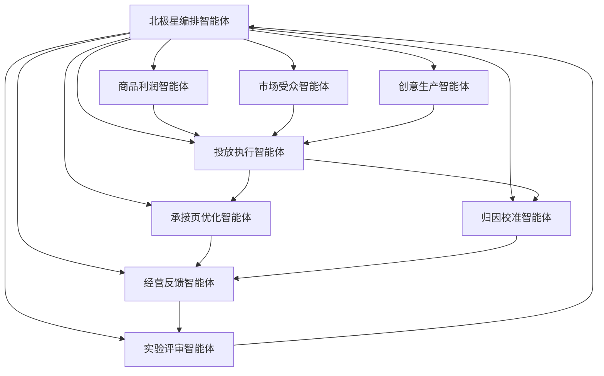
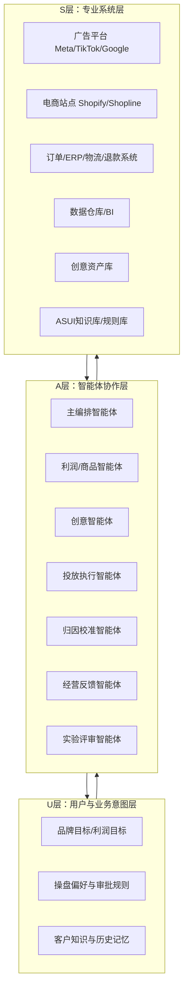

# 跨境电商广告代投：AI 智能体蜂群产品规划与 UAS 架构方案

> 基于 selfpaw 原生认知蜂群方法论，对“跨境电商广告代投真正的场景闭环、核心驱动、AI 智能体支撑要素、产品规划与 UAS 架构模式”进行完整沉淀。

---

## 1. 议题定义

研究问题：

1. 跨境电商广告代投真正的场景闭环是什么
2. 广告代投的核心驱动到底是什么
3. 如果要用 AI 代投智能体实验投放效率和效果的提升，真正的支撑是什么
4. 每个核心下有哪些可智能化的要素实体
5. 如何给出能实现该场景效果闭环的智能体解决方案

---

## 2. 蜂群辩证结论总览

### 2.1 核心结论

跨境电商广告代投真正的闭环，不是“广告账户自动优化闭环”，而是：

**围绕利润目标，把商品、创意、受众、预算、站内承接、履约结果、复购/退款、知识复盘连接成一个持续实验、持续纠偏、持续放大的经营闭环。**

AI 代投智能体若想真正提升效率和效果，真正的支撑不是“会不会自动调广告参数”，而是：

1. 统一利润口径
2. 可用归因底座
3. 标准化实验框架
4. 高速创意供给系统
5. 跨环节协同执行能力
6. 复盘与知识沉淀系统

### 2.2 一句话判断

**真正能穿透广告代投行业的，不是一个“自动投手 AI”，而是一套“利润驱动的经营实验智能体蜂群”。**

---

## 3. 第一次否定：五视角独立分析

### 3.1 用户视角智能体：客户真正买的不是代投，而是可控增长

这里的用户包含三类核心买方：

- 跨境品牌商/卖家老板
- 广告负责人/增长负责人
- 代投团队老板/操盘手

他们表面上购买“代投提效”，本质上买的是四件事：

1. **确定性增长**
   - 不是 ROAS 漂亮，而是利润、现金流、库存周转更稳
2. **低认知负担**
   - 不想靠人盯账户、盯素材、盯页面、盯数据归因
3. **可解释、可追责**
   - 为什么加预算、为什么停投、为什么换创意，必须能说清
4. **可复制**
   - 不只是单次爆量，而是能跨商品、跨国家、跨渠道稳定复制

用户视角结论：

**真正场景闭环必须跨越广告平台、站内转化、订单利润、履约结果和复盘知识，而不是停在平台投放界面内。**

### 3.2 关卡障碍智能体：问题不在“会不会投”，而在“闭环断裂”

跨境广告代投长期做不深，主要是以下断点：

1. **利润口径断裂**
   - 平台看 ROAS，财务看净利，运营看库存，团队没有统一放量口径
2. **归因断裂**
   - 平台归因、站内订单、退款拒付经常互相冲突
3. **创意供给断裂**
   - 不缺投手，缺高速、结构化、可淘汰的素材供给机制
4. **承接页断裂**
   - 广告把人带进来，但页面、价格、信任结构、结账体验接不住
5. **组织协同断裂**
   - 广告、设计、运营、客服、供应链、财务分散，无法统一实验
6. **时间尺度断裂**
   - 广告优化看小时级，真实利润看周级或月级，容易出现短期虚假最优

关卡视角结论：

**AI 代投真正要解决的是闭环断裂，不是自动点击平台按钮。**

### 3.3 核心决策智能体：真正闭环应被定义为增长操作系统

跨境广告代投的真实闭环定义为：

**以利润目标为北极星，以实验机制为驱动，以多源数据统一归因为底座，以素材-受众-预算-承接页协同优化为执行路径，以复盘知识库持续进化为回路的增长操作系统。**

闭环的 8 个核心环节：

1. 业务目标定义
2. 数据统一与真实归因
3. 商品/国家/渠道优先级排序
4. 创意生成与筛选
5. 账户结构与预算分配
6. 广告执行与异常监控
7. 站内承接与转化优化
8. 利润复盘与知识沉淀

决策视角结论：

**AI 代投智能体不是替代投手，而是替代低价值重复动作，增强高价值跨变量判断。**

### 3.4 买单价值智能体：客户为什么愿意持续付费

客户真正会为以下能力持续买单：

- 降低人力成本
- 缩短起量时间
- 提高投放试错效率
- 降低烧钱风险
- 提升利润率与复制能力
- 让小团队具备大团队方法论

核心价值驱动排序：

1. 利润而非单纯 ROAS
2. 实验速度
3. 素材迭代速度
4. 预算决策正确率
5. 归因可信度
6. 规模复制能力

买单视角结论：

**真正效果提升，必须同时体现在利润效率、决策效率、组织效率三层。**

### 3.5 博弈观察智能体：外部变量决定系统边界

外部博弈变量包括：

1. 平台规则与归因模型持续变化
2. 创意竞争加剧，素材生命周期缩短
3. 同质化 AI 工具增多，“会生成”不再构成壁垒
4. 品牌越来越强调可控、可解释、可复盘
5. 跨境业务受汇率、物流、库存、退款等变量影响很大

观察视角结论：

**未来胜出的不是最像自动投手的 AI，而是最能把广告、站点、利润、库存、实验知识连接成统一反馈系统的 AI。**

---

## 4. 第二次否定：认知对手盘交叉质询

### 4.1 用户视角对核心决策的质疑

- 如果系统太重、接入太慢、解释太复杂，客户不会接受
- 客户先买结果，不会先买一个很复杂的架构故事

### 4.2 关卡障碍对核心决策的质疑

- 数据脏、口径乱、创意供给不足、站内承接不配合时，再好的智能体也会失真
- 没有统一归因和实验框架，系统只能在脏反馈上加速犯错

### 4.3 买单价值对核心决策的质疑

- 如果方案要求客户先接很多系统、重建数据层、改组织流程，导入成本太高
- 代投产品必须先从轻量提效切入，再逐步做深

### 4.4 决策智能体反质疑

- 如果只做轻量自动化脚本，短期容易卖，但难以形成真正护城河
- 如果不从第一天按闭环系统设计，后续会陷入工具堆砌

### 4.5 第二次否定后的综合判断

真正的高维解不是“轻”或“重”二选一，而是：

- **前台产品形态必须轻量切入**
- **后台能力结构必须按闭环系统搭建**
- **商业上先卖提效**
- **架构上从第一天为经营闭环做准备**

---

## 5. 辩证融合：真正的场景效果闭环

### 5.1 闭环 1：商业目标闭环

`利润目标 -> 商品选择 -> 广告预算 -> 转化结果 -> 利润复盘 -> 下一轮预算`

作用：

- 解决广告团队与经营团队口径不一致
- 将投放动作纳入真实利润控制

### 5.2 闭环 2：流量实验闭环

`假设 -> 创意/受众/出价实验 -> 数据采集 -> 显著性判断 -> 保留/淘汰 -> 新假设`

作用：

- 提升试错效率
- 构建可复制的增长方法论

### 5.3 闭环 3：创意生产闭环

`市场洞察 -> 创意脚本 -> 素材生产 -> 上线 -> 表现分析 -> 要素拆解 -> 新素材`

作用：

- 解决创意供给不足
- 建立高频素材更新能力

### 5.4 闭环 4：转化承接闭环

`广告承诺 -> 落地页表达 -> 商品页信任 -> 结账体验 -> 下单/退款 -> 页面修正`

作用：

- 解决广告和站内脱节问题
- 把广告效率真正转化为支付效率

### 5.5 闭环 5：经营反馈闭环

`广告订单 -> 履约/物流 -> 退款/客诉 -> 真实毛利 -> SKU 策略调整 -> 广告策略调整`

作用：

- 把投放行为和经营质量绑定
- 避免“高 ROAS 低利润”误导

---

## 6. 真正的核心驱动

### 6.1 驱动 1：实验速度

谁更快完成以下闭环，谁更强：

- 生成假设
- 发起实验
- 读取结果
- 淘汰错误
- 放大正确答案

### 6.2 驱动 2：反馈正确性

错误反馈会导致系统放大错误：

- 归因错
- 利润口径错
- 创意标签错
- 商品成本错

### 6.3 驱动 3：跨环节协同

广告效果取决于协同，而不是单点：

- 创意强不强
- 页面接不接得住
- 价格与优惠结构是否合理
- 物流库存是否允许放量

### 6.4 驱动 4：决策周期压缩

真正的 AI 价值不是少一个投手，而是：

- 3 天完成的判断缩短到 3 小时
- 20 个素材实验扩展到 200 个
- 从个人经验判断转向知识系统判断

---

## 7. AI 代投智能体要成立，真正的支撑是什么

### 7.1 数据底座支撑

必须统一以下数据：

- 广告平台数据：Meta / TikTok / Google
- 站内行为数据：点击、停留、加购、结账
- 订单数据：支付、退款、拒付、复购
- 商品数据：价格、毛利、库存、国家适配
- 素材数据：脚本、镜头、卖点、画风、语言
- 运营数据：活动、折扣、发货时效、客服问题

### 7.2 决策框架支撑

必须结构化：

- 放量阈值
- 停投阈值
- 学习期策略
- 素材淘汰机制
- 国家/渠道/产品优先级
- 利润容错边界

### 7.3 实验机制支撑

每个实验必须具备：

- 核心变量
- 对照组
- 观察窗口
- 胜出阈值
- 回滚条件

### 7.4 知识系统支撑

必须沉淀而不是只存报表：

- 哪类商品在哪些国家/平台/人群下有效
- 哪类卖点、UGC 结构、视觉模式更高转化
- 哪类页面结构更适合高客单或低客单
- 哪些预算放量会出现衰减
- 哪些失败模式会反复出现

### 7.5 执行系统支撑

必须能执行，而不只是建议：

- 自动建 campaign / ad set / ad
- 自动加减预算
- 自动标签化
- 自动生成测试计划
- 自动拉取报表
- 自动推送异常告警
- 自动输出复盘

---

## 8. 可智能化的要素实体地图

### 8.1 经营目标实体

- `BusinessGoal`
- `ProfitTarget`
- `CountryPriority`
- `ChannelPriority`
- `BudgetConstraint`
- `CashflowConstraint`

可智能化动作：

- 分解利润目标到国家 / 渠道 / SKU
- 自动预算建议
- 自动识别预算过投或不足

### 8.2 商品与利润实体

- `Product`
- `SKU`
- `Margin`
- `LandedCost`
- `Inventory`
- `RefundRate`
- `AOV`
- `LTV`

可智能化动作：

- 计算真实可投放利润空间
- 识别高 ROAS 低利润商品
- 排序适合放量的商品池
- 识别库存与履约风险

### 8.3 市场与受众实体

- `Market`
- `Country`
- `Locale`
- `AudienceSegment`
- `IntentCluster`
- `InterestCluster`
- `Angle`

可智能化动作：

- 聚类受众意图
- 自动生成国家/语言适配策略
- 自动生成人群测试矩阵
- 识别受众疲劳与重叠

### 8.4 创意实体

- `Creative`
- `Hook`
- `Offer`
- `VisualPattern`
- `Script`
- `UGCType`
- `CTA`
- `LandingPromise`

可智能化动作：

- 自动生成脚本与变体
- 自动标签化创意元素
- 自动识别高表现创意共性
- 自动淘汰衰退素材
- 自动推荐下一轮素材方向

### 8.5 投放结构实体

- `Campaign`
- `AdSet`
- `Ad`
- `BidStrategy`
- `BudgetRule`
- `LearningStatus`
- `Frequency`
- `AttributionWindow`

可智能化动作：

- 自动账户结构标准化
- 自动预算分配与节奏控制
- 自动学习期保护
- 自动异常停投/降预算/放量

### 8.6 转化承接实体

- `LandingPage`
- `ProductPage`
- `CheckoutFlow`
- `OfferStructure`
- `TrustSignal`
- `PageSpeed`
- `Localization`

可智能化动作：

- 自动分析承接页掉点
- 自动生成页面优化建议
- 自动做文案/优惠 A/B 测试
- 自动对齐广告承诺与页面承接

### 8.7 订单与经营反馈实体

- `Order`
- `PaidOrder`
- `Refund`
- `Chargeback`
- `RepeatPurchase`
- `GrossProfit`
- `NetContribution`

可智能化动作：

- 自动映射广告结果到真实利润
- 自动识别低质量订单来源
- 自动识别高退款/高客诉流量
- 自动修正下轮预算与投放策略

### 8.8 知识与决策实体

- `Experiment`
- `Hypothesis`
- `Result`
- `WinningPattern`
- `FailurePattern`
- `Playbook`
- `DecisionReason`

可智能化动作：

- 自动记录实验
- 自动总结结果
- 自动生成 playbook
- 自动输出“为什么这样投”的解释链

---

## 9. 智能体解决方案：场景闭环蜂群

### 9.1 智能体清单

1. **北极星编排智能体**
   - 绑定利润目标、预算边界和优先级
2. **商品利润智能体**
   - 决定什么值得投
3. **市场受众智能体**
   - 决定投给谁
4. **创意生产智能体**
   - 决定拿什么打
5. **投放执行智能体**
   - 决定怎么投
6. **归因校准智能体**
   - 决定数据是否可信
7. **承接页优化智能体**
   - 决定流量能否接住
8. **经营反馈智能体**
   - 决定结果是否真的成立
9. **实验评审智能体**
   - 决定经验如何沉淀
10. **人工操盘官**
   - 做最终授权、异常处置和战略调整

### 9.2 智能体协作原则

- 北极星编排智能体负责任务编排和优先级
- 执行类智能体只在权限允许范围内操作
- 利润与归因相关结论必须由双重校验智能体交叉确认
- 高风险操作必须保留人工审批
- 所有实验必须沉淀进知识系统

---

## 10. 产品规划

## 10.1 产品定位

### 产品定义

一个面向跨境品牌和代投团队的 **AI 广告经营闭环平台**，不是单纯的投放工具，而是“广告实验 + 素材工厂 + 利润归因 + 经营复盘”的智能体系统。

### 核心定位

- 对品牌商：利润导向的 AI 代投操作系统
- 对代投团队：可复制方法论的提效平台
- 对中小卖家：低门槛半自动投放助手

### 核心价值主张

1. 少看报表，直接看行动
2. 少靠经验，更多靠实验
3. 少依赖投手个体，更多依赖系统复盘
4. 少做局部优化，直接对齐利润结果

## 10.2 产品形态分层

### 形态 1：代投 Copilot

定位：先帮团队提效，不替人拍板。

能力：

- 自动拉数
- 自动日报/周报
- 自动问题诊断
- 自动实验计划
- 自动创意标签分析

### 形态 2：代投 Autopilot

定位：半自动执行，人工审批关键动作。

能力：

- 自动预算微调
- 自动异常预警
- 自动素材轮换
- 自动停投/降预算建议
- 自动账户结构标准化

### 形态 3：经营闭环 OS

定位：广告、页面、订单、利润、库存、知识统一反馈。

能力：

- 广告平台 + Shopify/Shopline + BI + CRM 全链路接入
- 利润校准
- SKU 优先级动态调度
- 多智能体协同实验
- 全链路审计与复盘

## 10.3 产品演进路线

### P0：单账户提效切口

目标：

- 解决报表阅读慢、实验管理乱、素材分析弱

交付：

- 投放 Copilot
- 创意标签系统
- 实验面板

### P1：多账户协同

目标：

- 支持代投团队同时管理多个品牌、多个国家、多个商品线

交付：

- 多账户视图
- 预算规则引擎
- 异常监控中心

### P2：利润闭环

目标：

- 把广告数据接到订单利润和退款结果

交付：

- 利润归因
- SKU 放量评分
- 高退款流量识别

### P3：经营闭环平台化

目标：

- 形成可复制的跨境经营增长操作系统

交付：

- 智能体市场
- 行业模板
- 自动 playbook 沉淀

---

## 11. 产品架构图

## 11.1 业务闭环架构图

## 11.2 智能体协同架构图

## 11.3 UAS 架构模式图

---

## 12. UAS 架构模式设计

本场景非常适合采用 UAS 模式：

- `U` 负责“这个品牌/这个操盘团队/这个经营目标”的个性化理解
- `A` 负责多智能体任务分解、并行协作与结果综合
- `S` 负责广告平台、电商站点、订单系统、利润系统、创意系统的专业接入

### 12.1 U 层：用户与业务上下文层

U 层不只是记录“用户是谁”，而是记录：

- 当前利润目标
- 可承受 CPA/回本周期
- 重点国家和重点 SKU
- 审批规则
- 创意偏好
- 历史爆款模式
- 历史失败模式

U 层核心对象：

- `BrandProfile`
- `AccountGoal`
- `OperatorPreference`
- `ApprovalPolicy`
- `HistoricalPlaybook`

### 12.2 A 层：智能体协作网络

A 层由主编排 + 专业智能体构成：

- 主编排智能体：理解任务、拆解计划、控制节奏
- 专家智能体：商品、创意、投放、归因、页面、经营、复盘
- 风险治理智能体：检查权限、预算越界、异常放量

A 层核心职责：

1. 任务分解
2. 上下文注入
3. 智能体路由
4. 实验调度
5. 结果综合
6. 审计留痕

### 12.3 S 层：专业系统接入层

S 层必须打通以下专业系统：

- 广告平台 API
- 店铺/站点系统
- 订单与履约系统
- 利润与财务口径系统
- 创意素材资产系统
- BI / 数据仓库
- ASUI 规则与知识系统

S 层核心目标：

- 标准化输入输出
- 降低脏数据风险
- 把广告动作连接到真实经营结果

### 12.4 协议栈建议

沿用 UAS-AIOS 已定义的协议思想：

- `UIP`：承载品牌目标、操盘意图、历史偏好
- `A2A`：承载智能体之间的任务委派与结果回传
- `MCP`：承载广告平台、站点、BI、ERP 的工具调用
- `ASUI`：承载业务规则、实验协议、知识沉淀和可审计执行

---

## 13. MVP 功能清单（按 UAS 架构模式拆解）

原则：

- 先做最小闭环，不做大而全
- 先提效，再自动化
- 先半闭环，再全闭环

## 13.1 MVP 目标

在 8-12 周内做出一套能证明价值的最小系统，证明以下命题：

1. AI 能把广告代投的实验效率明显拉高
2. AI 能减少投手的重复动作
3. AI 能输出更一致、可解释、可复盘的决策链
4. AI 能初步对齐广告结果和经营结果

## 13.2 U 层 MVP

### 必做

- 品牌/客户档案
- 广告目标配置
- 利润口径配置
- 审批策略配置
- 国家/SKU 优先级配置
- 历史实验记录与检索

### 可延后

- 深度个性化偏好学习
- 多角色协同记忆
- 自动战略建议

## 13.3 A 层 MVP

### 必做智能体

1. **主编排智能体**
   - 接收目标
   - 编排实验
   - 组织复盘

2. **创意分析智能体**
   - 标签化素材
   - 总结胜出元素
   - 生成下一轮创意建议

3. **投放诊断智能体**
   - 自动识别异常账户
   - 给出预算/结构/频次建议

4. **实验计划智能体**
   - 自动生成测试矩阵
   - 规定变量、阈值、观察窗口

5. **经营反馈智能体**
   - 把广告结果初步映射到订单与利润反馈

### 可延后智能体

- 全自动投放执行智能体
- 页面改版自动发布智能体
- 创意自动生产流水线智能体

## 13.4 S 层 MVP

### 必接系统

- 1 个广告平台（建议 Meta）
- 1 个店铺系统（建议 Shopify）
- 1 个数据面板或数据仓库
- 1 个素材库
- 1 个知识库/规则库

### 必做系统能力

- 广告数据拉取
- 订单与退款数据拉取
- 素材元数据管理
- 报表写回与实验记录沉淀
- 权限和审计日志

### 可延后

- 多广告平台统一编排
- ERP/物流深接
- 自动页面发布

---

## 14. MVP 版本功能表

| 模块 | MVP 功能 | 价值 |
|------|----------|------|
| 目标中心 | 配置利润目标、预算上限、国家/SKU 优先级 | 建立统一决策口径 |
| 数据中心 | 拉取广告、订单、退款、素材数据 | 建立基础闭环 |
| 创意中心 | 素材标签、胜出要素分析、下一轮建议 | 提升创意迭代效率 |
| 实验中心 | 自动生成测试计划、变量定义、阈值设置 | 提升实验标准化 |
| 诊断中心 | 自动日报、异常识别、优化建议 | 压缩人工看盘时间 |
| 经营反馈 | 订单/退款/毛利回流分析 | 防止虚假优化 |
| 决策审计 | 记录每次建议、原因、执行结果 | 可解释、可复盘 |
| 协作中心 | 审批流、评论、结论确认 | 支持人机协同 |

---

## 15. MVP 验证指标

### 15.1 效率指标

- 日报/周报生成耗时下降
- 单周实验数量上升
- 投手人工看盘时间下降
- 素材分析时间下降
- 决策形成周期缩短

### 15.2 效果指标

- 素材淘汰速度提升
- 创意胜率提升
- 异常账户响应时间缩短
- 预算浪费下降
- 广告到订单的有效转化率提升

### 15.3 经营指标

- 毛利率改善
- 净贡献改善
- 高退款流量识别准确率
- 可放量 SKU 命中率

### 15.4 系统指标

- 归因一致性
- 实验记录完整率
- 自动建议采纳率
- 决策解释覆盖率

---

## 16. 推荐落地顺序

### Step 1：做轻量可卖的切口

- 自动拉数
- 自动日报
- 实验计划
- 创意标签分析

### Step 2：做半自动控制

- 异常预警
- 预算建议
- 素材轮换建议
- 放量/停投阈值控制

### Step 3：做真实闭环

- 利润归因
- 订单反馈
- SKU 放量评分
- 经营复盘

### Step 4：做平台化复制

- 多账户
- 多国家
- 多商品线
- 多角色协同

---

## 17. 最终判断

如果你要做这个方向，最重要的不是“做一个 AI 广告投手”，而是：

**做一个从利润目标出发、由多智能体协同、以实验和复盘驱动的跨境广告经营闭环系统。**

产品切入可以轻，但架构必须从第一天按闭环来设计。  
前台先卖“提效工具”，后台逐步长成“经营操作系统”。  
这才是跨境广告代投真正能穿透行业的场景闭环方案。
