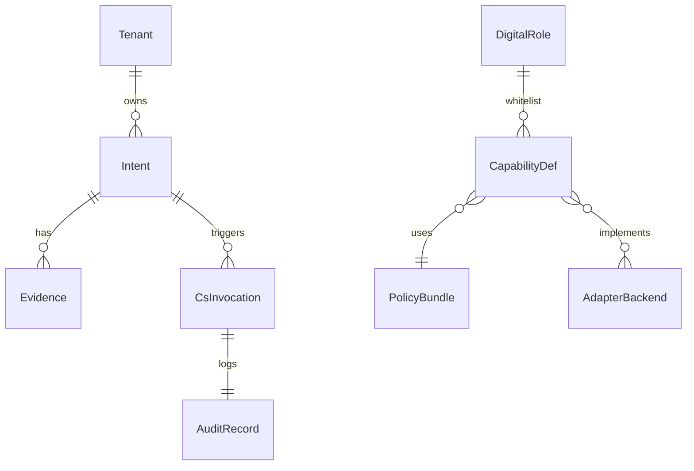

# 企业级 UAS 技术模块规格（EPS-03）

> **版本** 1.0 | **父标准**：[ENTERPRISE_PLATFORM_STANDARD.md](./ENTERPRISE_PLATFORM_STANDARD.md)  
> **产品对照**：[ENTERPRISE_PRODUCT_FUNCTIONAL_SPEC.md](./ENTERPRISE_PRODUCT_FUNCTIONAL_SPEC.md)

---

## 1. 架构总览

### 1.1 逻辑部署图

```
                    ┌─────────────────────────────────────┐
                    │         Model Layer (外部)           │
                    │  LLM / OCR / Embedding               │
                    └──────────────────┬──────────────────┘
                                       │ 仅推理，无写库
┌──────────────────────────────────────┴──────────────────────────────────────┐
│                         Enterprise UAS Control Plane                           │
│  ┌─────────────┐ ┌─────────────┐ ┌─────────────┐ ┌─────────────┐              │
│  │ TM-Intent   │ │ TM-Evidence │ │ TM-Policy   │ │ TM-Tenant   │              │
│  └──────┬──────┘ └──────┬──────┘ └──────┬──────┘ └──────┬──────┘              │
│         └───────────────┴───────────────┴───────────────┘                      │
│                                 │                                              │
│  ┌──────────────────────────────┴──────────────────────────────┐              │
│  │                    TM-CsRouter (核心)                          │              │
│  │   scope check → policy → adapter → audit → event               │              │
│  └──────────────────────────────┬──────────────────────────────┘              │
│  ┌─────────────┐ ┌─────────────┐ │ ┌─────────────┐ ┌─────────────┐              │
│  │ TM-SGrid    │ │ TM-Audit    │ │ │ TM-EventBus │ │ TM-MDM      │              │
│  └─────────────┘ └─────────────┘ │ └─────────────┘ └─────────────┘              │
│  ┌──────────────────────────────┴──────────────────────────────┐              │
│  │ TM-AgentOrch (扩展) ←→ TM-Runtime (UASRuntimeService 已有)     │              │
│  └──────────────────────────────────────────────────────────────┘              │
└──────────────────────────────────────┬──────────────────────────────────────┘
                                       │
                    ┌──────────────────┴──────────────────┐
                    │  Data Plane (per tenant)               │
                    │  MDM · Event Log · Audit Chain (JSONL) │
                    └──────────────────────────────────────┘
```

### 1.2 与现有仓库映射

| 技术模块 | 当前实现 | 路径/类 | 目标阶段 |
|----------|----------|---------|----------|
| TM-Runtime | ✅ 已有 | `asui.engine.UASRuntimeService` | R0 |
| TM-AgentOrch | ✅ 子集 | `RuntimeManager`, `AgentOrchestrator` | R0 |
| TM-ToolGateway | ✅ 脚本网关 | `ToolGateway.execute_script` | R0→需 CsRouter 包装 |
| TM-CapabilityReg | ✅ 子集 | `CapabilityRegistry.build` | R0→扩展 cs |
| TM-Audit | ✅ 子集 | `AuditEngine` | R0 |
| TM-CsRouter | ❌ 规划 | 新增 `asui.enterprise.cs_router` | R0 |
| TM-Intent | ❌ 规划 | 新增 `asui.enterprise.intent` | R1 |
| TM-Tenant | ❌ 规划 | Context 注入扩展 | R1 |
| TM-SGrid | ❌ 规划 | 适配器插件目录 | R0 |
| TM-OutwardGW | ❌ 规划 | 独立服务或 middleware | R1 |

---

## 2. 技术模块清单

### TM-CsRouter — 语义能力路由（核心）

**职责**：唯一合法的「写业务状态」入口（Agent 侧）。

**子组件**：

| 组件 | 职责 |
|------|------|
| `CsRegistryLoader` | 加载 `enterprise_cs_capability_registry.json` |
| `ScopeValidator` | 校验 actor.roles → required_scopes |
| `WhitelistValidator` | 校验岗位 allowed_capabilities |
| `PolicyEvaluator` | 加载 policy_bundle，deterministic 终裁 |
| `AdapterInvoker` | 调用 SGrid 适配器 |
| `AuditWriter` | 写 audit 链 + 返回 audit_id |
| `EventPublisher` | 发布 cs.invoked / cs.completed |

**对外 API**：

```
API-CS-Invoke
POST /v1/tenants/{tenant_id}/capabilities/invoke
Body: enterprise_cs_invoke.schema.json
Response: { request_id, status, data?, audit_id, escalation? }
```

**Python 接口（规划）**：

```python
class CsRouter:
    def invoke(self, envelope: CsInvokeEnvelope) -> CsInvokeResult: ...
```

**R0 实现路径**：在 `ToolGateway` 前增加 `CsRouter.invoke`；subapp script 仅作为 adapter 后端，由 registry 声明 `adapter` 路径。

**错误码**：

| code | HTTP | 含义 |
|------|------|------|
| POLICY_DENIED | 403 | 法则/scope 拒绝 |
| CAPABILITY_UNKNOWN | 404 | 未注册 cs |
| WHITELIST_DENIED | 403 | 岗位白名单 |
| BACKEND_DEGRADED | 503 | 连接器不健康 |
| IDEMPOTENCY_REPLAY | 200 | 返回首次结果 |

---

### TM-TenantContext — 租户上下文

**职责**：为每次 Runtime / cs 调用注入不可伪造的 `tenant_id`、`actor`。

| 字段 | 来源 |
|------|------|
| tenant_id | JWT / API Key / SSO |
| actor.user_id | SSO |
| actor.roles | IdP groups → 映射表 |
| actor.tier | DH-L1/L2/L3 |
| actor.delegation_from | 委托链 |

**集成点**：扩展 `ContextInjector`（`asui.engine.context_injector`）。

**配置**：`configs/enterprise_data_plane_manifest.json` + `configs/tenant_identity.json`（规划）。

---

### TM-Intent — 意图服务

**职责**：Intent 单 CRUD、分类、升级路由。

```
API-Intent-Create   POST /v1/tenants/{tid}/intents
API-Intent-Escalate POST /v1/tenants/{tid}/intents/{id}/escalate
API-Intent-Get      GET  /v1/tenants/{tid}/intents/{id}
```

**存储**：`database/intents/{intent_id}.json`（R0 文件）；R3 可迁 PG。

**升级规则引擎**：读取 `enterprise_digital_human_tiers.example.json` → `escalation_rules`。

---

### TM-Evidence — 证据包服务

**职责**：Evidence bundle 附加、版本、与 Intent 关联。

**存储**：`database/evidence/{evidence_id}.json`

**约束**：升级 ΠPaw 时 `require` 字段校验（EPS-06）。

---

### TM-SGrid — 连接器适配管理

**职责**：backend 注册、凭证、字段映射、健康检查。

**适配器契约**：

```python
class CsAdapter(Protocol):
    backend_id: str

    def health(self) -> AdapterHealth: ...

    def invoke(
        self,
        capability: str,
        payload: dict,
        *,
        idempotency_key: str,
    ) -> dict: ...
```

**目录约定**（subapp 或租户级）：

```
adapters/
  crm_adapter.py
  bpm_adapter.py
  mappings/
    cs.lead.capture.yaml
```

**R0**：单 adapter 硬编码 + YAML 映射；R1 插件加载。

---

### TM-Policy — 法则包引擎

**职责**：加载 `policy_bundle_id`；对 deterministic 能力执行规则集。

**输入**：cs 请求 + 主数据快照（只读）  
**输出**：`allow | deny | escalate` + 原因码

**R0**：JSON 规则表；R2：DSL 或 OPA。

---

### TM-AuditChain — 审计链

**职责**：append-only 审计；支持 FR-AUD-001 查询。

**R0 格式**（JSONL）：

```json
{"audit_id":"...","tenant_id":"...","capability":"cs.quote.create","actor":{},"request_id":"...","status":"ok","ts":"ISO8601"}
```

**扩展**：`asui.engine.audit_engine` 增加 `log_cs_invoke`。

---

### TM-EventBus — 事件流

**职责**：发布订阅 intent.* / cs.*（R1 可用文件 tail；R3 Kafka/NATS）。

---

### TM-MDM — 主数据解析

**职责**：实现 `cs.mdm.resolve`；屏蔽多 SoR ID 映射。

---

### TM-AgentOrch — Agent 编排扩展

**职责**：在现有编排上增加：

1. 工具列表仅暴露 `cs.*`（虚拟工具 → CsRouter）  
2. 执行计划步骤标注 `planned_cs[]` vs `executed_cs[]`  
3. 升级时调用 TM-Intent

**现有类**：`AgentOrchestrator`, `Planning`, `Execution` — 扩展而非替换。

---

### TM-Runtime — 运行时（已有）

**类**：`UASRuntimeService`, `RuntimeManager`

**企业扩展（FR-RT-004/005）**：

```python
# 规划：run_app 签名扩展
def run_app(
    self,
    app_id: str,
    topic: str,
    *,
    tenant_context: TenantContext,
    payload: dict | None = None,
    evaluate: bool = False,
) -> dict:
    # result["cs_trace"] = [...]
```

---

### TM-OutwardGW — 对外网关

**职责**：HTTP/Webhook 入口、脱敏、限流、会话 → tenant/channel。

**技术栈选项**：独立 FastAPI 服务或 API Gateway 插件（EPS 不强制）。

---

### TM-Evolution — 演化（扩展已有）

**类**：`EvolutionEngine`

**企业扩展**：消费 `cs.analytics.attribute` 输出 → 生成 ChangeSet → `evolution_apply` 写法则包。

---

## 3. 数据模型（核心实体）

| 实体 | 主键 | 关系 |
|------|------|------|
| Tenant | tenant_id | 1:N Actor, CapabilityRegistry |
| Actor | user_id + tenant_id | N:M Role |
| CapabilityDef | cs id + version | N:1 PolicyBundle, N:N Backend |
| Intent | intent_id | 1:N Evidence, N:1 EscalationTarget |
| CsInvocation | request_id | 1:1 AuditRecord |
| DigitalRole | role_agent_id | 1:1 Whitelist |
| AdapterBackend | backend_id | 1:N CapabilityDef |

ER 图（逻辑）：



---

## 4. Agent 工具暴露规范

**禁止**：

```json
{ "name": "salesforce_create_lead", "type": "http", "url": "https://..." }
```

**必须**：

```json
{
  "name": "cs_lead_qualify",
  "type": "capability",
  "capability": "cs.lead.qualify",
  "execution_mode": "deterministic"
}
```

Runtime 将 `type=capability` 路由至 `CsRouter.invoke`。

---

## 5. 目录与包结构（规划）

```
asui-cli/src/asui/
  enterprise/
    __init__.py
    cs_router.py
    cs_registry.py
    tenant_context.py
    intent_service.py
    evidence_service.py
    sgrid/
      adapter_protocol.py
      loader.py
    policy/
      evaluator.py
scripts/
  run_cs_router_dev.py          # R0 本地 invoke 调试
configs/
  enterprise_*.example.json
  schemas/
projects/<tenant-subapp>/
  adapters/
  configs/
    enterprise_cs_capability_registry.json  # 租户覆盖
```

---

## 6. 安全架构

| 控制点 | 实现 |
|--------|------|
| 认证 | SSO JWT → TenantContext |
| 授权 | Scope + Whitelist + Policy 三重 |
| 密钥 | 连接器凭证仅 TM-SGrid 进程可读 |
| 审计 | 所有 invoke 写 TM-AuditChain |
| 供应链 | Domain 包签名（R3） |

---

## 7. 可观测性

| 信号 | 内容 |
|------|------|
| Metrics | cs_invoke_total, latency, policy_denied_total |
| Traces | trace_id = request_id，跨 Agent→CsRouter→Adapter |
| Logs | 结构化 JSON，不含 PII 全文 |

---

## 8. 分阶段交付与技术任务分解

### R0（4–6 周当量，技术视角）

| 任务 | 模块 | 产出 |
|------|------|------|
| T0-1 | TM-CsRouter MVP | `CsRouter.invoke` + 单测 |
| T0-2 | TM-CapabilityReg 扩展 | 读取 enterprise registry |
| T0-3 | TM-AuditChain | JSONL + audit_id |
| T0-4 | TM-SGrid | 1 个 CRM adapter 样例 |
| T0-5 | TM-AgentOrch | capability 类型 tool |
| T0-6 | 文档 | 与 EPS-02 FR 对齐验收 |

### R1

Intent/Evidence 服务、OutwardGW、PolicyEvaluator 初版、FR-PP Task 队列文件实现。

### R2

Tenant 隔离、席位校验、SelfPaw U 轨 ContextInjector。

### R3

多租户 DB、事件总线、包签名与市场 CLI。

---

## 9. 测试策略

| 层级 | 内容 |
|------|------|
| 契约测试 | 每个 cs 的 input/output schema |
| 策略测试 | POLICY_DENIED 场景表 |
| 集成测试 | adapter mock + 全链 audit |
| 回归 | capability_version 升级兼容性 |

**仓库命令（现有）**：

```bash
cd asui-cli && python3 -m pytest tests/ -v
```

**规划新增**：`tests/test_cs_router.py`, `tests/test_intent_escalation.py`

---

## 10. 与 UAS 八元组对照

| 元组 | 主要技术模块 |
|------|--------------|
| I | TM-Intent, TM-Evidence |
| K | Domain 包文件 + PolicyBundle |
| R | TM-Runtime, TM-AgentOrch |
| A | TM-AgentOrch, DigitalRole 配置 |
| S | TM-CsRouter, TM-SGrid, TM-MDM |
| G | TM-Policy, TM-AuditChain, ScopeValidator |
| E | TM-Evolution |
| Π | API-CS-Invoke, Intent API, schemas |

---

*协议细节：[ENTERPRISE_CS_CAPABILITY_PROTOCOL.md](./ENTERPRISE_CS_CAPABILITY_PROTOCOL.md) · 目录标准：[ENTERPRISE_CS_CAPABILITY_CATALOG_STANDARD.md](./ENTERPRISE_CS_CAPABILITY_CATALOG_STANDARD.md)*
