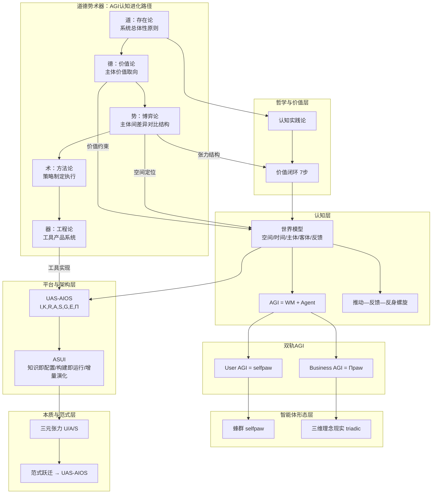
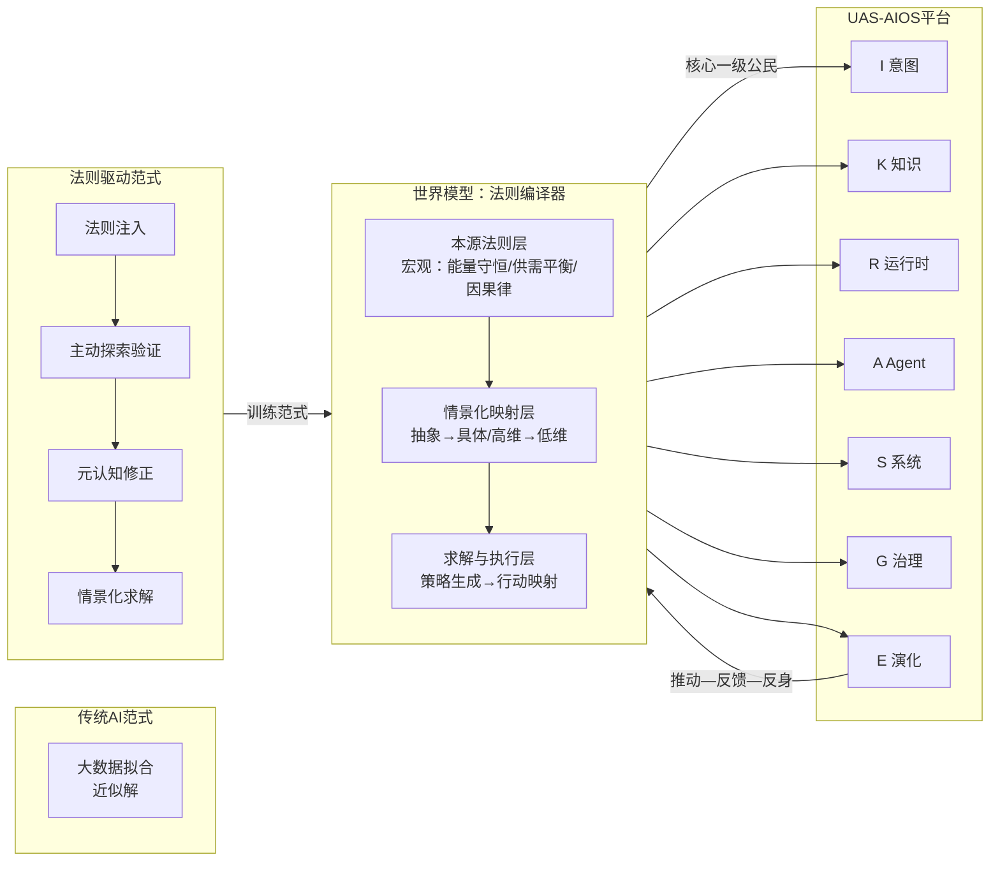
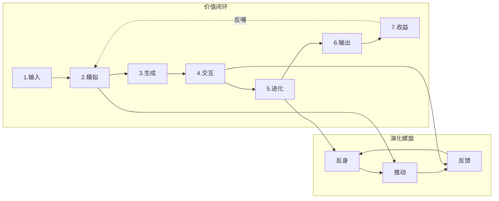
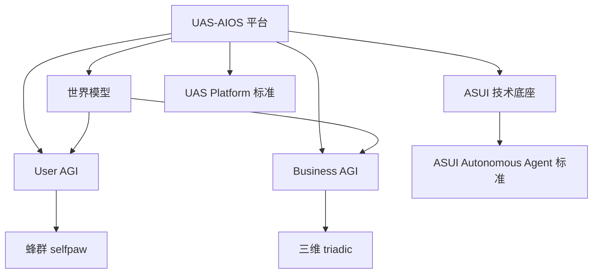

# UAS-AIOS 项目理论体系：方法论综合与关系图谱

> 综合项目中所有方法论及其关系，构建统一的理论体系，并给出可视化表达。  
> 本文档为**总纲**，各方法论细节见对应文档。

---

## 一、理论体系总览

### 1.1 核心命题

**认知实践是生产力创造价值的根本路线。**  
UAS-AIOS 以**世界模型**为认知内核、以**双轨 AGI**（User / Business）为智能载体、以**推动—反馈—反身**为演化螺旋，在**数字世界优先、再连接现实世界、最终理念与现实一体化**的路径上，实现可审计、可演化、切合各主客体视角的价值闭环。

### 1.2 方法论清单与定位

| 方法论 | 定位 | 核心文档 |
|--------|------|----------|
| **道德势术器** | AGI认知架构元方法论；道→德→势→术→器 | 本文 §二 |
| **认知实践论** | 价值创造的哲学基础；实践→表征→反思→再实践 | 讨论沉淀、本文 §三 |
| **世界模型** | 真实世界反馈能力的模型化；法则编译器；降维与重构 | [AGI_WORLD_MODEL_UAS](./AGI_WORLD_MODEL_UAS.md)、[世界模型](./世界模型/世界模型.md)、本文 §4.1.1 |
| **世界模型：法则编译器** | 本源法则→情景化现实；降维求解；理念与现实统一 | [世界模型](./世界模型/世界模型.md)、本文 §4.1.1 |
| **AGI = WM + Agent** | 智能的形式化分解；User AGI = selfpaw(UAS-U)，Business AGI = Πpaw(UAS-S) | 同上 |
| **UAS-AIOS** | 平台架构；I,K,R,A,S,G,E,Π；世界模型全面融入 | [UAS_AIOS_ARCHITECTURE](../UAS_AIOS_ARCHITECTURE.md) |
| **ASUI** | 技术底座与知识范式；AI×System×UI；知识即配置、构建即运行、增量演化 | [ASUI_ARCHITECTURE](./ASUI_ARCHITECTURE.md) |
| **蜂群智能体 (selfpaw)** | User AGI 的认知形态；五智能体、第一次否定→第二次否定→辩证融合 | examples/selfpaw-cognitive-swarm |
| **三维理念现实 (triadic)** | 理念—现实一体化；目的激活、宏/中/微观、理念vs现实对冲、实例化、涌现 | examples/triadic-ideal-reality-swarm |
| **三元张力与范式跃迁** | AI 应用本质；认知/执行/知识摩擦；范式相变→UAS-AIOS | [AI_APPLICATION_PARADIGM_REPORT](../AI_APPLICATION_PARADIGM_REPORT.md) |
| **价值闭环（7 步）** | 从问题输入到收益反哺的完整回路 | 讨论沉淀、本文 §二 |
| **推动—反馈—反身螺旋** | 世界模型下的演化机制 | [AGI_WORLD_MODEL_UAS](./AGI_WORLD_MODEL_UAS.md) §2.3 |
| **UAS Platform 标准** | 所有业务应用的技术与运行标准 | [UAS_PLATFORM_STANDARD](./UAS_PLATFORM_STANDARD.md) |
| **ASUI Autonomous Agent 标准** | 知识层、运行时、执行层、工作流阶段的强制约定 | [ASUI_AUTONOMOUS_AGENT_STANDARD](./ASUI_AUTONOMOUS_AGENT_STANDARD.md) |

---

## 二、道德势术器：AGI认知架构的元方法论

> **道德势术器**是将道家哲学重构为AGI认知架构的元方法论，为UAS-AIOS提供从「存在」到「工具」的完整认知进化路径。

### 2.1 道 (Tao)：系统总体性原则

- **哲学内涵**：宇宙运行规律，系统总体性原则
- **在AGI中的映射**：世界模型的**元理论层**
- **对应UAS概念**：
  - 核心命题：「认知实践是生产力创造价值的根本路线」
  - 世界模型的存在论基础：WM 回答「世界里有什么、如何变化、何为价值」
- **认知功能**：为AGI提供**本体论承诺**——系统必须承认并建模一个独立于认知者的客观世界结构

### 2.2 德 (De)：主体价值取向

- **哲学内涵**：顺道而行之道，个体/组织运行方式
- **在AGI中的映射**：**主体价值函数**
- **对应UAS概念**：
  - 认知实践论中的「价值闭环」
  - 双轨AGI中的主体性：User AGI 的个人意图、Business AGI 的组织目标
- **认知功能**：Agent 遵循的**伦理约束与价值规范**，决定「什么该做、什么不该做」

### 2.3 势 (Shi)：主体间差异对比结构（关键创新）

- **哲学内涵**：主题性系统空间，矛盾主体要素的差异对比关系作用
- **在AGI中的映射**：**世界模型中的结构性张力空间**
- **对应UAS概念**：
  - 世界模型的「主体」维度：主体间的意图、能力、权限、偏好差异
  - 世界模型的「客体」维度：客体被不同主体感知与操作的差异
  - 推动—反馈—反身螺旋中的**张力识别**
- **认知功能**：
  - **空间定位**：在多主体博弈中确定自身位置（是推动者、阻碍者还是连接者）
  - **差异建模**：显式建模主体间的**利益冲突、能力差距、信息不对称**
  - **势能积累**：识别并积累「势」——通过差异化对比形成的行动动能
  - **这是「术」的先决条件**：只有清晰理解「势」，才能制定有效的「术」

**「势」的形式化**：
```
势 (Shi) = f(主体集合 S, 差异矩阵 D, 关系图谱 G)
- S = {s₁, s₂, ..., sₙ}：所有相关主体
- D[i,j] = 主体i与主体j在意图/能力/资源上的差异
- G = 主体间的依赖/博弈/协作关系
势的价值 = Σ(差异化程度 × 关系权重) → 行动方向的选择依据
```

### 2.4 术 (Shu)：方法策略层

- **哲学内涵**：具体方法策略，行为模式与管理
- **在AGI中的映射**：**Agent 策略层**
- **对应UAS概念**：
  - 推动—反馈—反身螺旋中的「推动」与「反馈响应」
  - 蜂群智能体 (selfpaw) 的博弈策略
  - 三维理念现实 (triadic) 的方案生成
- **认知功能**：基于「势」的判断，制定**具体的推理、规划与执行策略**

### 2.5 器 (Qi)：工具与产品层

- **哲学内涵**：工具与产品，可见应用层
- **在AGI中的映射**：**工具与执行层**
- **对应UAS概念**：
  - ASUI：知识即配置、构建即运行的技术底座
  - UAS-AIOS：(I,K,R,A,S,G,E,Π) 完整平台
  - 双轨AGI：selfpaw (User AGI)、Πpaw (Business AGI)
- **认知功能**：将策略转化为**可执行的工具、产品与系统**

### 2.6 道德势术器与认知实践论的融合

```
道德势术器（认知进化路径）
    │
    ├─→ 道：承认客观世界结构（存在论）
    │         │
    │         └─→ 德：主体价值取向（伦理论）
    │                   │
    │                   └─→ 势：主体间差异对比（博弈论）← 关键桥梁
    │                             │
    │                             └─→ 术：策略制定（方法论）
    │                                       │
    │                                       └─→ 器：工具实现（工程论）
    │
    └─→ 认知实践论（价值实现路径）
              │
              └─→ 实践→表征→行动反馈→反思→再实践
```

**核心洞见**：「势」是连接「价值判断」与「行动策略」的**结构性桥梁**。没有清晰的「势」建模，「术」就是盲目的；没有正确的「德」，「势」就是有害的。

---

## 三、哲学与价值层：认知实践论与价值闭环

### 3.1 认知实践论

- **核心主张**：认识不是静态反映世界，而是通过**实践**不断生成、修正和进化；实践是认知的起点、动力和检验标准。
- **逻辑结构**：实践 → 表征（可操作模型）→ 行动与反馈（现实裁决）→ 反思与重构（元认知）→ 历史与社会传承。
- **对 AI 的启示**：  
  - 从算法中心转向**实践中心**；  
  - 评估从抽象指标转向**实践表现**；  
  - 数据/标签视为**实践产物**，需治理偏见与制度；  
  - 系统与元系统具备**认知演化**与**治理演化**能力。

### 3.2 价值闭环（7 步）

1. **输入**：真实世界复杂问题 + 行业专家知识  
2. **模拟（虚拟实践）**：数字孪生环境中海量试错与推演  
3. **生成**：多种可能方案或行动建议  
4. **交互（人机协同）**：人类/系统评估与修正，高质量反馈  
5. **进化**：修正数据回流，更新世界模型，预测更准、决策更优  
6. **输出（切中价值流）**：优化后的 AI 代理介入现实工作流，提效降本或创造新产品  
7. **收益**：实际效益反哺系统，支持更大规模模拟与更复杂任务  

**与认知实践论的关系**：价值闭环是认知实践论在工程上的**可执行形态**；世界模型是闭环中「认知」的集中承载，推动—反馈—反身是闭环中「进化」的机制。

---

## 四、认知层：世界模型与 AGI 分解

### 4.1 世界模型

- **基础定义**：对目标世界的**结构化、可更新认知**，核心价值是**将真实世界的反馈能力模型化**。
- **五维**：空间、时间、**主体**、**客体**、**感知—行动—反馈**。
- **在 UAS-AIOS 中的角色**：
  - 全面融入 I,K,R,A,S,G,E；
  - 系统与元系统**自主发现**反馈体系与关键主客体；
  - 基于主客体进行**交互与交付**；
  - 任务与交付需做**推动/阻碍/连接**视角的评估与**主客体全链路推演**。

### 4.1.1 世界模型的本质：法则编译器（跨文档整合）

> 本节整合自 [docs/世界模型/世界模型.md](./世界模型/世界模型.md)，将其核心哲学思想融入UAS-AIOS理论体系。

#### 本质重构：从"预测器"到"编译器"

世界模型的价值不在于它"算得准不准"，而在于它**能否自动完成从抽象真理到具体现实的"翻译"与"落地"**。

| 传统视角 | 法则编译器视角 |
|----------|----------------|
| 预测器 (Predictor) | 编译器 (Compiler) |
| 拟合数据 | 编译法则 |
| 记忆特定场景 | 掌握本源法则 |
| 依赖海量数据 | 自主迁移泛化 |

#### 核心机制：降维与重构

```
现实世界（高维混沌）→ 抽象映射 → 世界模型（低维有序）→ 求解 → 映射回现实
```

- **复杂度的"平移"而非"消除"**：世界模型在内部预计算了所有可能的状态转移概率和约束条件（本源法则）
- **自动解构**：不是看"现象"，而是看到"本质因果链"
- **去噪**：过滤随机噪声，只保留**核心因果链**

#### 本源法则的层次

| 层次 | 描述 | 示例 |
|------|------|------|
| **宏观层** | 全局法则（普适） | 能量守恒、供需平衡、因果律 |
| **微观层** | 具体子系统细节 | 特定工厂的摩擦系数、特定市场的供需曲线 |
| **交互机制** | 约束下推与实例化 | 宏观法则 → 微观执行层 → 具体步骤 |

#### 与"道德势术器"的映射

```
道（存在论）     → 本源法则（宏观层）：世界模型存储的抽象真理
德（价值论）     → 理念一致性：AI行动是否符合预设本源价值
势（博弈论）     → 差异对比结构：在具体情景中识别核心矛盾
术（方法论）     → 情景化策略：将法则实时投影到当前子系统
器（工程论）     → 执行器：策略映射回现实世界的具体行动
```

#### 符号-神经混合架构

| 组件 | 功能 |
|------|------|
| **神经部分**（感知层） | 高维数据输入、压缩、模式识别（提取表象） |
| **符号部分**（认知层） | 存储和推演本源法则（知识图谱、逻辑规则、微分方程） |
| **交互机制** | 神经→概念 → 符号→法则匹配 → 符号推演 → 神经执行与微调 |

**价值**：兼具神经网络的**泛化能力**和符号逻辑的**可解释性/迁移性**

#### 训练范式：从"监督学习"到"因果发现与验证"

1. **法则注入**：将人类专家提炼的底层逻辑作为初始约束注入模型
2. **主动探索**：在虚拟环境中尝试不同参数，观察法则符合/违反情况
3. **元认知修正**：当发现现实与法则冲突时，触发**元认知机制**更新"法则库"
4. **情景化验证**：将更新后的法则应用到新子系统，看能否解决问题

#### 评估指标：从"准确率"到"迁移成功率"

| 旧指标 | 新指标 |
|--------|--------|
| Loss / Accuracy | **OOD泛化率**：全新场景下解决问题的能力 |
| - | **因果鲁棒性**：分布外扰动时保持核心逻辑 |
| - | **理念一致性**：行动是否符合本源价值 |

#### 核心洞见：智能的本质是"降低复杂度"

> **智能的本质，不是增加复杂度，而是降低复杂度。**

- 人类大脑：通过**直觉**（潜意识简化模型）来简化问题
- 世界模型：将这种**隐式直觉**显式化、系统化、极致化
- 理念与现实统一：
  - **理念**：世界模型内部存储的抽象真理（简单、有序）
  - **现实**：外部世界的具体表现（复杂、混沌）
  - **统一**：通过**映射**将理念实例化为现实行动

#### 世界模型的三重身份

| 身份 | 描述 |
|------|------|
| **镜像** (Mirror) | 反映世界 |
| **透镜** (Lens) | 透过现象看本质 |
| **熔炉** (Forge) | 将抽象本质重塑为具体现实行动 |

### 4.2 AGI 分解与双轨

- **AGI = World Model ⊕ AI Agent**  
  - World Model：环境、主体、机制、价值、可行动空间的可计算表征。  
  - AI Agent：在 WM 上的推理、规划、执行与学习主体。  

- **User AGI = selfpaw (UAS-U)**：个人侧世界模型 + 个人 Agent（可蜂群形态）。  
- **Business AGI = Πpaw(UAS-S)**：业务侧世界模型 + 多专业 Agent 编排；价值闭环、治理、可审计。

### 4.3 演化机制：推动—反馈—反身螺旋

- **推动**：任务/目标/资源/动作的发出。  
- **反馈**：执行结果、环境反应、主体评价、客体状态变化。  
- **反身**：对假设、策略、世界模型的审视与修正。  
- 演化 = 反馈修正 WM 与策略 + 反身更新「关注哪些反馈与主客体」→ 下一轮推动收敛到**各维度各主客体视角下的最佳选择**。

### 4.4 DIKW方法论：双向回路与认知实践

> 本节整合DIKW（Data-Information-Knowledge-Wisdom）方法论，构建**从智慧到数据**的压缩回路与**从数据到智慧**的价值回路，实现本源法则与智能架构一体化。

#### 4.4.1 DIKW金字塔与现有体系的映射

```
                           Wisdom（智慧）
                              ▲
                              │
                         本源法则/道
                              ▲
                              │
                         Knowledge（知识）
                              ▲
                              │
                        世界模型/德
                              ▲
                              │
                       Information（信息）
                              ▲
                              │
                        主体间差异/势
                              ▲
                              │
                          Data（数据）
                              ▲
                              │
                        感知-行动-反馈
```

| DIKW层 | 内涵 | 对应现有体系 | 核心能力 |
|--------|------|--------------|----------|
| **Wisdom（智慧）** | 本源法则、终极真理 | 道（存在论） | 法则提取与验证 |
| **Knowledge（知识）** | 结构化认知、系统模型 | 世界模型、德（价值论） | 降维与重构 |
| **Information（信息）** | 差异对比、结构化张力 | 势（博弈论） | 模式识别、趋势判断 |
| **Data（数据）** | 原始感知、行动反馈 | 感知-行动-反馈 | 采集、清洗、存储 |

#### 4.4.2 本源法则到具体场景：智慧→数据（压缩回路）

```
智慧（Wisdom）
    │ 法则提取：从具体案例中提炼普适规律
    ▼
知识（Knowledge）
    │ 降维映射：将高维现实压缩为低维模型
    ▼
信息（Information）
    │ 情景化适配：将模型参数实例化到具体场景
    ▼
数据（Data）
    │ 执行：生成具体行动指令
    ▼
现实反馈
```

**核心机制**：
1. **法则提取**（Wisdom → Knowledge）：从大量案例中提取不变规律（"供需平衡"、"能量守恒"）
2. **降维映射**（Knowledge → Information）：将法则编译为可计算的模型结构
3. **情景化适配**（Information → Data）：根据具体场景参数化模型
4. **执行落地**（Data → 现实）：生成可执行的动作并观察反馈

**与"道德势术器"的映射**：
```
道（法则提取）→ 德（价值约束）→ 势（差异定位）→ 术（策略生成）→ 器（执行落地）
```

#### 4.4.3 数据到智慧的价值回路：认知实践的场景能力迭代

```
数据（Data）
    │ 采集：从现实世界获取原始感知
    ▼
信息（Information）
    │ 模式识别：从数据中发现规律与异常
    ▼
知识（Knowledge）
    │ 建模：将规律抽象为可推理的结构
    ▼
智慧（Wisdom）
    │ 归纳：从知识中提炼本源法则
    ▼
法则验证：回到现实检验
```

**核心机制**：
1. **数据采集**（现实 → Data）：传感器、用户反馈、业务日志
2. **模式识别**（Data → Information）：统计学习、异常检测、趋势分析
3. **结构建模**（Information → Knowledge）：构建/更新世界模型
4. **法则归纳**（Knowledge → Wisdom）：发现更高层次的规律
5. **法则验证**（Wisdom → 现实）：将新法则应用到实践，检验效果

**与"认知实践论"的融合**：
```
实践 → 表征（数据→信息）→ 行动反馈（信息→现实）→ 反思与重构（信息→知识→智慧）→ 再实践
```

#### 4.4.4 双向回路的统一：构建确认回路

```
                    ┌─────────────────────────────────────┐
                    │         本源法则（ Wisdom/道）        │
                    │         终极真理、普适规律             │
                    └──────────────────┬──────────────────┘
                                       │
           ┌───────────────────────────┼───────────────────────────┐
           │                           │                           │
           ▼                           ▼                           │
┌──────────────────────┐   ┌──────────────────────┐               │
│   智慧→数据压缩回路   │   │   数据→智慧价值回路   │               │
│   （法则编译）        │   │   （认知实践）        │               │
│                      │   │                      │               │
│ 道→德→势→术→器      │   │  实践→表征→反馈→重构 │               │
│                      │   │                      │               │
│ 目标：问题求解       │   │  目标：能力进化       │               │
└──────────────────────┘   └──────────┬───────────┘               │
                                      │                           │
                                      ▼                           │
                    ┌─────────────────────────────────────┐       │
                    │         世界模型（Knowledge/德）      │       │
                    │         结构化认知、可更新模型         │       │
                    └──────────────────┬──────────────────┘       │
                                       │                           │
           ┌───────────────────────────┼───────────────────────────┐
           │                           │                           │
           ▼                           ▼                           │
┌──────────────────────┐   ┌──────────────────────┐               │
│   降维映射           │   │   模式识别           │               │
│   Knowledge→Info    │   │   Data→Information   │               │
└──────────────────────┘   └──────────────────────┘               │
           │                           │                           │
           └───────────────────────────┼───────────────────────────┘
                                       ▼
                    ┌─────────────────────────────────────┐
                    │         具体场景（Data/器）            │
                    │         可执行的动作、现实反馈          │
                    └─────────────────────────────────────┘
```

**双向回路的核心区别**：

| 回路 | 方向 | 目的 | 触发条件 |
|------|------|------|----------|
| **压缩回路** | Wisdom → Data | 问题求解（已知目标，求解路径） | 业务需求、任务输入 |
| **价值回路** | Data → Wisdom | 能力进化（观测反馈，提炼规律） | 实践结果、环境变化 |

#### 4.4.5 "可创造、可运行、可适应、可进化"的一体化

| 特性 | 实现机制 | 对应回路 |
|------|----------|----------|
| **可创造** | 从本源法则（道）推演新策略 | 压缩回路：智慧→数据 |
| **可运行** | 将策略编译为可执行动作 | 压缩回路：术→器 |
| **可适应** | 根据环境反馈调整策略 | 价值回路：数据→信息→知识 |
| **可进化** | 从实践中归纳新法则 | 价值回路：知识→智慧 |

#### 4.4.6 工程实现要点

**1. 世界模型的双向接口**：
- **输入侧**（价值回路）：接收数据/信息，更新模型
- **输出侧**（压缩回路）：从法则生成策略，编译为动作

**2. 反馈通道设计**：
- 每个执行动作必须连接到可观测的状态变化
- 状态变化必须回流到模式识别模块

**3. 演化回路的DIKW层级**：
```
E层（演化回路） = {
  数据层：采样与偏差检测
  信息层：趋势分析与异常识别
  知识层：模型更新与参数调优
  智慧层：法则修正与新规律发现
}
```

**4. 与Domain Builder的集成**：
- 领域分析使用压缩回路（Wisdom → Data）
- 评估反馈触发价值回路（Data → Wisdom）

---

## 五、平台与架构层：UAS-AIOS 与 ASUI

### 5.1 UAS-AIOS

- **形式化**：`UAS-Platform = (I, K, R, A, S, G, E, Π)`  
  - I 意图，K 知识底座（默认 ASUI），R 自主运行时，A Agent 编织，S 系统网格，G 治理，E 演化回路，Π 协议栈。  
- **世界模型**：作为核心一级公民贯穿各层；演化依推动—反馈—反身螺旋；任务与交付做推动/阻碍/连接与主客体推演。  
- **双轨**：U 层实现 User AGI (selfpaw)，A/S 层实现 Business AGI (Πpaw)。

### 6.2 ASUI

- **定义**：AI-System-UI Integration；以**显式知识**为驱动、AI 与系统执行深度融合、支持人机协同**增量演化**的智能系统架构。  
- **三元组**：ASUI = AI 能力层 × System 执行层 × UI 交互层。  
- **原则**：知识即配置、构建即运行、增量演化。  
- **在 UAS 中的位置**：K 层（知识底座）的默认技术标准；所有 UAS 业务应用的技术底座默认 ASUI。

### 6.3 标准体系

- **UAS Platform 标准**：业务应用必须为 sub uas app；技术底座 ASUI、运行架构 autonomous_agent；标准目录与配置清单。  
- **ASUI Autonomous Agent 标准**：Knowledge / Runtime / Execution 分层；标准工作流阶段（intent_activation → … → render_report）；渲染与评估脚本约定。

---

## 六、智能体形态层：蜂群与三维理念现实

### 6.1 蜂群智能体 (selfpaw)

- **用途**：多立场博弈、对冲冲突（如用户、关卡、决策、买单、博弈观察）。  
- **三阶段**：  
  1. **第一次否定**：五智能体独立输出（用户视角、关卡障碍、核心决策、买单价值、博弈观察）。  
  2. **第二次否定**：认知对手盘公开质询。  
  3. **辩证融合**：统一议题、共识/冲突清单、修订路径、风险与成本细则等。  
- **与理论体系的关系**：实现 **User AGI** 的认知形态；在世界模型内体现为多**主体**的立场与反馈通道。

### 5.2 三维理念现实 (triadic)

- **用途**：宏观/中观/微观、理念与现实的张力与统一；目的守恒、可执行可迭代。  
- **阶段**：目的激活 → 三维拆解（理念/现实 × 宏/中/微）→ 理念现实对冲 → 现实实例化 → 交叉验证 → 涌现综合与进化。  
- **与理论体系的关系**：实现**理念—现实一体化**智能；对应世界模型演进路线第三阶段；Business AGI 在复杂决策与方案推演中的方法论。

---

## 七、本质与范式层：三元张力与范式跃迁

### 7.1 三元张力

- **认知摩擦 (U)**：用户将意图转化为系统可执行指令的成本。  
- **执行摩擦 (A)**：系统将指令转化为专业结果的自主程度。  
- **知识摩擦 (S)**：AI 与领域专业知识之间的语义鸿沟。  
- **形式化**：AI 应用系统 P = f(U, A, S) 在约束 C(t) 下的优化；范式 = 特定 C(t) 下的帕累托最优解族；范式跃迁 = C(t) 突破导致解族的离散跳跃。

### 7.2 与 ASUI / UAS-AIOS 的关系

- ASUI 同时降低 U（情景化命令、显式知识）、A（知识驱动的动态编排）、S（显式知识库）。  
- UAS-AIOS 是三轴同时推向高维时的**相变结果**：操作系统级范式，目标驱动 + 知识驱动 + Agent 协作 + 系统执行 + 审计治理 + 演化闭环。

---

## 八、方法论关系总图（文字版）

```
╔═══════════════════════════════════════════════════════════════════╗
║                    道德势术器：AGI认知进化路径                      ║
╠═══════════════════════════════════════════════════════════════════╣
║   道 (Tao) ──→ 德 (De) ──→ 势 (Shi) ──→ 术 (Shu) ──→ 器 (Qi)      ║
║     │            │            │            │            │          ║
║   存在论      价值论      博弈论      方法论      工程论          ║
║     │            │            │            │            │          ║
║   承认客观    主体价值    差异对比    策略制定    工具实现        ║
║   世界结构    取向约束    结构空间    执行方案    系统产品        ║
╚═══════════════════════════════════════════════════════════════════╝
                          │
                          ▼
              认知实践论（价值创造的哲学基础）
                          │
    ┌─────────────────────┼─────────────────────┐
    │                     │                     │
    ▼                     ▼                     ▼
价值闭环（7步）      世界模型（五维）    推动—反馈—反身
（工程化执行）      （认知集中承载）    （演化机制）
    │                     │                     │
    └─────────────────────┼─────────────────────┘
                          ▼
              AGI = World Model + AI Agent
                          │
        ┌───────────────┴───────────────┐
        ▼                               ▼
   User AGI (UAS-U)              Business AGI (UAS-S)
   = selfpaw 蜂群形态            = Πpaw 多专业 Agent 编排
        │                               │
        └───────────────┬───────────────┘
                        ▼
              UAS-AIOS 平台 (I,K,R,A,S,G,E,Π)
                        │
              K 层默认 = ASUI（知识即配置、构建即运行、增量演化）
              R 层 = autonomous_agent；G = 治理；E = 演化回路
                        │
        ┌───────────────┼───────────────┐
        ▼               ▼               ▼
   蜂群 (selfpaw)   三维 (triadic)   三元张力
   User AGI 认知形态  理念—现实一体化   本质：U/A/S 摩擦 → 范式跃迁 → UAS-AIOS

关键说明：
- 「势」是道德势术器的关键创新：连接「德」（价值判断）与「术」（行动策略）的结构性桥梁
- 世界模型的主体维度 ≡ 道德势术器中的「势」层
- 推动—反馈—反身螺旋中的「推动」需要先完成「势」的分析才能有效执行
```

---

## 九、可视化说明

- **Mermaid 图**：见本文档下一节「十、Mermaid 关系图」，可在支持 Mermaid 的查看器中渲染。  
- **交互式 HTML**：见 [docs/theory_system_visualization.html](./theory_system_visualization.html)，用于在浏览器中查看与折叠的方法论节点与关系。

---

## 十、Mermaid 关系图

### 10.1 理论体系层级与依赖



### 10.2 世界模型在 UAS-AIOS 中的融入



**图例说明**：
- 世界模型从"预测器"升级为"法则编译器"
- 核心机制：降维与重构（复杂→简单→复杂）
- 与UAS-AIOS全面融合：作为核心一级公民贯穿 I,K,R,A,S,G,E

### 10.3 推动—反馈—反身螺旋与价值闭环对应



### 10.4 方法论应用关系（谁实现谁）



---

## 十一、理念与实现一致性

理念体系与当前产品/技术架构的一致性检查见专门报告：  
**[理念体系与产品/技术架构一致性检查](THEORY_ARCHITECTURE_CONSISTENCY_AUDIT.md)**。

简要结论：  
- **已对齐**：UAS 八元组、标准工作流 8 阶段、ASUI 知识层、autonomous_agent 运行时、sub uas app 结构。  
- **部分或未落地**：世界模型（无显式 WM/主客体）、推动—反馈—反身（无三相位显式）、价值闭环 7 步（缺模拟/人机交互/收益反哺）、U 层/User AGI、Studio/Hub/Evolution Center（仅 Runtime 实现）。

---

## 十二、文档索引（按主题）

| 主题 | 文档路径 |
|------|----------|
| 理念与实现一致性检查 | [docs/THEORY_ARCHITECTURE_CONSISTENCY_AUDIT.md](./THEORY_ARCHITECTURE_CONSISTENCY_AUDIT.md) |
| 道德势术器：AGI认知架构元方法论 | [docs/THEORY_SYSTEM.md#二道德势术器agI认知架构的元方法论]（本文 §二） |
| 世界模型与双轨 AGI | [docs/AGI_WORLD_MODEL_UAS.md](./AGI_WORLD_MODEL_UAS.md) |
| 世界模型：法则编译器（跨文档整合） | [docs/世界模型/世界模型.md](./世界模型/世界模型.md)（整合至本文 §4.1.1） |
| UAS-AIOS 架构 | [UAS_AIOS_ARCHITECTURE.md](../UAS_AIOS_ARCHITECTURE.md) |
| ASUI 架构 | [docs/ASUI_ARCHITECTURE.md](./ASUI_ARCHITECTURE.md) |
| ASUI 战略 | [ASUI_STRATEGY.md](../ASUI_STRATEGY.md) |
| AI 应用范式与三元张力 | [AI_APPLICATION_PARADIGM_REPORT.md](../AI_APPLICATION_PARADIGM_REPORT.md) |
| UAS 平台标准 | [docs/UAS_PLATFORM_STANDARD.md](./UAS_PLATFORM_STANDARD.md) |
| ASUI 自主 Agent 标准 | [docs/ASUI_AUTONOMOUS_AGENT_STANDARD.md](./ASUI_AUTONOMOUS_AGENT_STANDARD.md) |
| 蜂群协议 | examples/selfpaw-cognitive-swarm/.claude/skills/swarm_protocol.md |
| 三维协议 | examples/triadic-ideal-reality-swarm/.claude/skills/triadic_protocol.md |
| 招聘 OS 方法论基础 | projects/ai-recruitment-os/docs/METHODOLOGY_FOUNDATION.md |

---

*本文档随项目方法论增补而更新，保持为理论体系总纲与可视化入口。*
