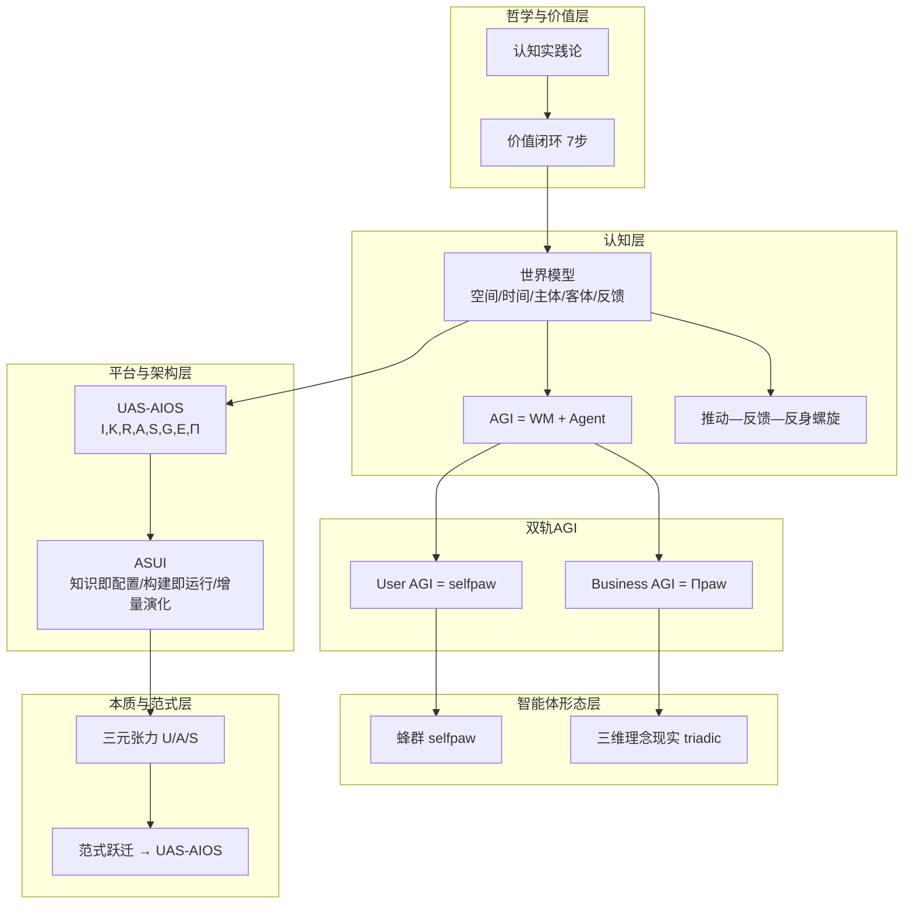
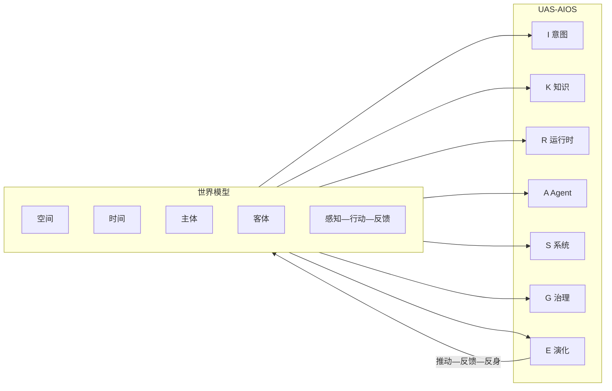
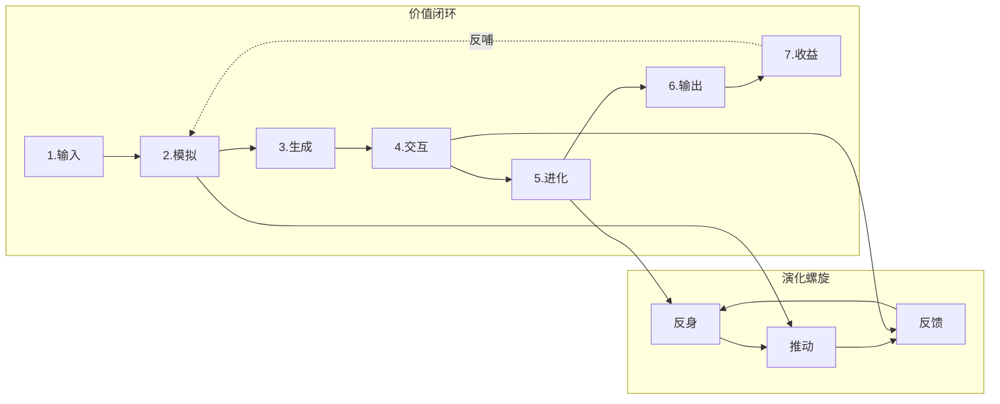
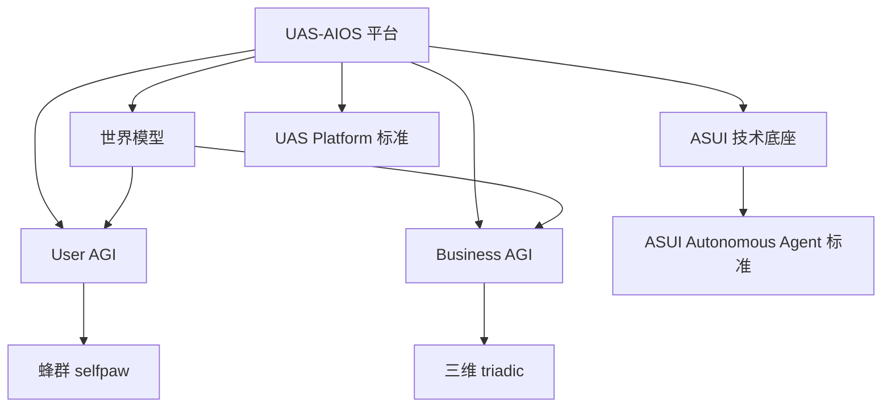

# UAS-AIOS 项目理论体系：方法论综合与关系图谱

> 综合项目中所有方法论及其关系，构建统一的理论体系，并给出可视化表达。  
> 本文档为**总纲**，各方法论细节见对应文档。

---

## 一、理论体系总览

### 1.1 核心命题

**认知实践是生产力创造价值的根本路线。**  
UAS-AIOS 以**世界模型**为认知内核、以**双轨 AGI**（User / Business）为智能载体、以**推动—反馈—反身**为演化螺旋，在**数字世界优先、再连接现实世界、最终理念与现实一体化**的路径上，实现可审计、可演化、切合各主客体视角的价值闭环。

### 1.2 方法论清单与定位

| 方法论 | 定位 | 核心文档 |
|--------|------|----------|
| **认知实践论** | 价值创造的哲学基础；实践→表征→反思→再实践 | 讨论沉淀、本文 §二 |
| **世界模型** | 真实世界反馈能力的模型化；空间/时间/主体/客体/感知行动反馈 | [AGI_WORLD_MODEL_UAS](./AGI_WORLD_MODEL_UAS.md) |
| **AGI = WM + Agent** | 智能的形式化分解；User AGI = selfpaw(UAS-U)，Business AGI = Πpaw(UAS-S) | 同上 |
| **UAS-AIOS** | 平台架构；I,K,R,A,S,G,E,Π；世界模型全面融入 | [UAS_AIOS_ARCHITECTURE](../UAS_AIOS_ARCHITECTURE.md) |
| **ASUI** | 技术底座与知识范式；AI×System×UI；知识即配置、构建即运行、增量演化 | [ASUI_ARCHITECTURE](./ASUI_ARCHITECTURE.md) |
| **蜂群智能体 (selfpaw)** | User AGI 的认知形态；五智能体、第一次否定→第二次否定→辩证融合 | examples/selfpaw-cognitive-swarm |
| **三维理念现实 (triadic)** | 理念—现实一体化；目的激活、宏/中/微观、理念vs现实对冲、实例化、涌现 | examples/triadic-ideal-reality-swarm |
| **三元张力与范式跃迁** | AI 应用本质；认知/执行/知识摩擦；范式相变→UAS-AIOS | [AI_APPLICATION_PARADIGM_REPORT](../AI_APPLICATION_PARADIGM_REPORT.md) |
| **价值闭环（7 步）** | 从问题输入到收益反哺的完整回路 | 讨论沉淀、本文 §二 |
| **推动—反馈—反身螺旋** | 世界模型下的演化机制 | [AGI_WORLD_MODEL_UAS](./AGI_WORLD_MODEL_UAS.md) §2.3 |
| **UAS Platform 标准** | 所有业务应用的技术与运行标准 | [UAS_PLATFORM_STANDARD](./UAS_PLATFORM_STANDARD.md) |
| **ASUI Autonomous Agent 标准** | 知识层、运行时、执行层、工作流阶段的强制约定 | [ASUI_AUTONOMOUS_AGENT_STANDARD](./ASUI_AUTONOMOUS_AGENT_STANDARD.md) |

---

## 二、哲学与价值层：认知实践论与价值闭环

### 2.1 认知实践论

- **核心主张**：认识不是静态反映世界，而是通过**实践**不断生成、修正和进化；实践是认知的起点、动力和检验标准。
- **逻辑结构**：实践 → 表征（可操作模型）→ 行动与反馈（现实裁决）→ 反思与重构（元认知）→ 历史与社会传承。
- **对 AI 的启示**：  
  - 从算法中心转向**实践中心**；  
  - 评估从抽象指标转向**实践表现**；  
  - 数据/标签视为**实践产物**，需治理偏见与制度；  
  - 系统与元系统具备**认知演化**与**治理演化**能力。

### 2.2 价值闭环（7 步）

1. **输入**：真实世界复杂问题 + 行业专家知识  
2. **模拟（虚拟实践）**：数字孪生环境中海量试错与推演  
3. **生成**：多种可能方案或行动建议  
4. **交互（人机协同）**：人类/系统评估与修正，高质量反馈  
5. **进化**：修正数据回流，更新世界模型，预测更准、决策更优  
6. **输出（切中价值流）**：优化后的 AI 代理介入现实工作流，提效降本或创造新产品  
7. **收益**：实际效益反哺系统，支持更大规模模拟与更复杂任务  

**与认知实践论的关系**：价值闭环是认知实践论在工程上的**可执行形态**；世界模型是闭环中「认知」的集中承载，推动—反馈—反身是闭环中「进化」的机制。

---

## 三、认知层：世界模型与 AGI 分解

### 3.1 世界模型

- **定义**：对目标世界的**结构化、可更新认知**，核心价值是**将真实世界的反馈能力模型化**。
- **五维**：空间、时间、**主体**、**客体**、**感知—行动—反馈**。
- **在 UAS-AIOS 中的角色**：  
  - 全面融入 I,K,R,A,S,G,E；  
  - 系统与元系统**自主发现**反馈体系与关键主客体；  
  - 基于主客体进行**交互与交付**；  
  - 任务与交付需做**推动/阻碍/连接**视角的评估与**主客体全链路推演**。

### 3.2 AGI 分解与双轨

- **AGI = World Model ⊕ AI Agent**  
  - World Model：环境、主体、机制、价值、可行动空间的可计算表征。  
  - AI Agent：在 WM 上的推理、规划、执行与学习主体。  

- **User AGI = selfpaw (UAS-U)**：个人侧世界模型 + 个人 Agent（可蜂群形态）。  
- **Business AGI = Πpaw(UAS-S)**：业务侧世界模型 + 多专业 Agent 编排；价值闭环、治理、可审计。

### 3.3 演化机制：推动—反馈—反身螺旋

- **推动**：任务/目标/资源/动作的发出。  
- **反馈**：执行结果、环境反应、主体评价、客体状态变化。  
- **反身**：对假设、策略、世界模型的审视与修正。  
- 演化 = 反馈修正 WM 与策略 + 反身更新「关注哪些反馈与主客体」→ 下一轮推动收敛到**各维度各主客体视角下的最佳选择**。

---

## 四、平台与架构层：UAS-AIOS 与 ASUI

### 4.1 UAS-AIOS

- **形式化**：`UAS-Platform = (I, K, R, A, S, G, E, Π)`  
  - I 意图，K 知识底座（默认 ASUI），R 自主运行时，A Agent 编织，S 系统网格，G 治理，E 演化回路，Π 协议栈。  
- **世界模型**：作为核心一级公民贯穿各层；演化依推动—反馈—反身螺旋；任务与交付做推动/阻碍/连接与主客体推演。  
- **双轨**：U 层实现 User AGI (selfpaw)，A/S 层实现 Business AGI (Πpaw)。

### 4.2 ASUI

- **定义**：AI-System-UI Integration；以**显式知识**为驱动、AI 与系统执行深度融合、支持人机协同**增量演化**的智能系统架构。  
- **三元组**：ASUI = AI 能力层 × System 执行层 × UI 交互层。  
- **原则**：知识即配置、构建即运行、增量演化。  
- **在 UAS 中的位置**：K 层（知识底座）的默认技术标准；所有 UAS 业务应用的技术底座默认 ASUI。

### 4.3 标准体系

- **UAS Platform 标准**：业务应用必须为 sub uas app；技术底座 ASUI、运行架构 autonomous_agent；标准目录与配置清单。  
- **ASUI Autonomous Agent 标准**：Knowledge / Runtime / Execution 分层；标准工作流阶段（intent_activation → … → render_report）；渲染与评估脚本约定。

---

## 五、智能体形态层：蜂群与三维理念现实

### 5.1 蜂群智能体 (selfpaw)

- **用途**：多立场博弈、对冲冲突（如用户、关卡、决策、买单、博弈观察）。  
- **三阶段**：  
  1. **第一次否定**：五智能体独立输出（用户视角、关卡障碍、核心决策、买单价值、博弈观察）。  
  2. **第二次否定**：认知对手盘公开质询。  
  3. **辩证融合**：统一议题、共识/冲突清单、修订路径、风险与成本细则等。  
- **与理论体系的关系**：实现 **User AGI** 的认知形态；在世界模型内体现为多**主体**的立场与反馈通道。

### 5.2 三维理念现实 (triadic)

- **用途**：宏观/中观/微观、理念与现实的张力与统一；目的守恒、可执行可迭代。  
- **阶段**：目的激活 → 三维拆解（理念/现实 × 宏/中/微）→ 理念现实对冲 → 现实实例化 → 交叉验证 → 涌现综合与进化。  
- **与理论体系的关系**：实现**理念—现实一体化**智能；对应世界模型演进路线第三阶段；Business AGI 在复杂决策与方案推演中的方法论。

---

## 六、本质与范式层：三元张力与范式跃迁

### 6.1 三元张力

- **认知摩擦 (U)**：用户将意图转化为系统可执行指令的成本。  
- **执行摩擦 (A)**：系统将指令转化为专业结果的自主程度。  
- **知识摩擦 (S)**：AI 与领域专业知识之间的语义鸿沟。  
- **形式化**：AI 应用系统 P = f(U, A, S) 在约束 C(t) 下的优化；范式 = 特定 C(t) 下的帕累托最优解族；范式跃迁 = C(t) 突破导致解族的离散跳跃。

### 6.2 与 ASUI / UAS-AIOS 的关系

- ASUI 同时降低 U（情景化命令、显式知识）、A（知识驱动的动态编排）、S（显式知识库）。  
- UAS-AIOS 是三轴同时推向高维时的**相变结果**：操作系统级范式，目标驱动 + 知识驱动 + Agent 协作 + 系统执行 + 审计治理 + 演化闭环。

---

## 七、方法论关系总图（文字版）

```
认知实践论（价值创造的哲学基础）
    │
    ├─→ 价值闭环（7 步）─────── 工程化执行形态
    │         │
    │         └─→ 世界模型（认知的集中承载）+ 推动—反馈—反身（进化的机制）
    │
    └─→ 世界模型（真实世界反馈能力模型化）
              │
              ├─ 五维：空间 / 时间 / 主体 / 客体 / 感知—行动—反馈
              ├─ 全面融入 UAS-AIOS；自主发现反馈体系与主客体
              └─ 演化：推动 → 反馈 → 反身 螺旋
                        │
                        ▼
              AGI = World Model + AI Agent
                        │
        ┌───────────────┴───────────────┐
        ▼                               ▼
   User AGI (UAS-U)              Business AGI (UAS-S)
   = selfpaw 蜂群形态            = Πpaw 多专业 Agent 编排
        │                               │
        └───────────────┬───────────────┘
                        ▼
              UAS-AIOS 平台 (I,K,R,A,S,G,E,Π)
                        │
              K 层默认 = ASUI（知识即配置、构建即运行、增量演化）
              R 层 = autonomous_agent；G = 治理；E = 演化回路
                        │
        ┌───────────────┼───────────────┐
        ▼               ▼               ▼
   蜂群 (selfpaw)   三维 (triadic)   三元张力
   User AGI 认知形态  理念—现实一体化   本质：U/A/S 摩擦 → 范式跃迁 → UAS-AIOS
```

---

## 八、可视化说明

- **Mermaid 图**：见本文档下一节「九、Mermaid 关系图」，可在支持 Mermaid 的查看器中渲染。  
- **交互式 HTML**：见 [docs/theory_system_visualization.html](./theory_system_visualization.html)，用于在浏览器中查看与折叠的方法论节点与关系。

---

## 九、Mermaid 关系图

### 9.1 理论体系层级与依赖



### 9.2 世界模型在 UAS-AIOS 中的融入



### 9.3 推动—反馈—反身螺旋与价值闭环对应



### 9.4 方法论应用关系（谁实现谁）



---

## 十、理念与实现一致性

理念体系与当前产品/技术架构的一致性检查见专门报告：  
**[理念体系与产品/技术架构一致性检查](THEORY_ARCHITECTURE_CONSISTENCY_AUDIT.md)**。

简要结论：  
- **已对齐**：UAS 八元组、标准工作流 8 阶段、ASUI 知识层、autonomous_agent 运行时、sub uas app 结构。  
- **部分或未落地**：世界模型（无显式 WM/主客体）、推动—反馈—反身（无三相位显式）、价值闭环 7 步（缺模拟/人机交互/收益反哺）、U 层/User AGI、Studio/Hub/Evolution Center（仅 Runtime 实现）。

---

## 十一、文档索引（按主题）

| 主题 | 文档路径 |
|------|----------|
| 理念与实现一致性检查 | [docs/THEORY_ARCHITECTURE_CONSISTENCY_AUDIT.md](./THEORY_ARCHITECTURE_CONSISTENCY_AUDIT.md) |
| 世界模型与双轨 AGI | [docs/AGI_WORLD_MODEL_UAS.md](./AGI_WORLD_MODEL_UAS.md) |
| UAS-AIOS 架构 | [UAS_AIOS_ARCHITECTURE.md](../UAS_AIOS_ARCHITECTURE.md) |
| ASUI 架构 | [docs/ASUI_ARCHITECTURE.md](./ASUI_ARCHITECTURE.md) |
| ASUI 战略 | [ASUI_STRATEGY.md](../ASUI_STRATEGY.md) |
| AI 应用范式与三元张力 | [AI_APPLICATION_PARADIGM_REPORT.md](../AI_APPLICATION_PARADIGM_REPORT.md) |
| UAS 平台标准 | [docs/UAS_PLATFORM_STANDARD.md](./UAS_PLATFORM_STANDARD.md) |
| ASUI 自主 Agent 标准 | [docs/ASUI_AUTONOMOUS_AGENT_STANDARD.md](./ASUI_AUTONOMOUS_AGENT_STANDARD.md) |
| 蜂群协议 | examples/selfpaw-cognitive-swarm/.claude/skills/swarm_protocol.md |
| 三维协议 | examples/triadic-ideal-reality-swarm/.claude/skills/triadic_protocol.md |
| 招聘 OS 方法论基础 | projects/ai-recruitment-os/docs/METHODOLOGY_FOUNDATION.md |

---

*本文档随项目方法论增补而更新，保持为理论体系总纲与可视化入口。*
