# UAS-AIOS 企业级可视化蓝图

> 本文把 UAS-AIOS 当前的架构理念、产品定义、功能设计、工程架构与 Enterprise Sales OS MVP 规约统一用图形化方式表达。详细文字规约见 [企业级 Agent 生态体系](./UAS_AIOS_ENTERPRISE_AGENT_ECOSYSTEM_L1_L3.md)、[企业级产品蓝图](./UAS_AIOS_ENTERPRISE_PRODUCT_BLUEPRINT.md) 与 [Enterprise Sales OS MVP 开发规约包](./enterprise-sales-os/README.md)。

---

## 1. 从第一性方法论到产品落地

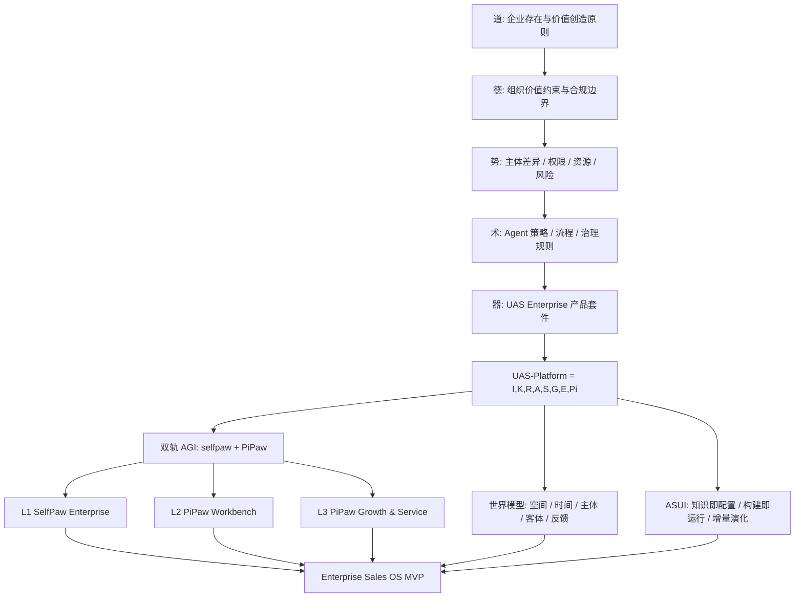

---

## 2. 企业级 L1-L3 数字人生态

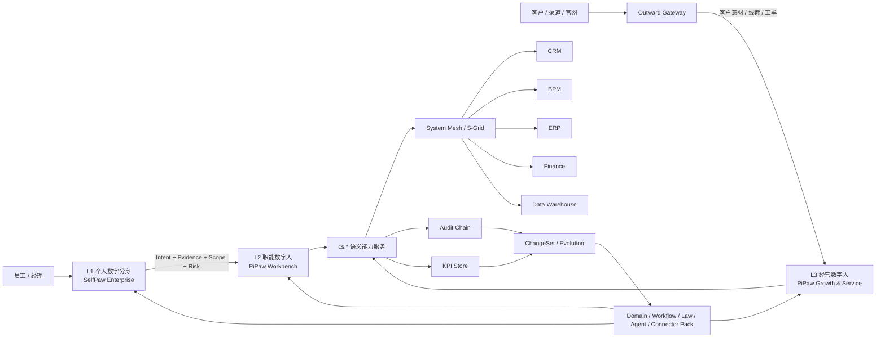

---

## 3. 产品套件关系图

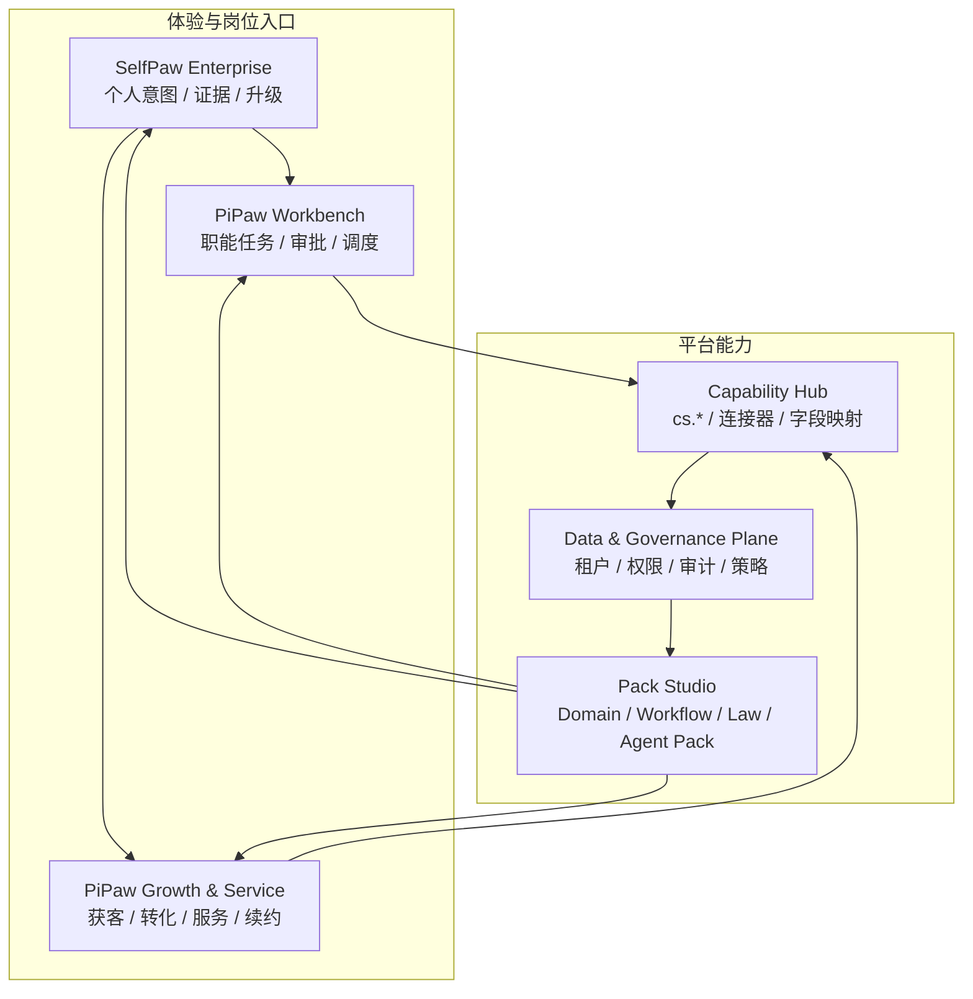

---

## 4. 功能地图

```mermaid
flowchart TB
    Product["UAS Enterprise"]

    Product --> SP["SelfPaw Enterprise"]
    SP --> SP1["组织身份绑定"]
    SP --> SP2["Intent Hub"]
    SP --> SP3["Evidence Capture"]
    SP --> SP4["授权内执行"]
    SP --> SP5["个人蜂群决策"]
    SP --> SP6["向上升级"]

    Product --> PW["PiPaw Workbench"]
    PW --> PW1["Task Inbox"]
    PW --> PW2["Evidence Board"]
    PW --> PW3["Agent Dispatch"]
    PW --> PW4["Approval Gate"]
    PW --> PW5["Decision Memo"]
    PW --> PW6["KPI Attribution"]

    Product --> PGS["PiPaw Growth & Service"]
    PGS --> PGS1["Outward Gateway"]
    PGS --> PGS2["Lead Qualification"]
    PGS --> PGS3["Solution & Quote"]
    PGS --> PGS4["Service & SLA"]
    PGS --> PGS5["Renewal & Upsell"]
    PGS --> PGS6["Customer Audit Trail"]

    Product --> DGP["Data & Governance Plane"]
    DGP --> DGP1["Tenant & Identity"]
    DGP --> DGP2["Scope & Policy"]
    DGP --> DGP3["Audit Chain"]
    DGP --> DGP4["Master Data"]
    DGP --> DGP5["Event Stream"]
    DGP --> DGP6["ChangeSet Center"]

    Product --> CH["Capability Hub"]
    CH --> CH1["Capability Catalog"]
    CH --> CH2["Connector Runtime"]
    CH --> CH3["Field Mapping"]
    CH --> CH4["Policy Adapter"]
    CH --> CH5["Result Normalizer"]

    Product --> PS["Pack Studio"]
    PS --> PS1["Domain Pack"]
    PS --> PS2["Workflow Pack"]
    PS --> PS3["Law Pack"]
    PS --> PS4["Agent Pack"]
    PS --> PS5["Connector Pack"]
    PS --> PS6["Evaluation Pack"]
```

---

## 5. 技术工程分层

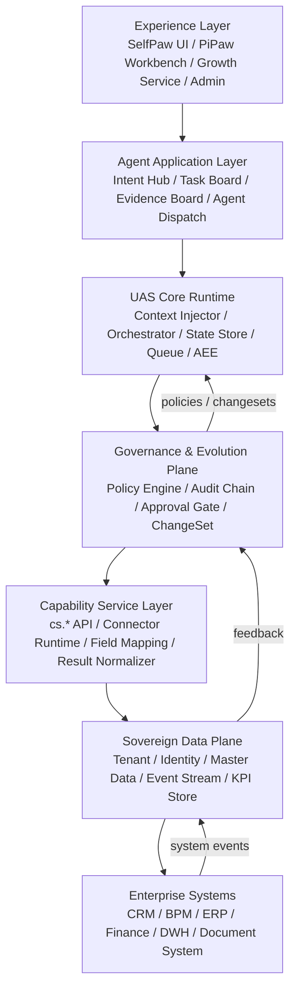

---

## 6. 逻辑服务依赖

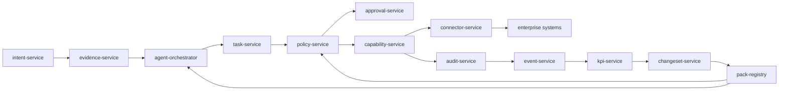

---

## 7. 运行时主路径

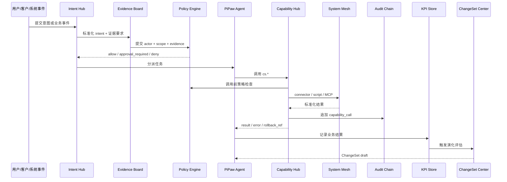

---

## 8. `cs.*` 能力调用图

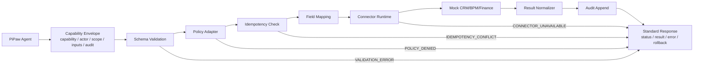

---

## 9. 核心数据模型

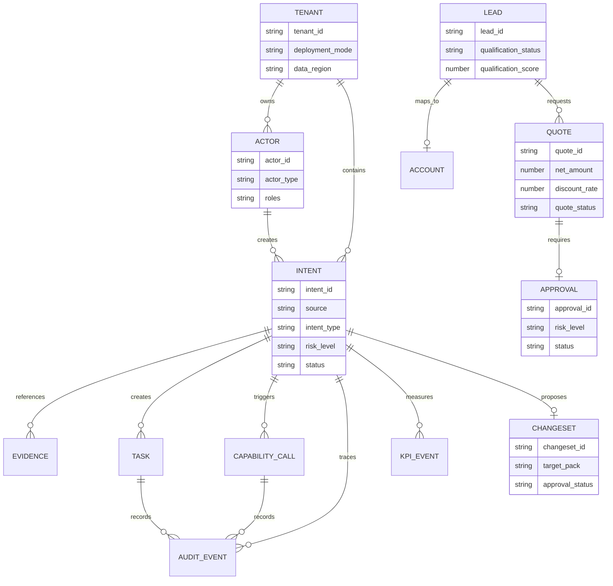

---

## 10. Enterprise Sales OS MVP 闭环

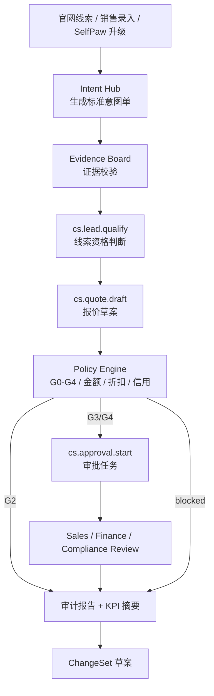

---

## 11. 治理决策树

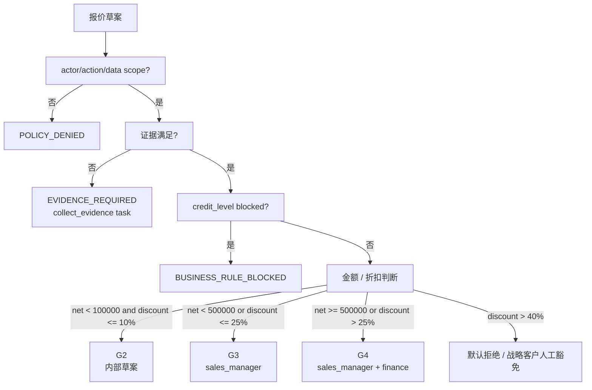

---

## 12. 工作流状态机

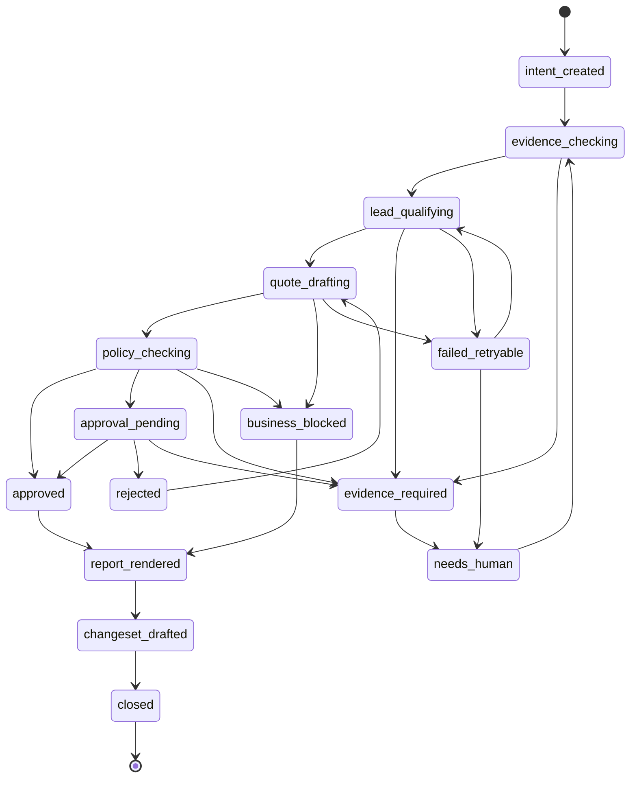

---

## 13. 世界模型五维配置图

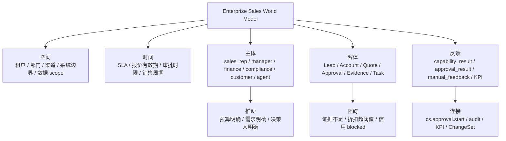

---

## 14. 反馈与 ChangeSet 演化闭环

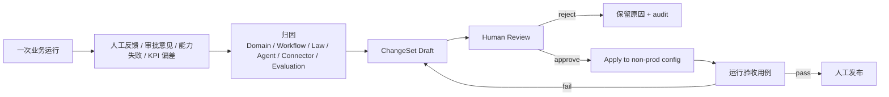

---

## 15. Pack 到运行时的映射

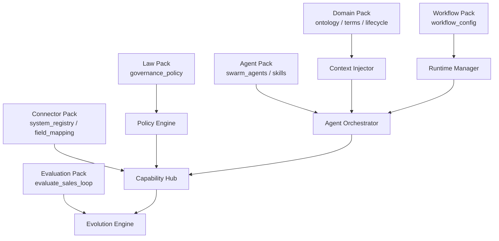

---

## 16. MVP 验收矩阵

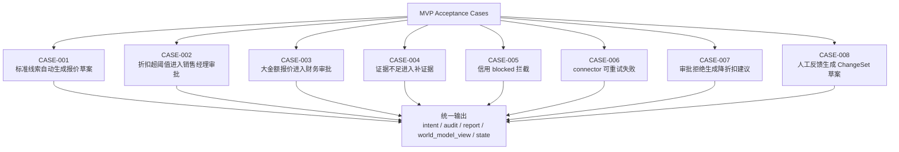

---

## 17. 仓库落地路径

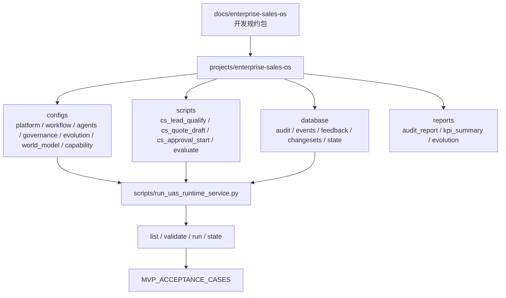

---

## 18. 版本路线图

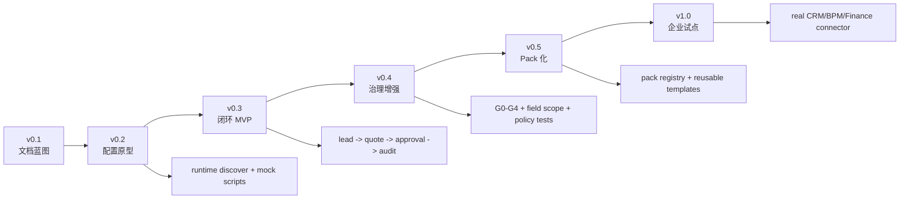
