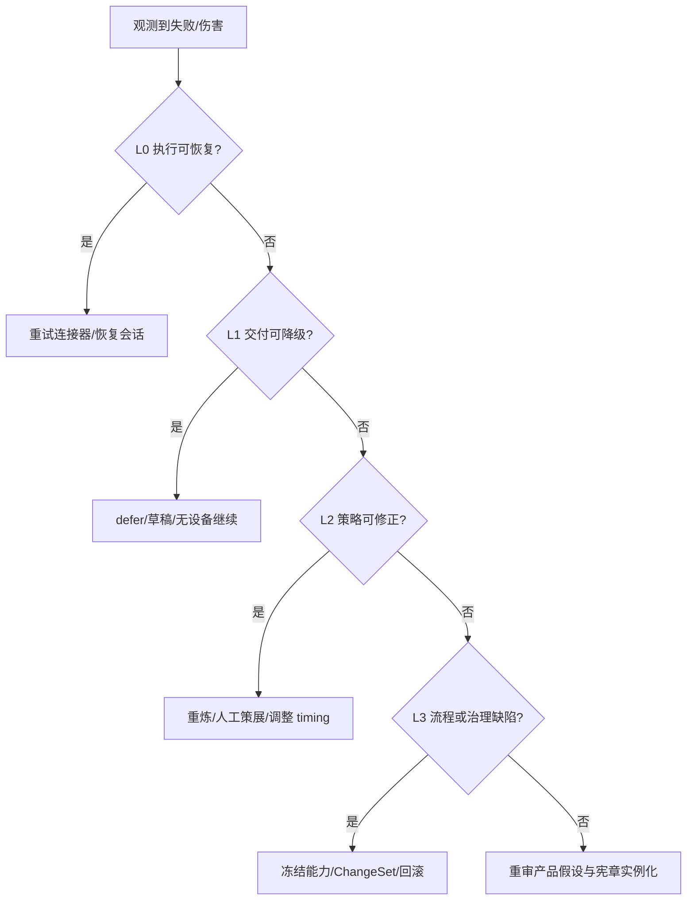

# LifeWake 推导与验证矩阵

> 目的：证明产品不是从功能反推口号，而是从宪章理念经第一性法则落到体验、工程、治理、CASE 与 KPI。符号定义见 [领域模型](./DOMAIN_MODEL.md)。

## 1. 追溯规则

每条上线功能必须具备完整链路：

`Charter → First Principle → Design Principle → Experience Moment → Product → Feature → Agent → Capability → Entity → Governance → CASE → KPI`

缺失任一环即标记 `TRACE_INCOMPLETE`；没有现实反馈 KPI 的理念不能宣称已验证。

## 2. 宪章全链路矩阵

| 宪章理念 | 第一性法则 | 设计原则 | 体验时刻 | 产品模块 | 功能 | Agent | 能力 | 实体 | 治理 | CASE | KPI |
|---|---|---|---|---|---|---|---|---|---|---|---|
| 每个生命都是独奏，值得倾听 | F1 解释主权 | 被理解，不被分析 | 首次单人惊喜揭晓 | Core | 特有来源惊喜 | Signal Weaver + Surprise Alchemist | `lw.surprise.compose` | `SignalBundle`、`RitualEnvelope` | C-01、E-02 | 001 | MRCR、trace 覆盖率 |
| AI 是人性的镜子与创造共谋者 | F7 AI 增强表达 | 先解释再建议 | 展开 inspiration trace | Core | 来源解释与可排除 | Ritual Host | `lw.ritual.render` | `RitualEnvelope` | E-02、A-01 | 001、008 | 来源理解率、冒犯反馈率 |
| 真正连接始于对人的敬畏 | F2 对称可撤回同意 | 双方先于作品 | duet 邀请与共同揭晓 | Bond | 双方 consent + needs gate | Bond Guardian | `lw.pulse.duet` | `Bond`、`ShareGrant` | B-01～B-03 | 005、006 | 双方同意完整率 |
| 产品随用户成长而生长 | F3 反馈裁决现实 | 证据驱动受控演化 | 反馈被确认、策略更新 | Studio | feedback→ChangeSet | Evolution Listener | `lw.feedback.capture`、`lw.changeset.draft` | `EmotionImpact`、`ChangeSet` | EV-01～EV-04 | 014 | ChangeSet 证据完整率 |
| 技术服务爱与自我发现 | F1/F7 | 不诊断、不代发 | solo pulse 结束 | Core | pulse 转艺术 | Pulse Composer | `lw.pulse.compose` | `PulseSession` | P-01、S-01 | 004、012 | 非诊断违规数、完成率 |
| 慢灵感对抗快消费 | F4/F5 时机与稀缺 | 允许不发生 | 第一次 defer | Core | timing gate | Timing Curator | `lw.timing.decide` | `TimingDecision` | T-01～T-03 | 009 | defer 接受率、打扰反馈率 |
| 隐私是灵魂领土 | F1/F6 | 先主权后惊喜 | 授权与撤回 | Privacy | scope/purpose/期限/撤回 | Privacy Steward | `lw.consent.check`、`lw.consent.revoke` | `ConsentGrant` | C-01～C-05 | 002、003、011 | 撤回后新处理次数 |
| 每个功能承载情感重量 | F3 | 用户反馈 + 策展 rubric 门禁 | 低冲击未交付 | Studio/Core | impact review、重炼/策展 | Ritual Host + Curator | `lw.impact.evaluate` | `EmotionImpact` | E-01～E-05 | 008 | 低冲击拦截率、策展一致性 |
| 每次交互是自我确认仪式 | F6 | 内容、来源、动作统一 | RitualView 揭晓 | Core/Memory | `RitualEnvelope` 渲染与保存 | Ritual Host | `lw.ritual.render`、`lw.keepsake.save` | `RitualEnvelope`、`Keepsake` | A-01、R-01 | 001、004 | Ritual 完成率、保存后主动重访率 |
| 关系作品可共同拥有也可退出 | F2/F6 | 共同权利不等于永久绑定 | 共享撤回 | Bond/Memory | revoke share | Bond Guardian | `lw.share.revoke` | `ShareGrant`、`Keepsake` | B-04、R-02 | 010 | 共享撤回成功率/时延 |
| 平凡者成为自己的艺术家 | F1/F3 | 用户可反馈、改编、删除 | “还不对”后重炼 | Core/Studio | feedback + rework | Surprise Alchemist + Evolution Listener | `lw.feedback.capture` | `EmotionImpact` | E-03、EV-01 | 008、014 | 负反馈闭环率 |
| 保护脆弱主体优先于创作完成 | F1/F7 | 安全失败 | 未成年人/高危信号 | Privacy | age/safety gate | Privacy Steward | `lw.policy.check` | `PolicyDecision` | M-01～M-03、S-01 | 011、013 | 安全违规数（0） |

## 3. 第一性法则可证伪矩阵

| 法则 | 假设 | 现实观测 | 支持信号 | 反证信号 | 决策 |
|---|---|---|---|---|---|
| F1 解释主权 | 来源解释增加“被理解”感 | 揭晓后反馈、来源展开/排除 | 来源理解率与 MRCR 同升 | 用户感到被监视、排除率高 | 收紧信号、重写解释或停止来源 |
| F2 对称同意 | 双方门禁提高信任且仍可完成 duet | 邀请接受、退出、争议 | 双方完成且撤回无争议 | 催促/误解增加、单方施压 | 简化邀请、限制提醒、停止功能 |
| F3 反馈裁决 | 用户反馈能推翻 rubric/模型并改善后续体验 | 负反馈→ChangeSet→实验 | 后续 MRCR 提升且护栏稳定 | 评分优化但用户反馈恶化 | 回滚 rubric/模型 |
| F4 时机重要 | defer 优于不合时宜的即时交付 | defer 后取消/接受/后续揭晓 | 打扰下降、后续完成稳定 | 用户困惑或长期不再发生 | 调整解释和重评窗口 |
| F5 稀缺保护仪式 | 更少触达不损害意义留存 | 周频率与主动回访 | 低频下主动重访/付费稳定 | 用户需要更明确的主动入口 | 增强 pull，不增加 push |
| F6 语境与控制造就记忆 | trace/导出/删除增强长期信任 | Vault 重访、导出、删除 | 主动重访且撤回无泄漏 | 锁定投诉、语境不可理解 | 开放格式、缩短保留 |
| F7 AI 增强而不替代 | 不代发仍能创造关系价值 | duet 反馈、外发请求 | 共同创作完成，无冒充争议 | 用户只因自动代发才使用 | 不突破红线，重审定位 |

## 4. 宏观—中观—微观交叉验证

| 宏观承诺 | 中观价值回路 | 微观实体/动作 | 界面/触点 | 系统承载 | 验证 CASE | 断裂判定 |
|---|---|---|---|---|---|---|
| 用户拥有灵魂领土 | 授权→使用→撤回 | `ConsentGrant.revoke()` | Consent Center | `lw.consent.revoke` + audit | 002、003 | 撤回后仍生成/推送 |
| 生命信号成为意义 | 信号→创作→解释→反馈 | 选择 signal、揭晓、反馈 | Source Picker/RitualView | compose/render/feedback | 001、008 | 无特有来源或无法反馈 |
| 慢灵感 | timing→defer→重评 | 查看原因/取消 | Ritual Stream | `TimingDecision` | 009 | defer 被当失败或无限等待 |
| 双向关系 | 邀请→逐方同意→共创→退出 | 接受/暂停/revoke | Bond Space | Bond gate/share revoke | 005、006、010 | 单方可强制共享 |
| 可撤回记忆 | 保存→重访→导出/删除 | Vault 权利动作 | Keepsake Vault | save/export/delete | 010 | 共同资产无逐方权利 |
| 安全优先 | age/safety gate→受限路径 | 本地体验/退出 | Consent Center/safety hold | policy service | 011、013 | 未成年人可外发或高危娱乐化 |
| 可演化不失控 | feedback→归因→ChangeSet→审批 | 策展评审/回滚 | Studio | ChangeSet service | 014 | 自动应用或扩大 purpose |

### 4.1 三问检查

1. **宏观→中观**：每个价值承诺是否有一条可运行回路？
2. **中观→微观**：每个回路是否有明确主体、对象、动作、触点和状态？
3. **微观→系统**：每个动作是否有数据来源、能力合约、治理门禁、审计和补偿？

任何回答为否，产品只完成了叙事，没有完成实例化。

## 5. 产品矩阵交叉验证

| 母体语法步骤 | Core | Bond | Memory | Privacy | Studio |
|---|---|---|---|---|---|
| 授权生命材料 | 读取授权材料 | 双方分别授权 | 读取保留策略 | 主责 | 只能看去标识证据 |
| 可解释创作 | 主责 | 共同创作 | 保存 trace | 校验用途 | 提供模板/rubric |
| 合适时机 | TimingDecision | 双方 ready 窗口 | 回访节奏 | 安静期 | 调整策略 |
| 私人/共同仪式 | RitualView | duet Ritual | 形成 Keepsake | 权利标识 | 质量门禁 |
| 主权记忆 | 选择保存 | 共同归属 | 主责 | 删除/导出/撤回 | 无原始访问 |
| 受控演化 | 反馈入口 | 双方反馈 | 保留/撤回事件 | scope 不可扩大 | ChangeSet 主责 |

## 6. 失败回退层级

| 层级 | 失败类型 | 回退动作 | 数据动作 | 再进入条件 | 例 |
|---|---|---|---|---|---|
| L0 执行 | 临时 connector/网络失败 | 有界重试 | 不扩大输入、不重复扣费 | 幂等恢复 | CASE-007 |
| L1 交付 | 断连、时机不合、材料不足 | 暂停、降级、defer、取消 | 保留最小恢复点 | 用户重连或到重评时间 | CASE-009、012 |
| L2 策略 | 低冲击、trace 空泛 | 重炼或人工策展 | 记录 `EmotionImpact` | 新版本通过门禁 | CASE-008 |
| L3 流程/治理 | 同意、共享、未成年人规则缺陷 | 阻断能力、回滚配置 | 清理未交付资产、保留审计 | 独立审批与回归 CASE | CASE-003、010、011 |
| L4 产品/法则 | 持续冒犯、关系伤害、商业冲突 | 停止功能，重审定位 | 最小保留/用户通知 | 宪章与现实重新验证 | 护栏连续失败 |

### 6.1 不允许的回退

- 用降低隐私或共享门槛换取完成率。
- 把用户负反馈归因为“用户不懂作品”。
- 重试时悄悄扩大数据源或调用第三方。
- 用模型高分覆盖用户低反馈。
- 用增长实验修改同意、撤回、未成年人或安全红线。

## 7. CASE—KPI 覆盖

| CASE | 核心链路 | 主要 KPI | 护栏 |
|---|---|---|---|
| 001 | 授权惊喜成功 | MRCR、trace 覆盖率 | 冒犯反馈率 |
| 002 | 无同意拒绝 | consent gate 正确率 | 未授权处理数=0 |
| 003 | 创作中撤回 | 撤回生效时延 | 撤回后新处理数=0 |
| 004 | solo pulse | Ritual 完成率 | 非诊断违规数=0 |
| 005 | duet 成功 | 双方完成率 | 双方同意完整率=100% |
| 006 | 非双向拦截 | Bond gate 正确率 | 单方共享数=0 |
| 007 | 连接器恢复 | 恢复成功率 | 重复交付数=0 |
| 008 | 低冲击 | 低冲击拦截率 | 模型越权裁决数=0 |
| 009 | 慢灵感 defer | defer 接受率 | 打扰反馈率 |
| 010 | 共享撤回 | 撤回成功率/时延 | 撤回后访问数=0 |
| 011 | 未成年人 | 年龄策略正确率 | 外发违规数=0 |
| 012 | 设备断连 | 会话安全恢复率 | 误诊断文案数=0 |
| 013 | 高危安全路径 | 安全路由正确率 | 娱乐化生成数=0 |
| 014 | 串联反馈→ChangeSet | 证据完整率 | auto_apply 数=0 |

## 8. 发布门禁

发布必须同时满足：

- 追溯链完整，无 `TRACE_INCOMPLETE`。
- 相关 MVP CASE 与回归 CASE 通过。
- 北极星方向改善或至少不恶化。
- 所有主权、安全、关系护栏通过；护栏具有否决权。
- ChangeSet 有证据、影响范围、审批人、回滚点。
- 产品负责人确认 UAS 仍是承载，不替代用户价值叙事。

