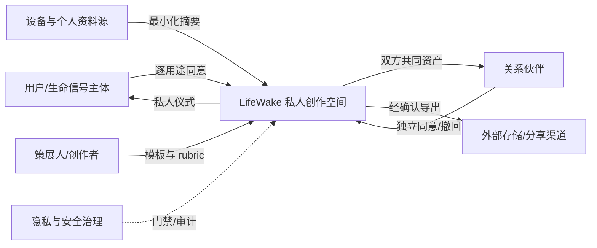
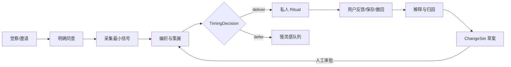
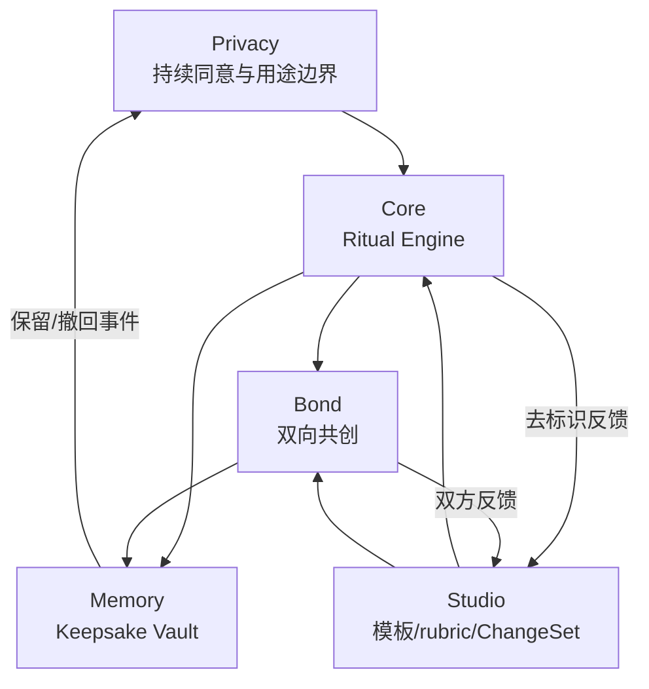
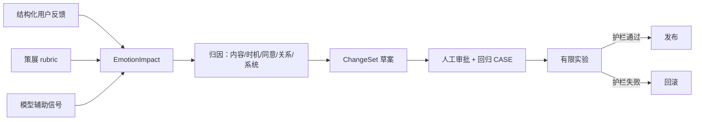

# LifeWake 产品蓝图

> 版本：v1.0 产品体系基线  
> 定位：从生命信号到私人仪式、关系共鸣与可撤回记忆的情感创作产品  
> 本文是 L1 产品母体；体验、功能与工程规约见 [README](./README.md)。

## 0. Executive Summary

LifeWake 不是健康监测、效率助手、社交内容流或“数字永生”工具。它把用户主动授权的微小生命信号——一段哼唱、一次心跳、一张照片、一句想念——转化为可感知、可解释、可撤回的私人仪式，让人感到“我的此刻被看见了”。

产品母体由五个相互约束的产品域组成：

| 产品域 | 用户价值 | 核心触点 | 核心对象 |
|---|---|---|---|
| **LifeWake Core** | 把信号变成恰逢其时的私人仪式 | Ritual Stream | `RitualEnvelope` |
| **LifeWake Bond** | 让关系双方共同创作，而非单向监控 | Bond Space | `Bond`、`DuetSession` |
| **LifeWake Memory** | 保存可重访、可迁移、可撤回共享的生命纪念物 | Keepsake Vault | `Keepsake` |
| **LifeWake Privacy** | 让用户持续看见并控制数据用途 | Consent Center | `ConsentGrant`、`ShareGrant` |
| **LifeWake Studio** | 让策展人安全地设计模板、rubric 与内测实验 | Curation Studio | `RitualTemplate`、`CurationRubric`、`ChangeSet` |

首个 MVP 聚焦三条完整闭环：单人惊喜、solo pulse、双方同意的 duet。UAS-AIOS 提供意图、Agent、能力、治理、审计与演化承载，但它是产品基础设施，不是用户叙事中心。

## 1. 基础目的锚点

### 1.1 基础目的

**让个体在不被画像、不被催促、不被占有的前提下，感知自身生命的独特性，并与重要的人共同留下可撤回的情感作品。**

### 1.2 守恒约束

任何功能、实验、商业化或模型升级都必须同时回答：

1. 它是否增加“被理解”而不是“被分析”的感受？
2. 用户是否知道用了什么数据、为什么此刻出现、如何撤回？
3. 关系价值是否对双方成立？
4. 它是否尊重等待、沉默和不参与？
5. 失败时是否安全退回草稿、延期或人工策展？

若任一答案为否，功能不得以增长或自动化为理由上线。

## 2. 问题定义与第一性原理

### 2.1 现实问题

| 张力 | 现实表现 | LifeWake 的问题定义 |
|---|---|---|
| 数据很多，意义很少 | 可穿戴数据停在曲线和分数 | 如何把信号转为不做诊断的个人意义？ |
| 内容很多，独特性很少 | 推荐流追求停留而非自我确认 | 如何创造“只属于我”的有限作品？ |
| 连接很多，关系仍单向 | 共享常等同于发送、监控或占有 | 如何让双方分别同意、共同受益、随时撤回？ |
| AI 很快，灵感需要时间 | 即时生成造成模板感和打扰 | 如何允许系统明确说“现在不该打扰”？ |
| 评分看似客观，情感不可裁决 | 模型分数被误当用户感受 | 如何把模型降为辅助证据，把用户反馈作为现实裁决？ |

### 2.2 第一性法则

| 法则 ID | 第一性法则 | 可证伪条件 | 产品推论 |
|---|---|---|---|
| F1 | 人对生命意义拥有解释主权 | 系统标签替代用户自述 | 不做人格、关系、健康结论 |
| F2 | 亲密连接必须由持续、对称、可撤回的同意构成 | 一方可永久控制共同作品 | 双人动作逐方授权，共享可撤回 |
| F3 | 情感价值由体验者反馈验证，不由模型宣告 | 模型分高却用户感到冒犯 | `EmotionImpact` 记录用户反馈与 rubric 证据 |
| F4 | 合适时机与内容同等重要 | 好内容在错误时机造成打扰 | `TimingDecision` 可选择 defer |
| F5 | 稀缺与停顿能保护仪式感 | 频率优化退化为刷屏 | 不以时长、DAU 或推送量为北极星 |
| F6 | 记忆价值依赖来源、语境与控制权 | 作品脱离来源或不可删除 | 每件作品有 trace、用途与保留策略 |
| F7 | AI 应增强表达，不应替代关系主体 | 自动代发制造虚假亲密 | MVP 不代发；外发逐次确认 |

### 2.3 非目标

- 不做医疗诊断、心理诊断或风险评分。
- 不做广告画像、保险/就业/信用用途。
- 不做无限信息流、连续签到、羞耻式召回。
- 不做伴侣监控、关系评分、位置追踪。
- 不做未经审核的数字分身代聊。
- 不宣称模型能客观测量爱、共鸣或“真实情感”。

## 3. 道德势术器

| 层 | LifeWake 定义 | 产品落点 |
|---|---|---|
| **道** | 每个生命时刻都具有不可替代的主体意义 | 私人仪式而非数据管理 |
| **德** | 隐私领土、解释主权、双向同意、慢灵感 | Consent Center、反增长原则 |
| **势** | 被看见/被分析、连接/占有、即时/等待的张力 | `TimingDecision`、Bond 双方需求 |
| **术** | 低打扰策展、来源解释、渐进授权、安全回退 | Agent 协作、策展 rubric、defer |
| **器** | Ritual Stream、Bond Space、Keepsake Vault、Studio | `lw.*` 能力与可运行 subapp |

这里的“器”必须回测“德”：技术可做不等于产品该做。

## 4. 宏观—中观—微观现实实例化

### 4.1 宏观生态



生态原则：设备方只提供授权数据；生成供应商只处理最小化输入；策展人不能浏览用户原始内容；外部渠道不能成为默认目的地。

### 4.2 中观价值回路



价值不是“生成完成”，而是用户完成一次有主权的自我确认或双向共鸣，并且反馈能修正下一轮。

### 4.3 微观现实实体、动作与承载

| 现实主体/客体 | 界面或触点 | 数据 | 用户动作 | 流程节点 | 系统承载 |
|---|---|---|---|---|---|
| 本人 | Consent Center | scope、用途、期限 | 授权/暂停/撤回 | consent gate | `ConsentGrant`、`lw.consent.check` |
| 哼唱/照片/心情提示 | Source Picker | 最小摘要、来源引用 | 选择/排除 | signal weaving | `SignalBundle` |
| 心跳设备 | Pulse Setup | 会话级 pulse 摘要 | 连接/断开 | device linking | `DeviceLink`、`lw.pulse.compose` |
| 惊喜仪式 | Ritual Stream | 作品、trace、timing | 揭晓/保存/meh | ritual delivery | `RitualEnvelope` |
| 关系双方 | Bond Space | 双方 scope、needs | 邀请/接受/退出 | bond gate | `Bond`、`lw.pulse.duet` |
| 纪念物 | Keepsake Vault | 资产、归属、共享状态 | 重访/导出/撤回 | retention/share | `Keepsake`、`ShareGrant` |
| 策展人 | Curation Studio | 去标识反馈、rubric | 评审/调阈值/发布 | evolution review | `CurationReview`、`ChangeSet` |

## 5. 产品定位与差异化

### 5.1 一句话定位

**LifeWake 是一个把个人生命信号转化为私人仪式和双向纪念物的情感创作产品。**

### 5.2 替代方案对比

| 替代方案 | 擅长 | LifeWake 的差异 |
|---|---|---|
| 可穿戴健康 App | 测量与趋势 | 不做诊断，把会话信号转为作品 |
| 生成式内容工具 | 快速生成 | 以来源、时机、同意和策展质量为门禁 |
| 社交平台 | 分发与互动 | 默认私人、无无限流、共享可撤回 |
| 相册/日记 | 存档 | 把多模态信号编织为可重访仪式 |
| 情侣 App | 打卡与互动 | 不做关系分数，强调双方需求和独立主权 |

## 6. 目标用户与 JTBD

| 用户 | 情境 | JTBD | 成功感受 | 主要阻力 |
|---|---|---|---|---|
| 情感敏感的个人 | 平凡、孤独或创作停滞时 | “帮我重新听见自己的此刻” | 被理解而非被推荐 | 隐私担忧、模板感 |
| 异地/亲密关系双方 | 想念但不想强迫表达时 | “让我们共同留下一个双方都愿意的时刻” | 连接而非监控 | 同意不对称、设备断连 |
| 记忆保存者 | 想保存某段人生材料时 | “把碎片变成有来源的纪念物” | 可重访、可迁移 | 数据锁定、语境丢失 |
| 内测策展人 | 生成内容质量不稳定时 | “安全地提升仪式质量而不窥探隐私” | 证据充分、可回滚 | 反馈稀疏、rubric 漂移 |

首发核心人群是愿意参与邀请制内测的个人与关系双人组；未成年人不是增长目标，只提供受限本地体验。

## 7. 产品母体与产品矩阵

### 7.1 母体

LifeWake 母体不是五个独立 App，而是一条统一产品语法：

`授权的生命材料 → 可解释的创作 → 合适的时机 → 私人/共同仪式 → 主权记忆 → 受控演化`

### 7.2 产品矩阵

| 产品 | P0 | P1 | P2 |
|---|---|---|---|
| **Core** | 单人惊喜、solo pulse、Ritual Stream、慢灵感 defer | 多模态仪式组合、手动策展请求 | 情境化仪式空间 |
| **Bond** | duet 邀请、双方同意、共享撤回 | 异步双人共创、关系仪式模板 | 小型家庭/挚友圈 |
| **Memory** | 保存/删除/导出纪念物、来源 trace | 记忆时光机、主题回访 | 用户自有存储与跨服务迁移 |
| **Privacy** | Consent Center、用途/期限、撤回与审计摘要 | 本地优先、供应商透明度 | 可验证隐私计算与个人数据仓 |
| **Studio** | rubric、失败策展、ChangeSet 审批 | 模板发布、实验分层、回放 | 创作者生态与审核市场 |

### 7.3 产品关系



Privacy 是所有产品的横向前置条件；Studio 只能操作模板、rubric 和去标识反馈，不直接成为用户内容后台。

## 8. P0 / P1 / P2 功能矩阵

| 能力域 | P0（验证基础目的） | P1（深化价值） | P2（扩展生态） |
|---|---|---|---|
| 授权 | 按用途/scope/期限授权、暂停、撤回 | 分设备授权、授权收据导出 | 用户自管密钥/个人数据仓 |
| 信号 | 手动选择低敏感信号、会话 pulse | 多源材料组合 | 本地情境感知 |
| 时机 | `deliver/defer/cancel` 可解释决策 | 用户节奏偏好、安静期 | 本地时机推断 |
| 创作 | song/artwork/task mock、solo/duet pulse | 记忆叙事、多模态编排 | 第三方策展模板 |
| 仪式 | `RitualEnvelope`、揭晓、trace、反馈 | 可重访章节、手动改编 | 空间化/环境化体验 |
| 关系 | 双方独立同意、needs、共享撤回 | 异步共同贡献 | 家庭/挚友多方协议 |
| 记忆 | 保存、删除、导出、共享状态 | 主题回访与迁移 | 开放纪念物格式 |
| 治理 | 未成年人限制、危机降级、审计 | 供应商治理、区域策略 | 独立透明度验证 |
| 演化 | 用户反馈 + rubric → ChangeSet 草案 | 分层实验、回滚 | 模板生态质量治理 |

详细前后条件、异常与验收见 [FUNCTIONAL_DESIGN](./FUNCTIONAL_DESIGN.md)。

## 9. 体验系统

### 9.1 四个一级空间

1. **Ritual Stream**：有限、非滚动成瘾的仪式入口；每次只呈现一个值得注意的时刻。
2. **Consent Center**：按“数据—用途—受益者—期限”管理同意。
3. **Bond Space**：展示双方贡献、同意与共享状态，不展示关系分数。
4. **Keepsake Vault**：保存、解释、导出、删除及撤回共同资产。

### 9.2 关键体验承诺

- 三步内看懂“为何是我、为何是现在、用了什么”。
- 撤回入口不弱于分享入口。
- 慢灵感明确显示为尊重，而不是加载失败。
- duet 中任何一方断连或撤回时，先保护关系，再保护作品。
- 低情感冲击不伪装成功：进入草稿、重炼或人工策展。

完整旅程与 `RitualView` 模型见 [PRODUCT_EXPERIENCE_DESIGN](./PRODUCT_EXPERIENCE_DESIGN.md)。

## 10. 工程与运行承载

### 10.1 产品优先分层

```text
Experience: Consent Center / Ritual Stream / Bond Space / Keepsake Vault / Studio
Product:    Ritual / Timing / Bond / Memory / Feedback services
Intelligence: Signal Weaver / Surprise Alchemist / Pulse Composer / Ritual Host
Governance: Privacy Steward / Bond Guardian / policy / audit / curation gate
Systems:    device connector / generator / encrypted object store / notification
Runtime:    UAS intent + orchestration + capability + ChangeSet
```

UAS 八元组映射只承担工程完整性：

| UAS | LifeWake 承载 |
|---|---|
| I | surprise、pulse、duet、revoke、feedback 意图 |
| K | 宪章、rubric、模板、治理策略 |
| R | 状态机、幂等、重试、恢复点 |
| A | 创作、时机、关系、隐私、演化 Agent |
| S | 设备、生成器、存储、通知连接器 |
| G | 同意、未成年人、分享、情感门禁 |
| E | 反馈归因、ChangeSet、审批与回滚 |
| Π | `RitualEnvelope` 与 `lw.*` 合约 |

### 10.2 关键工程对象

- `EmotionImpact`：用户反馈、策展 rubric、模型辅助信号和结论；不代表情感真理。
- `TimingDecision`：`DELIVER_NOW | SLOW_INSPIRATION_DEFERRED | CANCELLED` 及理由、最早重评时间。
- `RitualEnvelope`：内容、来源、时机、同意、动作与治理元数据的交付信封。
- `ShareGrant`：共同资产逐方共享许可；撤回触发 `SHARE_REVOKED`。

数据、状态与能力详见 [DOMAIN_MODEL](./DOMAIN_MODEL.md)、[WORKFLOW_STATE_MACHINE](./WORKFLOW_STATE_MACHINE.md)、[CAPABILITY_CONTRACTS](./CAPABILITY_CONTRACTS.md)。

## 11. 治理与信任

### 11.1 情感冲击门禁的正确含义

**情感冲击测试不是模型真理，而是“用户反馈 + 策展 rubric”的可解释门禁。**

模型可提供新颖度、来源覆盖或潜在冒犯风险等辅助信号，但不能宣告用户会感动。首次体验的发布决策必须记录：

- 用户显式反馈或同类内测反馈；
- 策展 rubric 各维证据与评审人；
- 模型辅助信号及其不确定性；
- `deliver / rework / curate / defer` 结论和可申诉路径。

### 11.2 治理红线

- 无有效同意不得采集、生成、通知或共享。
- duet 每位参与者分别授权；一方撤回立即 `SHARE_REVOKED`。
- 原始连续心跳默认不持久化，不能用于诊断。
- 未成年人禁用 duet 外部共享与公开导出。
- 高危内容不娱乐化、不自动诊断，停止生成并转人工安全路径。
- ChangeSet 永不自动扩大用途或自动发布。

## 12. 指标体系

### 12.1 北极星指标

**Meaningful Ritual Completion Rate（MRCR，有意义仪式完成率）**

在获得有效同意并实际揭晓的合格仪式中，满足“用户确认有意义”且未在安全窗口内因冒犯/误触撤回的比例。

该指标同时要求价值与信任；不能靠增加推送、时长或重复触达抬高。公式、指标树、事件与实验见 [METRICS_GROWTH_AND_BUSINESS](./METRICS_GROWTH_AND_BUSINESS.md)。

### 12.2 护栏

| 类型 | 指标 |
|---|---|
| 主权 | 撤回生效时延、撤回后新处理次数（必须为 0） |
| 关系 | 双方同意完整率、共享撤回成功率 |
| 节奏 | defer 正确率、打扰反馈率、单位用户周推送数 |
| 质量 | trace 覆盖率、低冲击重炼率、策展一致性 |
| 公平安全 | 未成年人违规次数、高危路径错误娱乐化次数 |

## 13. 演化闭环

LifeWake 的演化不是后台自动“更懂用户”，而是受控的产品学习：



演化守则：

- 用户反馈可以推翻 rubric 与模型信号，反之不成立。
- ChangeSet 必须有证据、假设、影响范围、护栏、回归 CASE 和回滚点。
- `auto_apply=false`；不能扩大 `create_for_user` 或新增隐性 scope。
- 低冲击先回退内容/时机策略；主权或关系伤害回退治理；持续无意义回退产品假设。
- 详细协议见 [FEEDBACK_CHANGESET](./FEEDBACK_CHANGESET.md)。

## 14. MVP

### 14.1 验证假设

1. 来源可解释的私人仪式比通用生成内容更易产生“被理解”感。
2. 用户接受会话级生命信号创作，前提是用途清楚且可撤回。
3. duet 的双向协议不会显著破坏惊喜，反而增强信任。
4. 明确 defer 比低质量即时交付更符合慢灵感。
5. 反馈可形成可审查 ChangeSet，而不需要自动学习用户画像。

### 14.2 P0 范围

- 单人惊喜：授权 → 信号选择 → 时机决策 → 仪式 → 反馈。
- solo pulse：设备连接 → 会话创作 → 仪式 → 保存。
- duet：邀请 → 双方授权/needs → 会话 → 共同纪念物 → 任一方撤回。
- 低冲击、慢灵感、设备断连、未成年人、连接器失败的完整回退。
- 去标识反馈 → ChangeSet 草案，`auto_apply: false`。

### 14.3 不包含

- 真实医疗级解释、自动公开分享、数字分身代发。
- 背景持续监听、中高敏感信号推断、关系评分。
- 自动发布 ChangeSet、开放模板市场、复杂多方 Bond。

### 14.4 完成定义

- [MVP_ACCEPTANCE_CASES](./MVP_ACCEPTANCE_CASES.md) CASE-001～014 全部有确定结果。
- 每条路径生成 `RitualEnvelope` 或明确失败/延期信封。
- consent、timing、capability、feedback、share revoke 全链路审计。
- 所有理念能在 [DERIVATION_AND_VALIDATION_MATRIX](./DERIVATION_AND_VALIDATION_MATRIX.md) 追溯到 CASE 与 KPI。

## 15. 交付形态

| 阶段 | 面向用户 | 面向策展/运营 | 工程形态 |
|---|---|---|---|
| 文档/可运行原型 | 邀请制 Web ritual preview | rubric 与报告文件 | 单一 `projects/lifewake` subapp + mock connector |
| 私密 Beta | 移动 Web/轻 App、设备会话 | Curation Studio 内测台 | 托管控制面 + 加密个人数据域 |
| 正式产品 | iOS/Android/桌面伴随入口 | 模板发布与治理台 | 多区域服务；可选本地/个人云存储 |
| 生态阶段 | 开放纪念物格式与受审模板 | 创作者 Studio | SDK/协议；供应商可替换 |

交付不以“把 UAS 卖给用户”为目标；用户购买的是仪式、关系和记忆体验。

## 16. 商业模式与 GTM

### 16.1 商业原则

- 核心同意、撤回、导出和删除能力永不作为付费墙。
- 不出售用户数据、不以广告画像变现。
- 不按推送次数或停留时长激励团队。
- 付费来自创作价值、长期保管与高质量策展，而非制造焦虑。

### 16.2 模式

| 层 | 收费对象 | 价值 | 边界 |
|---|---|---|---|
| Free | 个人 | 基础 Ritual、Consent Center、有限 Vault | 主权功能完整 |
| Individual | 个人 | 更多高品质模态、长期版本与导出 | 不提高打扰频率 |
| Bond | 双方共同选择 | duet、共同 Vault、关系仪式包 | 任一方可退出，不锁定共同资产 |
| Studio | 受审创作者/机构 | 模板制作、测试、发布工具 | 不能访问用户原始数据 |
| Storage add-on | 个人 | 用户选择的加密保管 | 支持迁移，不制造锁定 |

### 16.3 GTM

1. **邀请制内测**：创作者、异地伴侣、小型情感科技社群；验证惊喜质量和信任。
2. **标志性 ritual 分享**：只分享经用户主动导出的作品封面/片段，链接默认过期。
3. **设备合作试点**：以会话级 API 集成，不获取持续健康画像。
4. **策展合作**：邀请音乐人、视觉艺术家制作 rubric 与模板，不做名人流量内容池。
5. **付费验证**：比较“作品/保管价值”付费意愿，不测试焦虑召回或功能封锁。

不编造 TAM/SAM/SOM；市场判断以访谈、邀请转化、付费实验与留存后的主动回访验证。

## 17. 路线图

| 阶段 | 产品目标 | 核心交付 | 退出门槛 |
|---|---|---|---|
| **v0.1 规约** | 理念到 CASE 可追溯 | 本文档体系、14 CASE | 链接/术语/追溯一致 |
| **v0.2 runnable MVP** | 三条 P0 闭环可运行 | mock subapp、审计、报告 | 14 CASE 通过 |
| **v0.3 curated alpha** | 证明有意义且不打扰 | Ritual preview、人工策展 | MRCR 与护栏达到内测阈值 |
| **v0.5 private beta** | 验证真实设备与双方信任 | 移动体验、设备接入、Vault | 撤回零泄漏、duet 双方满意 |
| **v1.0** | 形成可持续个人产品 | Core/Bond/Memory/Privacy | 付费不损害反增长护栏 |
| **v2.0 Studio** | 建立受治理策展生态 | 模板协议、创作者工具 | rubric 稳定、供应商可替换 |

具体时间不在证据不足时承诺；每阶段以退出门槛而非日历驱动。

## 18. 风险与应对

| 风险 | 早期信号 | 应对 | 停止条件 |
|---|---|---|---|
| 作品模板化、低 wow | meh、立即关闭、trace 空泛 | defer、重炼、人工策展 | 核心体验持续无意义 |
| “被监控”感 | 授权放弃、隐私投诉 | 手动选择优先、最小化、删除证明 | 撤回后仍处理数据 |
| 关系伤害 | 单方施压、共享争议 | 双方独立授权、退出不通知原因细节 | 无法保证对称撤回 |
| 生理数据误读 | 用户理解为健康建议 | 明确非医疗、无健康标签 | 输出诊断性表述 |
| 未成年人风险 | 年龄未知或外发请求 | 年龄门禁、本地限制、监护规则评审 | 无法可靠执行限制 |
| 生成供应商泄漏 | 输入超范围、保留不透明 | 数据处理协议、最小输入、替换/本地化 | 供应商无法提供删除与保留保证 |
| 策展偏见 | rubric 对人群差异大 | 分群评审、用户反馈优先、回滚 | rubric 被当作情感真理 |
| 商业化侵蚀价值 | 推送/时长目标上升 | 反增长治理、指标否决权 | 收入依赖广告或成瘾 |
| 演化漂移 | ChangeSet 扩大 scope | 人工审批、影响分析、目的守恒检查 | 自动扩大用途 |

## 19. 文档闭环

| 层 | 文档 |
|---|---|
| L1 产品 BP | 本文、[PRODUCT_CHARTER](./PRODUCT_CHARTER.md)、[METRICS_GROWTH_AND_BUSINESS](./METRICS_GROWTH_AND_BUSINESS.md) |
| L2 体验与规约 | [PRODUCT_EXPERIENCE_DESIGN](./PRODUCT_EXPERIENCE_DESIGN.md)、[FUNCTIONAL_DESIGN](./FUNCTIONAL_DESIGN.md)、[DERIVATION_AND_VALIDATION_MATRIX](./DERIVATION_AND_VALIDATION_MATRIX.md) 及领域/治理/状态/能力文档 |
| L3 runnable subapp | [`projects/lifewake`](../../projects/lifewake/) 与 [MVP_ACCEPTANCE_CASES](./MVP_ACCEPTANCE_CASES.md) |

