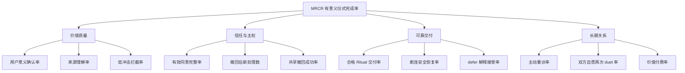

# LifeWake 指标、增长与商业

> 指标服务于“有意义且有主权的仪式”，不服务于成瘾。任何增长结果都受隐私、关系、安全和节奏护栏否决。

## 1. 北极星指标

### 1.1 定义

**Meaningful Ritual Completion Rate（MRCR，有意义仪式完成率）**

```text
MRCR =
  meaningful_rituals
  / eligible_revealed_rituals

meaningful_ritual =
  consent_valid
  AND ritual_revealed
  AND user_feedback IN {meaningful, moved, worth_keeping}
  AND no_safety_or_privacy_violation
  AND no_regret_revoke_within_safety_window
```

- 分母只包含已有效授权并真实揭晓的仪式；deferred、技术失败、未揭晓不进入分母。
- “有意义”只能由体验者显式反馈，不由模型 `wow_score` 代填。
- safety window 在实验前固定；不得为美化指标缩短。
- 同一 Ritual 去重；重复推送不能增加分子。

### 1.2 为什么不是 DAU/时长

LifeWake 的理想结果可能是用户完成一次仪式后离开。增加使用时长、打开次数、推送次数会直接侵蚀慢灵感与仪式稀缺，因此只能作为诊断量，不能作为目标。

## 2. 指标树



## 3. 指标定义与公式

| ID | 指标 | 公式 | 解释 |
|---|---|---|---|
| M-01 | MRCR | meaningful / eligible revealed | 北极星 |
| M-02 | 用户意义确认率 | meaningful feedback / feedback submitted | 不含模型标签 |
| M-03 | 来源理解率 | “理解为何属于我” / trace viewed survey | 验证解释性 |
| M-04 | trace 覆盖率 | 有有效来源引用的 Ritual / delivered | 工程前置指标 |
| M-05 | 低冲击拦截率 | 未交付的 low-impact / detected low-impact | 越高不必然越好，需看误拦截 |
| M-06 | 策展一致性 | rubric 一致项 / 双人复评项 | 监控 rubric 稳定，不是真理分 |
| M-07 | 有效同意完整率 | 完整 consent receipt / consent-required runs | scope/purpose/期限/主体齐全 |
| M-08 | 撤回后新处理数 | revoke 后产生的非审计处理事件数 | 必须为 0 |
| M-09 | 撤回生效 P95 | P95(enforced_at - requested_at) | 单人和共享分别统计 |
| M-10 | 双方同意完整率 | 双方有效 grant 的 duet / attempted duet | 交付前必须 100% |
| M-11 | 共享撤回成功率 | 成功失效入口 / revoke 请求 | 必须 100% |
| M-12 | 打扰反馈率 | intrusive feedback / delivered | 时机护栏 |
| M-13 | defer 接受率 | 未取消且理由可理解 / deferred | 不用“最终交付”强迫定义成功 |
| M-14 | 断连安全恢复率 | reconnect/degrade/end 正确完成 / disconnect | 不丢失治理状态 |
| M-15 | 主动重访率 | 用户主动打开旧 Keepsake / eligible users | 不含推送召回 |
| M-16 | 双方自愿再次 duet 率 | 30 天内双方主动再发起 / completed bonds | 不使用单方催促 |
| M-17 | ChangeSet 证据完整率 | 带 feedback+rubric+impact+rollback 的 CS / CS | 演化质量 |
| M-18 | 价值付费率 | 因创作/保管主动付费 / exposed eligible | 不含隐私能力付费 |

## 4. 埋点与采集点

### 4.1 事件信封

```yaml
event_id: evt_001
event_name: ritual.feedback_submitted
occurred_at: 2026-07-22T03:00:00Z
pseudonymous_person_ref: p_7f2
trace_id: trace_001
ritual_ref: ritual_001
product_area: core
properties:
  feedback: meaningful
  trace_viewed: true
  timing_decision: DELIVER_NOW
consent_basis_ref: consent_001
data_class: product_telemetry
retention_policy: aggregate_90d
```

禁止进入埋点：原始 pulse、哼唱内容、照片内容、自由文本反馈正文、伴侣拒绝理由、健康推断。

### 4.2 采集表

| 事件 | 触点/节点 | 最小字段 | 计算指标 |
|---|---|---|---|
| `consent.viewed` | Consent Center | scopes_count、purpose | 授权理解漏斗 |
| `consent.granted` | consent gate | scope categories、expiry | M-07 |
| `consent.revoked` | Consent Center | target_type、requested_at | M-08/M-09 |
| `signal.selected` | Source Picker | category_count | trace 前置覆盖 |
| `timing.decided` | timing gate | decision、reason_code | M-12/M-13 |
| `ritual.ready` | Ritual Stream | modality、rubric_status | 交付漏斗 |
| `ritual.revealed` | RitualView | reveal_at | M-01 分母 |
| `trace.viewed` | RitualView | source_category_count | M-03 |
| `ritual.feedback_submitted` | Feedback Sheet | enum feedback | M-01/M-02 |
| `keepsake.saved` | RitualView | ownership_type | 保存诊断 |
| `keepsake.opened_direct` | Vault | age_bucket_of_asset | M-15 |
| `duet.invite_resolved` | Bond Space | accepted/declined/expired | Bond 漏斗 |
| `duet.completed` | Bond Space | both_consents_valid | M-10/M-16 |
| `device.disconnected` | Pulse session | stage、resolution | M-14 |
| `share.revoked` | Bond/Vault | enforced_at、surface_count | M-09/M-11 |
| `impact.evaluated` | curation gate | user_signal/rubric/model presence | M-05/M-06 |
| `changeset.drafted` | Studio | evidence flags、auto_apply | M-17 |
| `subscription.started` | paywall | value_area | M-18 |

### 4.3 采集治理

- 用户可在 Consent Center 查看产品遥测类别并选择退出非必要分析。
- 人级明细短保留；长期只保留满足 k 匿名阈值的聚合。
- duet 指标按 Bond 聚合时不得反推出单方私密反馈。
- 实验分配不跨撤回边界；撤回后停止新增分析事件。

## 5. 内测实验

| 实验 | 假设 | 变量 | 主指标 | 护栏 | 最小决策 |
|---|---|---|---|---|---|
| E1 来源解释深度 | 分层 trace 比一次展开更易理解 | 简短/分层 | M-03、MRCR | 冒犯反馈率 | 护栏不恶化才采用 |
| E2 defer 文案 | 明确尊重时机降低困惑 | 两种非焦虑文案 | M-13 | 取消率、投诉 | 不以最终交付率单独取胜 |
| E3 单人惊喜模态 | 用户选择两类模态优于系统全选 | 手选/系统选 | MRCR | 授权放弃率 | 以意义而非点击决策 |
| E4 duet 邀请 | 私密拒绝说明提高双方安全感 | 标准/强化说明 | 接受后完成率 | 重复邀请、争议 | 拒绝不受惩罚 |
| E5 低冲击门禁 | 用户信号+rubric 优于模型分单独门禁 | 组合策略 | M-05、后续 MRCR | 冒犯率 | 禁止模型单独发布 |
| E6 付费价值 | 高质量模板/长期保管有支付意愿 | 作品包/Vault | M-18 | 撤回、导出、MRCR | 不测试隐私付费墙 |

### 5.1 实验要求

1. 预注册假设、样本、停止条件、safety window 和护栏。
2. 样本不足时报告区间，不把方向性结果包装为结论。
3. 未成年人、高危路径、同意/撤回文案不进入增长 A/B。
4. 负向反馈可触发即时停止，不等待统计显著。
5. 结果通过 ChangeSet 进入审批，不直接改生产策略。

## 6. GTM

### 6.1 楔子

首发不是“大而全生命 OS”，而是两个可演示且可验证的时刻：

- **私人惊喜仪式**：证明“来源解释 + 慢灵感”比通用生成更有意义。
- **双人心跳纪念物**：证明双方同意与共同主权仍能形成惊喜。

### 6.2 渠道与动作

| 阶段 | 人群 | 渠道 | 动作 | 证据 |
|---|---|---|---|---|
| 发现 | 创作者、异地伴侣 | 定向邀请/小型社群 | 访谈 + 仪式原型 | 问题强度、隐私顾虑 |
| Alpha | 受邀个人/双人组 | 候补名单 | 三次以内策展体验 | MRCR、护栏、主动回访 |
| Beta | 有兼容设备用户 | 设备伙伴/创作者合作 | 真实会话、有限模板 | 断连、撤回、付费实验 |
| Launch | 价值已验证人群 | 用户主动分享/口碑 | 可过期导出、礼赠订阅 | 非激励转介绍、价值付费 |

分享不是默认增长回路。只有用户主动导出、共同作品获得双方确认、链接可过期时，分享才成立。

## 7. 商业模型

| 产品层 | 定价逻辑 | 收入来源 | 成本驱动 | 信任边界 |
|---|---|---|---|---|
| Free | 足以体验并完整控制数据 | 无/转化 | 基础生成、存储 | consent/revoke/export/delete 完整 |
| Individual | 创作质量与长期价值 | 月/年订阅、作品包 | 高品质生成、存储 | 不增加推送 |
| Bond | 双方共同价值 | 共同订阅/礼赠 | 双人会话、共同 Vault | 任一方退出不罚没资产 |
| Studio | 专业创作与发布工具 | 创作者订阅/模板分成 | 审核、测试、分发 | 无原始用户数据 |
| Storage | 用户选配容量/保管 | 容量订阅 | 加密存储、迁移 | 开放导出、无锁定 |

### 7.1 单位经济验证

不预设市场规模数字。内测按以下可观测公式判断可持续性：

```text
Contribution Margin per paid account
= subscription_revenue
 - generation_cost
 - storage_cost
 - payment_fee
 - allocated_curation_and_support_cost

Value-qualified conversion
= paid_accounts_with_prior_meaningful_ritual
 / eligible_accounts_with_meaningful_ritual
```

若付费只能通过增加触达、锁定记忆或削弱免费主权能力实现，则商业模型未成立。

## 8. 反增长原则

### 8.1 禁止目标

- 不以 DAU、连续天数、总时长、push open rate、内容消费量作为团队北极星。
- 不做无限滚动、自动连播、随机奖励、焦虑倒计时、失去记忆威胁。
- 不为提高转化隐藏撤回、删除、导出或取消订阅。
- 不把伴侣响应速度、心跳相关度或互动频率变成排名/分数。
- 不向广告系统、保险、雇主或数据经纪商提供数据。

### 8.2 护栏否决机制

任何实验即使提高 MRCR 或收入，只要出现以下任一情况即停止并回滚：

1. 撤回后新处理次数大于 0。
2. 未授权/未成年人外发大于 0。
3. duet 缺少任一方有效同意。
4. 模型分数覆盖用户负反馈。
5. 打扰反馈或冒犯反馈超过预注册阈值。
6. 商业变更削弱免费主权能力。

## 9. 经营复盘

每个周期只回答五个问题：

1. 哪些 Ritual 被用户确认有意义，来源证据是什么？
2. 哪些时机造成打扰，defer 是否被理解？
3. 哪些 consent、撤回或共享路径产生摩擦/风险？
4. 哪些付费来自真实创作与保管价值？
5. 哪些反馈应形成 ChangeSet，哪些要求回退到产品假设？

复盘输出进入 [反馈与 ChangeSet](./FEEDBACK_CHANGESET.md)，追溯到 [推导与验证矩阵](./DERIVATION_AND_VALIDATION_MATRIX.md)。

