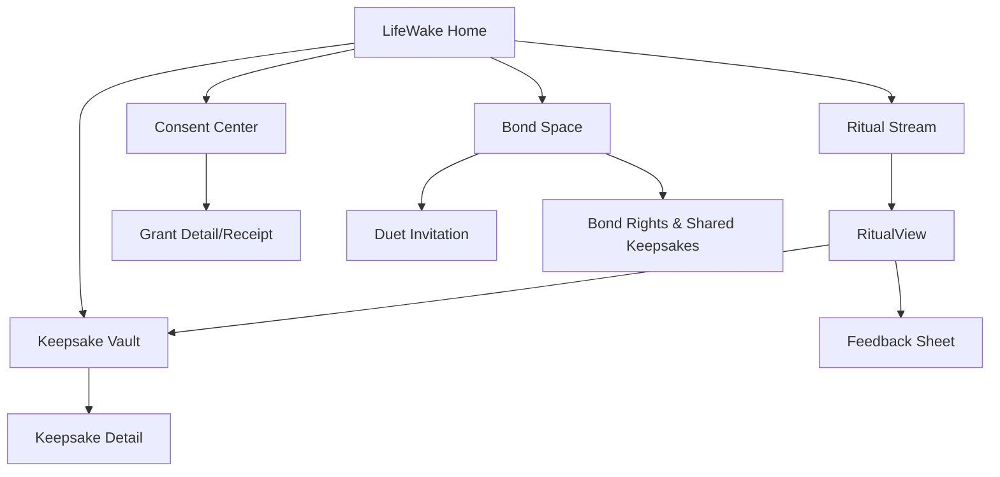
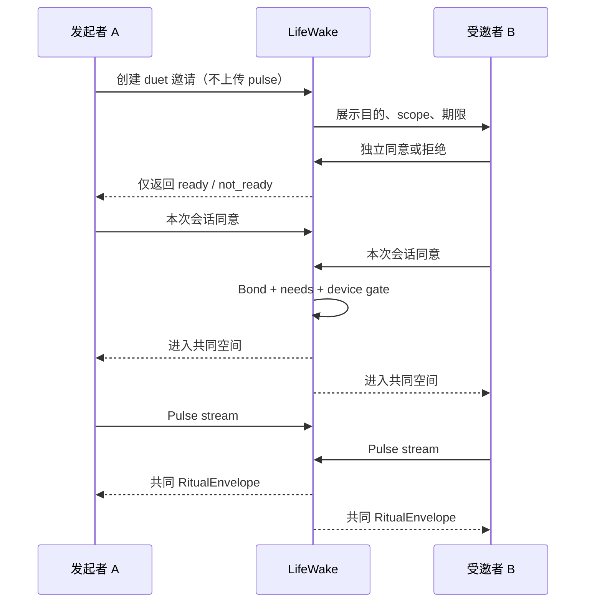

# LifeWake 产品体验设计

> 体验目标不是增加使用时长，而是用最少交互完成一次“被理解、可控制、值得记住”的仪式。产品定义见 [主产品蓝图](./LIFEWAKE_PRODUCT_BLUEPRINT.md)。

## 1. 体验原则

1. **先主权，后惊喜**：惊喜内容可以未知，但数据范围、用途、受益者和撤回方式必须已知。
2. **先意义，后模态**：先回答“为什么属于你”，再选择音乐、图像、文字或行动。
3. **先双方，后关系作品**：duet 不是一方发给另一方，而是双方分别进入共同空间。
4. **允许不发生**：`SLOW_INSPIRATION_DEFERRED` 是尊重时机的产品结果，不是技术失败。
5. **可解释但不解剖用户**：解释来源，不输出人格、健康或关系结论。
6. **液态表达、稳定控制**：仪式视觉可变；同意、返回、暂停、撤回、字幕必须稳定可寻。
7. **反馈是现实裁决**：情感冲击测试是用户反馈 + 策展 rubric 的可解释门禁，不是模型真理。

## 2. 信息架构



### 2.1 Ritual Stream

- 不是无限流；最多呈现一个“现在可揭晓”的 Ritual 和少量历史入口。
- 卡片只显示标题、模态、来源类别、出现原因与“稍后”。
- 无可交付内容时显示安静状态，不用推荐填满。

### 2.2 Consent Center

- 一级维度：数据源、用途、受益者、期限。
- 每项显示：已授权 scope、最近使用、生成资产、第三方处理者、暂停/撤回。
- 撤回与授权同等可见；撤回前说明结果，不采用恐吓式损失文案。

### 2.3 Bond Space

- 显示双方是否已准备，而不暴露对方拒绝理由或私密偏好。
- 显示共同作品的归属、共享状态和逐方撤回权。
- 禁止关系分数、亲密排行、在线监控和“对方多久未回应”施压。

### 2.4 Keepsake Vault

- 按人生章节/共同关系/模态组织，不按互动热度排序。
- 纪念物详情包含来源 trace、创建时同意、共同权利人、导出/删除/撤回。
- 共享被撤回后显示 `SHARE_REVOKED` 占位与权利说明，不泄露被撤回内容。

## 3. 核心用户旅程

### 3.1 单人惊喜

| 阶段 | 用户看见 | 用户动作 | 系统动作 | 数据/状态 | 体验验收 |
|---|---|---|---|---|---|
| 邀请 | “用你选的一小段材料，为此刻做件作品” | 查看用途 | 不采集 | `intent_created` | 未授权前无预览诱导 |
| 授权 | scope、用途、期限、处理者 | 逐项授权 | 生成 consent receipt | `ConsentGrant` | 可跳过任一来源 |
| 等待 | 安静提示，可关闭 | 离开/取消 | 编织信号，做 timing 决策 | `TimingDecision` | 不用倒计时制造期待 |
| 揭晓 | 单一 Ritual，先内容后 trace | 播放/展开 | 交付 `RitualEnvelope` | `delivered` | 三步内看到为何是我/现在 |
| 反馈 | “有触动/还不对/不舒服” | 选择、补充、删除 | 写 `EmotionImpact` | `feedback_captured` | 负反馈不要求解释 |
| 留存 | 保存到 Vault 或让它消散 | 保存/删除/导出 | 应用保留策略 | `saved/deleted` | 删除与保存同等清晰 |

### 3.2 Solo Pulse

1. 用户进入 Pulse Setup，看到“非医疗、仅本次会话、默认不保存原始流”。
2. 连接设备；先用 5 秒测试确认震动/声音输出。
3. 用户选择视觉/声音强度，可开启无音频视觉模式。
4. 会话中显示抽象波纹，不显示“健康/焦虑/异常”等判断。
5. 断连时音乐平滑淡出并暂停，显示重连、无设备继续、结束三个动作。
6. 完成后生成 `RitualEnvelope`；用户决定保存作品，原始 pulse 摘要按策略销毁。

### 3.3 Duet



关键约束：

- 邀请不携带隐私数据，不显示拒绝原因，不循环催促。
- 双方都可在会话中暂停；暂停不被解释为关系态度。
- 任一方断连先暂停共同生成；对方仅看到“连接中断”。
- 共同纪念物默认仅在 Bond Space 可见；外发需逐方确认。

### 3.4 撤回

| 撤回对象 | 入口 | 即时结果 | 后台结果 | 用户证明 |
|---|---|---|---|---|
| 数据 scope | Consent Center | 新处理停止 | 队列取消、未交付草稿清除 | receipt + 生效时间 |
| 单个 Ritual | RitualView/Vault | 个人不可见 | 资产删除或进入法定保留流程 | 删除状态 |
| 共同共享 | Bond Space/Vault | 外链与对方访问失效 | `ShareGrant` revoked、`SHARE_REVOKED` | 双方各自 receipt |
| 整个 Bond | Bond Space | 新共创停止 | 共同资产逐项处理 | 待处理清单 |

撤回不能要求用户联系支持；不能用“你将失去美好回忆”阻碍。

### 3.5 失败与恢复

| 场景 | 用户语言 | 系统状态/码 | 主动作 | 禁止 |
|---|---|---|---|---|
| 无同意 | “需要你先选择可使用的材料” | `CONSENT_REQUIRED` | 查看授权 | 暗中生成预览 |
| 内容低冲击 | “这次还不像你，我们先不打扰” | `EMOTION_IMPACT_FAILED` | 重试/策展/删除 | 伪装成成功推送 |
| 慢灵感 | “现在不是好时机，已安静地放回灵感池” | `SLOW_INSPIRATION_DEFERRED` | 查看原因/取消 | 红点、倒计时 |
| 设备断连 | “连接中断，作品已安全暂停” | `DEVICE_DISCONNECTED` | 重连/继续/结束 | 将断连解释为健康异常 |
| 生成器失败 | “作品没有完成，材料未被再次使用” | `CONNECTOR_UNAVAILABLE` | 重试/退出 | 技术堆栈错误 |
| 共享撤回 | “这件共同纪念物已停止共享” | `SHARE_REVOKED` | 查看权利说明 | 暴露撤回方理由 |
| 高危信号 | “这次不继续创作；你可以选择获得支持” | `SAFETY_HUMAN_REVIEW` | 安全资源/退出 | 诊断、娱乐化生成 |

### 3.6 策展旅程

1. 系统将低冲击 `EmotionImpact` 去标识聚合，不向策展人暴露原始个人材料。
2. 策展人按 rubric 评审：来源贴合、具体性、情绪安全、节奏、可访问性。
3. 策展人可选择 `rework_template`、`adjust_timing`、`add_safety_rule` 或 `no_change`。
4. 系统生成带证据、影响范围、回滚点的 ChangeSet。
5. 独立审批后进入内测分层；护栏失败自动回滚。

## 4. 关键体验时刻

| 时刻 | 用户内心问题 | 必须回答 | 失败信号 |
|---|---|---|---|
| 首次授权 | “你到底要看什么？” | 数据、用途、期限、受益者 | 一键全选、模糊用途 |
| 第一次揭晓 | “这真的属于我吗？” | 特有来源与创作变化 | 通用文案、空 trace |
| 第一次 defer | “是不是坏了？” | 尊重时机的理由和可取消性 | 无限等待、制造期待 |
| duet 邀请 | “拒绝会伤害对方吗？” | 私密拒绝、无重复催促 | 暴露拒绝原因 |
| duet 共鸣 | “我们都在这里吗？” | 双方贡献可见但不可比较 | 心率排名、关系分 |
| 共享撤回 | “我还能控制共同作品吗？” | 立即失效、各自权利 | 隐藏入口、撤回延迟 |
| 低 wow | “你真的听见反馈了吗？” | 承认未达成、不给用户归因 | 要求用户迁就模型 |

## 5. 液态 UI 原则

### 5.1 可变层

- 背景、色彩、粒子、排版节奏随 `visual_theme` 变化。
- 音频、图像、任务、双人波形按 `content_blocks` 组合。
- 动效强度由用户偏好与系统无障碍设置控制。

### 5.2 稳定层

- 返回、暂停、关闭、字幕、来源、同意、撤回始终在固定可达区域。
- 不以颜色单独表示 consent、错误或双方状态。
- 不允许仪式模板覆盖系统级治理组件。
- 任何动画都可暂停；界面在无动画、无音频下仍完整表达。

### 5.3 节奏

- 揭晓前最多一个主动动作，不做多页 onboarding。
- 文本逐字动画可跳过；核心信息直接进入可访问树。
- 不自动循环播放音频；振动必须显式开启。

## 6. `RitualView` 内容模型

```yaml
ritual_view:
  ritual_id: ritual_001
  envelope_ref: renv_001
  state: ready
  header:
    title: "雨夜哼唱"
    occasion: "为你的通勤留下一段回响"
    timing_reason: "你允许在通勤窗口出现"
  content_blocks:
    - type: audio
      asset_ref: asset://sur_001
      transcript_ref: text://sur_001
      autoplay: false
    - type: visual
      asset_ref: visual://sur_001
      alt: "两条柔和波纹在深蓝背景中交织"
  inspiration_trace:
    - source_category: hum_melody
      explanation: "保留了你选择的四音动机"
      consent_ref: consent_001
  emotion_impact:
    status: pending_user_feedback
    rubric_summary: "来源贴合通过；情绪安全通过"
  actions:
    primary: reveal
    secondary: [save, later, feedback]
    sovereign: [exclude_source, delete, revoke_share]
  accessibility:
    reduced_motion_variant: true
    transcript_available: true
    contrast_mode: system
```

`RitualView` 是展示模型；治理依据来自不可被模板篡改的 `RitualEnvelope`。

## 7. 交互状态

| 状态 | 可见内容 | 可用动作 | 自动行为 |
|---|---|---|---|
| `empty_calm` | 安静说明 | 创建/查看 Vault | 无推送 |
| `consent_needed` | 用途与 scope | 授权/跳过 | 无采集 |
| `weaving` | 可离开的静态状态 | 取消 | 无倒计时 |
| `deferred` | 延期理由、最早重评 | 取消/调整节奏 | 到点仅重评，不必交付 |
| `ready` | Ritual 封面 | 揭晓/稍后 | 不自动播放 |
| `revealed` | 内容 + trace | 保存/反馈/删除 | 无连续推荐 |
| `low_impact` | 承认未达成 | 重炼/策展/删除 | 不推送 |
| `device_paused` | 断连说明 | 重连/无设备继续/结束 | 音频淡出 |
| `share_revoked` | 权利占位 | 查看 receipt/删除本地引用 | 外部访问失效 |
| `safety_hold` | 安全说明 | 资源/退出/人工支持 | 停止生成 |

## 8. 可访问性

- 目标基线：WCAG 2.2 AA。
- 所有音频有文字稿；所有视觉作品有人工可编辑 alt 文本。
- 支持减少动态、关闭粒子、关闭振动、单声道音频、字幕和键盘导航。
- 心跳可视化不依赖颜色或频闪；避免 3Hz 以上闪烁。
- 触控目标至少 44×44 CSS px；正文可放大至 200% 不丢失功能。
- 屏幕阅读器先读标题/目的，再读内容与来源，不朗读装饰粒子。
- duet 双方状态用文本与图标表达；不把听觉/视觉能力差异当作断连。
- 高压或悲伤场景采用直接、非诗化的安全文案。

## 9. 体验验收

| ID | 验收条件 | 证据 |
|---|---|---|
| UX-01 | 用户在首次授权前能复述数据、用途、期限、受益者 | 任务测试 + consent receipt |
| UX-02 | 三步内可查看“为何是我、为何是现在” | 交互回放 |
| UX-03 | `SLOW_INSPIRATION_DEFERRED` 无红点、倒计时或焦虑文案 | UI 审查 + CASE-009 |
| UX-04 | 低冲击内容不进入可交付流 | 状态日志 + CASE-008 |
| UX-05 | duet 拒绝原因不向邀请方泄露 | 双端测试 + CASE-006 |
| UX-06 | 任一方撤回后共享访问立即返回 `SHARE_REVOKED` | 双端测试 + CASE-010 |
| UX-07 | 设备断连可重连、降级或结束，且不丢失已同意范围 | CASE-012 |
| UX-08 | 仅键盘/屏幕阅读器完成授权、揭晓、反馈、撤回 | 无障碍走查 |
| UX-09 | reduced motion 下内容与控制完整 | 视觉回归 |
| UX-10 | 负反馈一步完成，不强迫填写原因 | 任务测试 |
| UX-11 | Ritual Stream 无无限滚动或自动连续播放 | 产品审查 |
| UX-12 | 策展人无法访问原始用户信号 | 权限测试 + audit |

体验 CASE 与工程 CASE 的映射见 [DERIVATION_AND_VALIDATION_MATRIX](./DERIVATION_AND_VALIDATION_MATRIX.md)。

