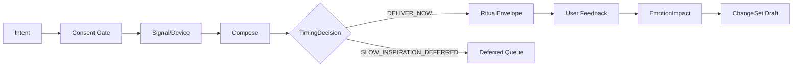

# LifeWake 产品体系索引

> 基础目的：让个体在不被画像、不被催促、不被占有的前提下，感知自身生命的独特性，并与重要的人共同留下可撤回的情感作品。

本目录不是孤立的“开发规约包”，而是从产品理念到可运行原型的三层产品体系。阅读顺序建议：L1 理解为何做与做什么，L2 确认如何体验、治理和验收，L3 用 CASE 验证真实运行。

## L1 · 产品 BP：目的、产品母体与商业闭环

| 文档 | 用途 |
|---|---|
| [LIFEWAKE_PRODUCT_BLUEPRINT](./LIFEWAKE_PRODUCT_BLUEPRINT.md) | 主 BP：第一性原理、宏中微实例化、Core/Bond/Memory/Privacy/Studio、MVP、商业与路线图 |
| [PRODUCT_CHARTER](./PRODUCT_CHARTER.md) | 不可被增长或技术覆盖的哲学宪章与守恒约束 |
| [METRICS_GROWTH_AND_BUSINESS](./METRICS_GROWTH_AND_BUSINESS.md) | 北极星、指标树、事件采集、实验、GTM、商业与反增长原则 |

## L2 · 体验与产品规约：从原则到可验收行为

| 文档 | 用途 |
|---|---|
| [PRODUCT_EXPERIENCE_DESIGN](./PRODUCT_EXPERIENCE_DESIGN.md) | 用户旅程、信息架构、液态 UI、`RitualView`、状态、可访问性与体验验收 |
| [DERIVATION_AND_VALIDATION_MATRIX](./DERIVATION_AND_VALIDATION_MATRIX.md) | 理念→法则→体验→模块→功能→Agent→能力→实体→治理→CASE→KPI 全链路 |
| [FUNCTIONAL_DESIGN](./FUNCTIONAL_DESIGN.md) | P0–P2 功能规格、用户故事、前后条件、异常与验收 |
| [DOMAIN_MODEL](./DOMAIN_MODEL.md) | `EmotionImpact`、`TimingDecision`、`RitualEnvelope` 等领域实体 |
| [CAPABILITY_CONTRACTS](./CAPABILITY_CONTRACTS.md) | `lw.*` 能力输入/输出、权限、错误、幂等与补偿 |
| [GOVERNANCE_MATRIX](./GOVERNANCE_MATRIX.md) | 同意、双向关系、共享撤回、未成年人、策展门禁 |
| [WORKFLOW_STATE_MACHINE](./WORKFLOW_STATE_MACHINE.md) | 交付、defer、失败、断连、撤回与人工接管状态 |
| [WORLD_MODEL_CONFIG](./WORLD_MODEL_CONFIG.md) | 五维世界模型、宏中微现实映射与可证伪法则 |
| [FEEDBACK_CHANGESET](./FEEDBACK_CHANGESET.md) | 用户反馈与策展证据如何受控生成、审批和回滚 ChangeSet |

## L3 · Runnable subapp：用现实路径验证

| 资产 | 用途 |
|---|---|
| [MVP_ACCEPTANCE_CASES](./MVP_ACCEPTANCE_CASES.md) | CASE-001～014：成功、低 wow、慢灵感、共享撤回、未成年人、断连与反馈演化 |
| [`projects/lifewake`](../../projects/lifewake/) | 单一 UAS subapp 原型、配置、脚本、状态、审计与报告 |
| [`scripts/run_uas_runtime_service.py`](../../scripts/run_uas_runtime_service.py) | 仓库级 runtime 发现与验证入口 |

### v0.1 运行边界

| 项 | 决策 |
|---|---|
| 工程形态 | 单一 `projects/lifewake` subapp，不提前拆微服务 |
| 设备/生成器 | mock connector；不声称医疗级或真实生成质量 |
| 界面 | JSON 输入 + report/audit/state 验证；正式 UI 由体验文档定义 |
| 数据 | 仅 `create_for_user`；禁止广告、评分、诊断与关系监控 |
| 演化 | 只产出 `ChangeSet` 草案，`auto_apply: false` |
| UAS 角色 | 支撑意图、执行、治理和演化，不占据产品叙事中心 |

### MVP 运行闭环

## 统一术语

| 术语 | 定义 |
|---|---|
| `EmotionImpact` | 用户反馈 + 策展 rubric + 模型辅助信号的可解释记录；不是模型真理 |
| `TimingDecision` | 交付、慢灵感延期或取消的有理由决策 |
| `RitualEnvelope` | 仪式内容、来源、同意、时机、动作和治理元数据的统一信封 |
| `SLOW_INSPIRATION_DEFERRED` | 因节奏、质量或情境不合适而延期，不是失败 |
| `SHARE_REVOKED` | 任一共同权利人撤回后，共享访问立即失效 |

## 完成定义

1. L1 的每条核心理念都能经追溯矩阵落到功能、治理、CASE 与 KPI。
2. CASE-001～014 均有确定终态、错误/延期码、审计与下一步。
3. 无有效同意时无采集、生成、通知或共享。
4. duet 始终要求逐方同意与双向需求；任一方可撤回共享。
5. 情感冲击门禁保留证据与人工策展路径，不把模型分数当作用户感受。
6. 反馈只能生成可审查、可回滚的 ChangeSet 草案。
