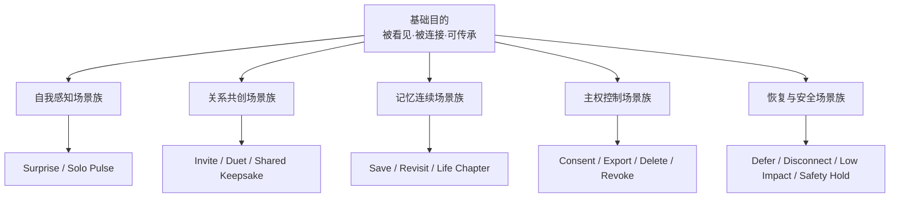
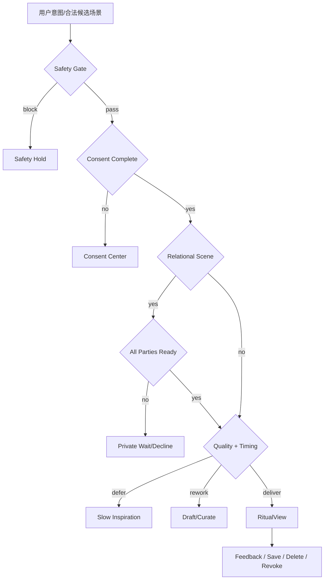

# LifeWake 用户场景与体验系统

> 版本：v1.0 场景体系基线  
> 目标：把“用户是谁、为何此刻需要 LifeWake、产品应出现还是沉默、如何形成仪式、失败后如何保护用户”定义为可规划、可编排、可验收的产品系统。  
> 上游约束：[产品蓝图](./LIFEWAKE_PRODUCT_BLUEPRINT.md) · [产品宪章](./PRODUCT_CHARTER.md)  
> 下游承载：[体验设计](./PRODUCT_EXPERIENCE_DESIGN.md) · [功能设计](./FUNCTIONAL_DESIGN.md) · [验收 CASE](./MVP_ACCEPTANCE_CASES.md)

---

## 0. 场景规划原则

LifeWake 不以“功能入口”组织产品，而以**生命情境中的未完成张力**组织体验。

一个有效用户场景必须同时回答：

1. **谁**：当前主体是谁，是否涉及关系中的其他主体？
2. **为何此刻**：发生了什么现实事件或主动作出？
3. **想完成什么**：用户的 JTBD 是什么，而不是系统想推送什么？
4. **允许使用什么**：数据、用途、受益者、期限是否明确？
5. **产品应做什么**：交付、询问、延期、降级、拒绝还是保持沉默？
6. **怎样才算有意义**：用户如何确认价值，哪些护栏拥有否决权？

场景公式：

```text
UserScenario
= LifeStage
× RelationshipTopology
× EmotionalTension
× TriggerAndTiming
× ExperienceMode
× SovereigntyAndRisk
→ ExperienceOutcome
```

反例：

- “生成一首歌”是功能，不是场景。
- “用户孤独时主动推送”是未经验证的系统假设，不是用户需求。
- “情侣心跳同步”只有模态，没有双方目的、同意和退出机制。

合格表达：

> 异地伴侣双方主动进入纪念日共创，在分别授权本次心跳会话后，把两段会话级节律编织为共同纪念物；任一方可在会话中暂停，并可在未来撤回共享。

---

## 1. 六维场景模型

### 1.1 维度一：用户生命阶段

| 阶段 | 用户状态 | 核心任务 | 产品责任 |
|---|---|---|---|
| `first_contact` 初识 | 好奇但不信任 | 判断产品是否尊重自己 | 先说明边界，不用惊喜诱导授权 |
| `trust_building` 建立信任 | 愿意提供少量材料 | 验证“真的属于我” | 小范围授权、完整来源解释 |
| `self_discovery` 自我发现 | 想理解当下感受/身体 | 把不可言说变成作品 | 不诊断、不贴标签 |
| `bond_creation` 关系共创 | 与重要的人共同表达 | 形成双方都愿意的时刻 | 独立同意、双向需求、可退出 |
| `memory_continuity` 记忆延续 | 想重访人生片段 | 保留语境而不是堆积内容 | trace、保留策略、主动回访 |
| `transition_or_loss` 转折/失去 | 搬迁、分别、纪念、哀伤 | 安全地承载复杂情绪 | 用户主动、低刺激、非诗化安全文案 |
| `mature_control` 成熟控制 | 已积累材料和作品 | 管理、迁移、删除、退出 | 主权中心、批量导出、清晰撤回 |

### 1.2 维度二：关系结构

| 结构 | 定义 | 默认边界 |
|---|---|---|
| `self` | 单一主体的私人体验 | 默认不分享 |
| `dyad` | 两个独立主体共同创作 | 双方逐用途同意；拒绝理由私密 |
| `close_circle` | 家庭/挚友小型多方关系（P2） | 每个参与者独立授权；不采用多数同意覆盖少数 |
| `creator_to_self` | 策展模板服务个人体验 | 创作者不能访问原始个人材料 |
| `self_to_public` | 用户主动导出到外部 | 逐次确认、链接可过期、可撤回 |

### 1.3 维度三：情感张力

情感张力只用于组织体验，不是对用户作心理判断。

| 张力 | 用户语言 | 适合的产品回应 | 禁止回应 |
|---|---|---|---|
| 平凡 ↔ 被看见 | “今天没什么特别，但想留下点什么” | 微小私人仪式 | 夸大人生意义 |
| 停滞 ↔ 灵感 | “我卡住了” | 可执行的小作品/行动 | 高频随机任务 |
| 孤独 ↔ 自我陪伴 | “想听见自己的此刻” | solo ritual | 宣称理解其心理状态 |
| 思念 ↔ 连接 | “想靠近，但不想打扰” | 私密邀请或 duet | 自动代发、连续催促 |
| 喜悦 ↔ 分享 | “想把这一刻留给我们” | 双方确认的纪念物 | 默认公开 |
| 激动 ↔ 安定 | “想把身体节奏听出来” | 非医疗 pulse experience | 健康/焦虑判断 |
| 改变 ↔ 连续性 | “生活变了，想留住前后的自己” | 时间章节与记忆编织 | 制造怀旧依赖 |
| 哀伤 ↔ 承载 | “我想纪念，但不想被打扰” | 用户主动、可随时退出的低刺激仪式 | 娱乐化、高惊喜动效 |

### 1.4 维度四：触发与时机

| 触发类型 | 示例 | 默认策略 |
|---|---|---|
| `explicit_pull` 用户主动 | 打开“为此刻创作”、发起 duet | 优先响应，仍执行 consent/quality gate |
| `relationship_invite` 关系邀请 | 对方发起共同会话 | 只通知一次，不披露材料和拒绝原因 |
| `chosen_calendar` 用户选定时间 | 纪念日、生日、搬家日 | 事前确认，不从历史自动推断重要日期 |
| `session_signal` 会话内信号 | 本次哼唱、心跳、照片 | 会话结束后按保留策略销毁原始信号 |
| `memory_revisit` 用户主动回访 | 打开旧 Keepsake | 不附带推荐流 |
| `system_suggestion` 系统建议 | 已授权安静窗口内的候选仪式 | 必须可解释；低置信度时 defer |
| `safety_interrupt` 安全中断 | 高危信号、未成年人外发 | 停止创作，进入安全路径 |

时机决策优先级：

```text
Safety
> Consent
> Relationship readiness
> User quiet preferences
> Content quality
> Context confidence
> Delivery opportunity
```

### 1.5 维度五：体验模式

| 模式 | 用户目的 | 核心空间 | 典型结果 |
|---|---|---|---|
| `discover` | 重新感知自己 | Ritual Stream | Surprise Ritual |
| `embody` | 听见身体的此刻 | Pulse Setup / RitualView | Solo Pulse |
| `cocreate` | 与重要的人共同表达 | Bond Space | Duet / Shared Keepsake |
| `remember` | 把碎片编织成有语境的记忆 | Keepsake Vault | Memory Chapter |
| `revisit` | 主动重访过去作品 | Keepsake Vault | Revisit Ritual |
| `reflect` | 告诉系统“有意义/还不对/不舒服” | Feedback Sheet | EmotionImpact |
| `control` | 授权、暂停、导出、删除、撤回 | Consent Center | Receipt / Revocation |
| `curate` | 在不访问原始材料下改进体验 | Curation Studio | ChangeSet Draft |

### 1.6 维度六：主权与风险

| 等级 | 场景 | 产品动作 |
|---|---|---|
| `R0 private_read` | 查看自己的授权/纪念物 | 身份校验 + audit |
| `R1 private_create` | 私人惊喜、solo pulse | 有效 consent + 情感门禁 |
| `R2 relational_create` | duet、共同纪念物 | 逐方 consent + Bond gate |
| `R3 external_share` | 外发作品、公开链接 | 逐次确认；共同作品逐方确认 |
| `R4 vulnerable_or_sensitive` | 未成年人、高危信号、哀伤安全场景 | 降级/拒绝/人工安全路径 |

任何风险提升不得由“更高 wow”抵消。

---

## 2. 场景体系分层



### 2.1 场景优先级规则

场景优先级不是“用户量最大优先”，采用四项门槛：

```text
PriorityScore
= PurposeFit × 0.35
+ EmotionalDistinctiveness × 0.25
+ LearningValue × 0.20
+ DeliveryFeasibility × 0.20

前置否决：
- SovereigntyRisk 不可控
- RelationshipSymmetry 不成立
- SafetyFallback 不存在
```

| 优先级 | 定义 | 产品策略 |
|---|---|---|
| P0 | 能直接验证基础目的，且 mock 可形成完整闭环 | MVP 必须可运行、可验收 |
| P1 | 深化长期价值，需要真实存储、设备或策展运营 | Alpha/Beta 验证 |
| P2 | 扩展关系规模、生态和开放格式 | 基础主权成熟后进入 |
| Hold | 价值可能存在，但当前风险/证据不足 | 不进入路线图承诺 |

---

## 3. 全量场景地图

### 3.1 自我感知场景族

| ID | 场景 | 核心 JTBD | 触发 | 模式 | 产品域 | 优先级 | 成功信号 |
|---|---|---|---|---|---|---|---|
| SELF-01 | 第一次私人回响 | 验证“它真的属于我” | explicit pull | discover | Core/Privacy | P0 | 来源理解 + meaningful feedback |
| SELF-02 | 无聊时的灵感盲盒 | 给停滞一个具体起点 | explicit pull | discover | Core | P0 | 任务被认为具体可做 |
| SELF-03 | 通勤中的安静惊喜 | 在可接受时机获得有限惊喜 | chosen quiet window | discover | Core | P1 | 无打扰反馈、主动揭晓 |
| SELF-04 | 冥想后的 Solo Pulse | 把身体节律变成作品 | session signal | embody | Core | P0 | 完成且无诊断误解 |
| SELF-05 | 运动后身体回响 | 纪念身体能量而非健康评分 | explicit pull | embody | Core | P1 | 用户确认表达准确 |
| SELF-06 | 创作卡顿后的素材转译 | 从自己的材料获得新视角 | explicit pull | discover | Core/Studio | P1 | 用户继续创作而非消费内容 |

### 3.2 关系共创场景族

| ID | 场景 | 核心 JTBD | 关系 | 模式 | 产品域 | 优先级 | 成功信号 |
|---|---|---|---|---|---|---|---|
| BOND-01 | 异地双方心跳会话 | 在不监控对方时感到共同在场 | dyad | cocreate | Bond/Core | P0 | 双方自愿完成 |
| BOND-02 | 纪念日共同作品 | 把双方选择的材料变成纪念物 | dyad | cocreate/remember | Bond/Memory | P1 | 双方保存且无权利争议 |
| BOND-03 | 想念但不想打扰 | 发出无压力、可私密拒绝的邀请 | dyad | cocreate | Bond | P1 | 无重复催促、拒绝无伤害 |
| BOND-04 | 两人共同哼唱 | 让双方贡献同等可见 | dyad | cocreate | Bond | P1 | 无主次排名、双方认可 |
| BOND-05 | 共同作品共享撤回 | 退出共享但不解释关系态度 | dyad | control | Bond/Privacy | P0 | 所有入口即时失效 |
| BOND-06 | 家庭共同记忆章节 | 多人共同编织同一事件 | close circle | remember | Bond/Memory | P2 | 每位贡献者权利独立 |

### 3.3 记忆连续场景族

| ID | 场景 | 核心 JTBD | 触发 | 模式 | 产品域 | 优先级 | 成功信号 |
|---|---|---|---|---|---|---|---|
| MEM-01 | 保存刚完成的 Ritual | 自己决定这刻是否值得留下 | post ritual | remember | Memory | P0 | 保存/删除选择清晰 |
| MEM-02 | 主动重访旧纪念物 | 重新理解过去的自己 | memory revisit | revisit | Memory | P1 | 主动重访而非 push 召回 |
| MEM-03 | 搬家/毕业生命章节 | 把变化前后的碎片放在同一语境 | chosen event | remember | Memory | P1 | 用户确认章节叙事 |
| MEM-04 | 哀伤纪念 | 在不被娱乐化时承载思念 | explicit pull | remember | Memory/Privacy | Hold→P1 | 安全研究通过后进入 |
| MEM-05 | 导出个人生命作品 | 不被平台锁定地带走记忆 | explicit pull | control | Memory/Privacy | P1 | 开放格式完整导出 |
| MEM-06 | 删除一个人生章节 | 让遗忘也成为真实权利 | explicit pull | control | Memory/Privacy | P1 | 删除证明且无新处理 |

### 3.4 主权、恢复与安全场景族

| ID | 场景 | 用户真实问题 | 系统结果 | 优先级 | 关键护栏 |
|---|---|---|---|---|---|
| TRUST-01 | 首次逐项授权 | “你到底要看什么？” | consent receipt | P0 | 未授权前零采集 |
| TRUST-02 | 创作中撤回 | “我现在反悔还来得及吗？” | `CONSENT_REVOKED` | P0 | 队列取消、草稿清理 |
| TRUST-03 | 第三次请求被延期 | “它是在尊重我还是坏了？” | `SLOW_INSPIRATION_DEFERRED` | P0 | 无红点/倒计时 |
| TRUST-04 | 内容不像自己 | “你是否真的听见我的否定？” | `EMOTION_IMPACT_FAILED` | P0 | 不伪装成功 |
| TRUST-05 | 设备中途断开 | “作品和我的数据安全吗？” | `DEVICE_DISCONNECTED` | P0 | 平滑暂停、无健康推断 |
| TRUST-06 | 生成器失败 | “我的材料会不会被重复使用？” | retry/exit | P0 | 有界重试、幂等 |
| TRUST-07 | 未成年人请求 duet/外发 | “产品会保护脆弱主体吗？” | `POLICY_DENIED` | P0 | 仅本地受限体验 |
| TRUST-08 | 高危信号 | “系统会不会把痛苦做成娱乐？” | `SAFETY_HUMAN_REVIEW` | P0 | 停止生成、非诊断支持 |
| TRUST-09 | 退出整个 Bond | “关系结束后共同作品怎么办？” | rights resolution | P1 | 逐项处理，不默认删除对方副本 |
| TRUST-10 | 关闭账户 | “我能完整离开吗？” | export/delete receipt | P1 | 无暗留、无失去恐吓 |

---

## 4. P0 场景组合与版本边界

### 4.1 P0 不是功能集合，而是八个体验证明

| 证明 | 主场景 | 验证的产品命题 | 对应 CASE |
|---|---|---|---|
| P0-A 被理解 | SELF-01 | 特有来源 + trace 能形成私人意义 | 001 |
| P0-B 身体可成为艺术 | SELF-04 | pulse 可创作但不被诊断 | 004 |
| P0-C 关系可以双向共创 | BOND-01 | 双方同意与 needs 不损害共鸣 | 005/006 |
| P0-D 共同作品仍可退出 | BOND-05 | 共同拥有不等于永久绑定 | 010 |
| P0-E 产品允许不发生 | TRUST-03 | defer 比低质量即时交付更符合理念 | 009 |
| P0-F 产品承认没做好 | TRUST-04 | 用户反馈可否定系统判断 | 008/014 |
| P0-G 失败时保护用户 | TRUST-02/05/06 | 撤回、断连、连接器异常可恢复 | 003/007/012 |
| P0-H 安全具有否决权 | TRUST-07/08 | 未成年人和高危路径优先于创作 | 011/013 |

### 4.2 P0 出口标准

- SELF-01、SELF-04、BOND-01 至少各完成一轮真实用户任务测试。
- TRUST-01～08 的治理/恢复路径全部可演示。
- 任何成功场景都能回到 Consent Center 和删除/撤回入口。
- 至少一个负反馈从真实 Ritual 串联到 ChangeSet 草案。
- 不用 DAU、推送打开率或使用时长证明场景成立。

---

## 5. 核心场景卡

### 5.1 SELF-01 · 第一次私人回响

| 字段 | 定义 |
|---|---|
| Persona | 对情感体验敏感、首次接触 LifeWake 的个人 |
| 情境 | 愿意用一小段哼唱和风格偏好验证产品 |
| JTBD | “让我判断你是在理解我的材料，还是套模板。” |
| 前置 | 未授权、无历史画像 |
| 用户输入 | 主动选择 1–2 个低敏感材料 |
| 核心触点 | Consent Center → Source Picker → RitualView |
| 后台编排 | consent → signal weave → impact rubric → timing → render |
| 成功 | 用户理解来源，并选择 meaningful / worth keeping |
| 失败 | 感到被监视、trace 空泛、作品通用 |
| 恢复 | 排除来源、删除、负反馈、人工策展 |

体验节奏：

```text
了解边界
→ 逐项授权
→ 离开也可继续的安静编织
→ 单一 Ritual 揭晓
→ “为何是我 / 为何是现在”
→ 有触动 / 还不对 / 不舒服
→ 保存或消散
```

### 5.2 SELF-04 · Solo Pulse

| 字段 | 定义 |
|---|---|
| JTBD | “把此刻身体节奏听出来，而不是得到健康判断。” |
| 触发 | 用户主动开始会话 |
| 数据边界 | 本次 pulse 摘要；原始连续流默认不持久化 |
| 体验 | 设备测试 → 风格/强度 → 实时抽象反馈 → 完成 Ritual |
| 安全 | 禁止焦虑、异常、健康评分等文案 |
| 恢复 | 断连后重连、无设备降级或结束 |
| 成功 | 用户认为作品表达此刻，且没有医疗误解 |

### 5.3 BOND-01 · 异地双方心跳会话

| 字段 | 定义 |
|---|---|
| 双方 JTBD | “共同在场，但不监控、不强迫对方。” |
| 发起方 | 只创建目的明确、不携带 pulse 的邀请 |
| 受邀方 | 独立查看用途、范围、期限；拒绝理由私密 |
| Ready Gate | 双方 consent + needs acknowledgment + device ready |
| 共同体验 | 不显示心率高低排名；以交织而非比较呈现 |
| 产物 | Shared Keepsake，默认仅 Bond Space 可见 |
| 退出 | 任一方可暂停会话、撤回共享或退出 Bond |
| 成功 | 双方都确认体验有意义且未感到被监控 |

### 5.4 TRUST-03 · 慢灵感延期

| 字段 | 定义 |
|---|---|
| 触发 | 当日触达已达阈值、内容质量不足或情境置信度低 |
| 产品回应 | “现在不是合适时机，已安静地放回灵感池。” |
| 用户动作 | 查看原因、调整节奏、取消 |
| 系统动作 | 到点只重评，不保证交付 |
| 禁止 | 红点、倒计时、损失文案、偷偷换来源 |
| 成功 | 用户理解 defer 是尊重而不是故障 |

### 5.5 TRUST-04 · “还不像我”

| 字段 | 定义 |
|---|---|
| 用户反馈 | 有触动 / 还不对 / 不舒服；后两者无需说明原因 |
| 系统姿态 | 承认未达成，不教育用户理解作品 |
| 下一步 | 删除、排除来源、重炼、请求人工策展 |
| 数据 | 结构化原因可选；自由文本短保留 |
| 演化 | 反馈 + rubric → ChangeSet 草案，禁止自动应用 |
| 成功 | 负反馈被完整尊重且不触发更多推送 |

### 5.6 BOND-05 · 共享撤回

| 字段 | 定义 |
|---|---|
| 入口 | Bond Space 和 Keepsake Detail 同等可见 |
| 即时结果 | 外链和对方访问失效，返回 `SHARE_REVOKED` |
| 对方可见 | 共享已停止；不显示撤回理由 |
| 各方权利 | 私人原始贡献按各自 consent 处理 |
| 证明 | 双方各有最小 receipt 和生效时间 |
| 成功 | 所有 surface 在 SLA 内失效，撤回后访问数为 0 |

### 5.7 TRUST-08 · 高危安全路径

| 字段 | 定义 |
|---|---|
| 触发 | 可能自伤、伤害或其他高危信号 |
| 结果 | 停止 surprise/音乐/任务生成 |
| 用户语言 | 直接、非诗化、非诊断 |
| 可选动作 | 退出、联系信任的人、查看本地支持资源 |
| 数据隔离 | 原始内容不进入普通策展、增长或模板训练 |
| 成功 | 娱乐化生成数为 0，安全路由正确 |

---

## 6. 场景识别与体验编排

### 6.1 场景识别输入

允许使用：

- 用户显式意图；
- 当前界面与会话状态；
- 当前有效 consent；
- 用户主动设置的安静时间和节奏偏好；
- 本次会话设备状态；
- Bond ready 状态；
- 已交付次数、质量门禁与系统可用性。

禁止作为自动触发依据：

- 未经授权的心理/孤独推断；
- 持续背景监听；
- 伴侣响应速度、位置或心率比较；
- 从敏感材料推断重大人生事件；
- 以商业转化为目的的脆弱时刻识别。

### 6.2 编排决策树



### 6.3 场景置信度

系统不得因“高模型置信度”绕过用户控制。

| 置信度 | 来源 | 允许动作 |
|---|---|---|
| High | 用户主动选择场景和材料 | 进入 consent 后执行 |
| Medium | 用户设定的日历/安静窗口 | 提供可忽略候选，不直接揭晓 |
| Low | 模糊行为或模型推断 | 保持沉默或询问，不生成、不推送 |
| Unsafe | 高危/未成年人/授权冲突 | 阻断并进入治理路径 |

### 6.4 Pull / Push 原则

| 类型 | 适用 | 频率与控制 |
|---|---|---|
| Pull | 创作、Pulse、回访、撤回 | 用户随时可发起 |
| Invite | duet/Bond | 单次通知；不循环催促 |
| Gentle availability | 已授权且 timing 合格的 Ritual | 非红点、可稍后、受频控 |
| Safety message | 安全中断 | 仅必要信息，不用于召回 |
| Marketing push | 不适用脆弱/亲密场景 | 不用情感数据做营销触达 |

---

## 7. 跨触点体验蓝图

| 阶段 | 用户触点 | 前台体验 | 后台服务 | 核心实体 | 证据 |
|---|---|---|---|---|---|
| 发现 | 邀请页/Home | 价值与边界说明 | scenario resolver | `Intent` | 来源渠道 |
| 授权 | Consent Center | 逐项 scope/purpose/期限 | consent service | `ConsentGrant` | receipt |
| 材料 | Source Picker/Pulse Setup | 主动选择/设备测试 | signal/device adapter | `SignalBundle` | consent ref |
| 编织 | Calm waiting | 可离开、可取消 | agent orchestration | `TimingDecision` | audit |
| 揭晓 | RitualView | 单一仪式 + trace | render service | `RitualEnvelope` | impact gate |
| 共创 | Bond Space | ready/共同体验 | bond gate | `Bond` | 双方 consent |
| 留存 | Keepsake Vault | 保存/导出/删除 | object store | `Keepsake` | retention policy |
| 反馈 | Feedback Sheet | 一步负反馈 | impact service | `EmotionImpact` | feedback event |
| 演化 | Studio | 去标识评审 | changeset service | `ChangeSet` | approval/rollback |

---

## 8. 场景状态与切换

### 8.1 场景生命周期

```text
candidate
→ offered
→ consent_pending
→ ready
→ weaving
→ deferred | rework | ritual_ready
→ revealed
→ saved | dissolved
→ feedback_captured
→ closed
```

关系场景增加：

```text
invite_created
→ participant_pending
→ all_ready
→ live
→ paused | completed | declined
→ share_active
→ share_revoked
```

### 8.2 关键切换规则

| 从 | 事件 | 到 | 用户可见 |
|---|---|---|---|
| `candidate` | 置信度低 | `silent` | 无 |
| `consent_pending` | 用户跳过 | `cancelled` | 返回且不惩罚 |
| `weaving` | timing 不合适 | `deferred` | 理由、取消、重评时间 |
| `weaving` | impact 不通过 | `rework` | “这次还不像你” |
| `live` | 设备断连 | `paused` | 重连/降级/结束 |
| `all_ready` | 任一方撤回 | `cancelled` | 不披露原因 |
| `share_active` | 任一方撤回 | `share_revoked` | 权利说明 |
| 任意创作态 | safety gate | `safety_hold` | 直接安全文案 |

---

## 9. 体验指标按场景归因

### 9.1 统一指标框架

| 层 | 核心问题 | 指标 |
|---|---|---|
| Purpose | 场景是否创造了意义？ | MRCR、用户意义确认率 |
| Experience | 用户是否理解并掌控？ | 来源理解率、授权理解率、撤回任务成功率 |
| Relationship | 双方是否都受益？ | 双方自愿完成率、再次 duet 率、争议率 |
| Timing | 产品是否在合适时机出现？ | defer 接受率、打扰反馈率 |
| Reliability | 场景是否安全完成？ | 断连恢复率、幂等恢复率 |
| Sovereignty | 用户是否真正拥有退出权？ | 撤回 P95、撤回后新处理数 |
| Evolution | 反馈是否修正产品？ | ChangeSet 证据完整率、回归通过率 |

### 9.2 场景成功不能互相替代

- SELF-01 的 MRCR 不能证明 BOND-01 成立。
- duet 完成率不能覆盖一方的负反馈。
- 高保存率不能抵消撤回失败。
- 用户最终揭晓不能证明 defer 文案没有制造焦虑。
- 商业转化不能否决隐私、安全和关系护栏。

---

## 10. 用户研究与体验验证计划

### 10.1 研究阶段

| 阶段 | 目标 | 方法 | 样本 | 产出 |
|---|---|---|---|---|
| Problem discovery | 验证情感张力而非功能偏好 | 深访、情境回溯 | 个人/异地双方/创作者 | JTBD 与反例 |
| Concept test | 验证产品母体与边界 | 概念卡、Consent 原型 | 首发人群 | 信任与价值排序 |
| Ritual prototype | 验证关键体验时刻 | 可点击原型、think-aloud | 个人与双方配对 | 体验问题清单 |
| Closed-loop alpha | 验证完整场景 | 日记研究 + 真实任务 | 邀请制小样本 | MRCR + 护栏 |
| Longitudinal beta | 验证长期价值与反增长 | 周期访谈、主动回访分析 | 自愿持续用户 | 保留/退出/付费证据 |

### 10.2 核心研究问题

1. 用户何时把作品感知为“被理解”，何时感到“被分析”？
2. 哪些来源解释增加意义，哪些解释造成监视感？
3. defer 被理解为尊重还是产品失效？
4. duet 的同意步骤是否增加信任，是否造成关系压力？
5. 用户是否真正理解共同资产的权利与撤回后果？
6. 负反馈能否无负担地完成，系统回应是否足够诚实？
7. 用户愿意为什么价值付费，而不是为什么焦虑付费？

### 10.3 任务测试

| Task | 完成标准 | 严重失败 |
|---|---|---|
| T-01 首次授权 | 能复述数据/用途/受益者/期限 | 认为授权是使用前强制同意 |
| T-02 理解 Ritual 来源 | 三步内找到“为何是我/现在” | 感到被监视 |
| T-03 拒绝 duet | 私密拒绝且无后续压力 | 认为对方会看到拒绝原因 |
| T-04 撤回共同共享 | 所有入口失效并看懂权利 | 找不到入口或需联系支持 |
| T-05 低冲击反馈 | 一步选择“还不对” | 被迫解释或被再次推送 |
| T-06 设备断连 | 能选择重连/降级/结束 | 误以为身体异常 |
| T-07 关闭账户 | 完成导出/删除并获得证明 | 因“失去回忆”文案放弃 |

---

## 11. 场景—产品—功能—验收追溯

| 场景 | 产品域 | 核心功能 | Agent | 能力 | 治理 | CASE/KPI |
|---|---|---|---|---|---|---|
| SELF-01 | Core/Privacy | consent、signal weave、Ritual | Signal Weaver / Ritual Host | `lw.surprise.compose` | C-01/E-02 | CASE-001 / MRCR |
| SELF-04 | Core | session pulse、非医疗 Ritual | Pulse Composer | `lw.pulse.compose` | P-01/S-01 | CASE-004/012 |
| BOND-01 | Bond/Core | invite、双向 gate、duet | Bond Guardian / Pulse Composer | `lw.pulse.duet` | B-01～03 | CASE-005/006 |
| BOND-05 | Bond/Memory | share revoke | Bond Guardian | `lw.share.revoke` | B-04/R-02 | CASE-010/M-11 |
| TRUST-03 | Core | timing defer | Timing Curator | `lw.timing.decide` | T-01～03 | CASE-009/M-13 |
| TRUST-04 | Core/Studio | impact review、feedback、rework | Ritual Host / Evolution Listener | `lw.impact.evaluate` | E-01～05 | CASE-008/014 |
| TRUST-07 | Privacy | minor gate | Privacy Steward | `lw.policy.check` | M-01～03 | CASE-011 |
| TRUST-08 | Privacy | safety hold | Privacy Steward | `lw.policy.check` | S-01 | CASE-013 |

---

## 12. 路线图

| 阶段 | 场景范围 | 体验交付 | 退出门槛 |
|---|---|---|---|
| v0.2 runnable | SELF-01/04、BOND-01/05、TRUST-01～08 | mock Ritual + 状态/审计 | CASE-001～014 |
| curated alpha | SELF-01/02/04、BOND-01、TRUST-03/04 | 可点击 Consent/Ritual/Bond 原型 | 真实任务测试通过 |
| private beta | 增加 SELF-03/05、BOND-02/03、MEM-01/02/05 | 移动体验、真实设备、Vault | MRCR 与主权护栏成立 |
| v1.0 | Core/Bond/Memory 主路径 | 完整个人产品 | 价值付费不损害反增长原则 |
| v2.0 | BOND-04/06、MEM-03/06、Studio | 多方协议、开放格式、策展生态 | 多主体治理成熟 |

`MEM-04 哀伤纪念` 保持 Hold，直到专项用户研究、安全评审、文案与人工支持能力齐备。

---

## 13. 场景定义完成标准

一个场景进入产品路线图前，必须具备：

- [ ] 明确 Persona、现实触发、JTBD 与反例；
- [ ] 明确产品应出现、询问、延期、拒绝或沉默；
- [ ] 明确前台触点、后台服务、数据、实体和状态；
- [ ] 明确 consent、关系、安全与退出机制；
- [ ] 明确成功指标及不可被其覆盖的护栏；
- [ ] 明确异常、恢复、降级与停止条件；
- [ ] 明确产品域、功能、Agent、能力、CASE 与 KPI 追溯；
- [ ] 至少有一种现实验证方法，而不是仅凭团队想象；
- [ ] 不把模型推断当作用户事实；
- [ ] 不依赖成瘾、压力或数据锁定成立。

未满足任一项的内容只能作为“场景假设”，不能进入功能开发。
