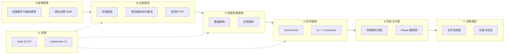

# Business AGI（ΠPaw）标准化架构模式与 TOGAF 交付设计

> **版本**：v1.0 · 2026-07-05  
> **状态**：Architecture Baseline（Phase-0 冻结草案）  
> **规范来源**：`harness/` reqharness 世界模型 · ADR-EDH-001/002 · TOGAF ADM 交付视图  
> **关联**：`Enterprise_Digital_Human_Ecosystem_Product_Definition.md` · `ΠPaw_*_Detailed_Design.md` · `docs/strategic/demo/README.md`

---

## 0. 文档控制（Architecture Repository）

| 属性 | 值 |
|------|-----|
| **架构制品类型** | 标准化架构模式 + 解决方案基线设计（SBB） |
| **架构域覆盖** | 业务 · 数据 · 应用 · 技术 · 治理 |
| **交付阶段** | Phase-0（基线）→ Phase-1（标杆扩展）→ Phase-2（套件规模化） |
| **验证入口** | `python harness/invariants/run-all.py` |
| **实体图谱** | `harness/entity-map.json` |
| **需求追溯** | REQ-EDH-PP-001 ~ PP-003 · REQ-EDH-PL-001 ~ PL-007 |

---

## 1. Executive Summary

**Business AGI（ΠPaw）** 是企业经营的**类人 AI 岗位体系**，不是聊天外挂。其标准化架构模式为：

```
企业经营逻辑（战略→组织→管理→业务）
        ↓ 四适配引擎配置化
角色化应用（战略罗盘 / 管理驾驶舱 / 执行助手）
        ↓ 场景套件（四要素预匹配）
岗位 Agent 编制（L2 职能 / L3 经营）
        ↓ 仅允许 cs.* 语义能力调用
UAS Kernel + 企业数据平面 + 治理审计 + 演化闭环
```

**Harness 强制约束（不可协商）**：

1. **ADR-EDH-001**：SelfPaw（对内个人）与 ΠPaw（组织经营）双轨边界；对外通道默认仅 ΠPaw。  
2. **ADR-EDH-002**：先能力服务化（`cs.*` + 租户/审计），再挂 Agent 岗位。  
3. **Agent 禁止直连** CRM/BPM/ERP；一律经 `CapabilityServiceRouter`。  
4. **模型提议、平台执行**（ASUI）：LLM 规划，确定性引擎执行。

---

## 2. 架构原则（Architecture Principles）

| ID | 原则 | Harness / TOGAF 对齐 |
|----|------|----------------------|
| AP-01 | **能力先于 Agent** | ADR-EDH-002；Phase-0 先交付 cs.* 注册中心 |
| AP-02 | **数据平面先于智能体** | 租户 · 主数据 · 事件 · 审计链 |
| AP-03 | **岗位先于人格** | BusinessAgentRoster：`position_id` + `role_id` + `domain_id` |
| AP-04 | **语义契约稳定** | `cs.{domain}.{action}` + JSON Schema 版本化 |
| AP-05 | **全链路可审计** | intent → evidence → decision → cs.* → result → ChangeSet |
| AP-06 | **双轨不混权** | `product_track`: `selfpaw` \| `pipaw` |
| AP-07 | **知识即配置** | Domain/Workflow/Law Pack 进 `configs/` |
| AP-08 | **增量演化** | E 层 ChangeSet + `evolve_apply` |
| AP-09 | **经营闭环先于片段自动化** | Objective→Strategy→Action→Result→Attribution |
| AP-10 | **分层可替换** | ABB 逻辑块与 SBB 实现解耦（TOGAF Building Blocks） |

---

## 3. TOGAF ADM 交付映射

Business AGI 采用 TOGAF ADM 作为**交付编排框架**（非理论主线），各阶段产出如下：



| ADM 阶段 | Business AGI 交付物 | 仓库工件 |
|----------|---------------------|----------|
| **A 架构愿景** | 产品定位、双轨边界、经营向外 KPI | `Enterprise_Digital_Human_Ecosystem_Product_Definition.md` |
| **B 业务架构** | 四适配层、岗位 Roster、LTC/OTD 价值流、双闭环 | `detailed-design/ΠPaw_*` · Demo |
| **C 数据架构** | 租户/组织/主数据/事件/审计；企业 WM 五维 | `schemas/enterprise_*.json` · `enterprise_world_model` |
| **C 应用架构** | 三层应用、Task Panel、Intent 升级、Outward Gateway | `pipaw_task_panel.py` · `intent_hub.py` |
| **D 技术架构** | UAS 八元组、AEE、Capability Registry、Connector | `asui-cli/src/asui/engine/` · `configs/` |
| **E 机会与方案** | 场景套件、实施五步法、价值对赌指标 | `projects/enterprise-sales-os/` |
| **F 迁移规划** | 灰度上线、并行运行、ChangeSet 回滚 | `evolve_apply.py` · 实施文档 |
| **G 治理** | RBAC/ABAC、审计链、Invariant CI | `harness/invariants/run-all.py` |

---

## 4. 标准化架构模式（Reference Architecture Pattern）

### 4.1 模式名称：**1核 · 4适配 · 3应用 · N套件 · Agent 执行**

```
┌─────────────────────────────────────────────────────────────────────────┐
│ L6 交互层 · 角色化应用（Application Architecture）                       │
│  ┌──────────────┐  ┌──────────────┐  ┌──────────────┐                  │
│  │ 战略罗盘      │  │ 管理驾驶舱    │  │ 执行助手      │  + 智慧闭环主控台 │
│  │ CEO/BG       │  │ BU/部门      │  │ 一线岗位      │                  │
│  └──────┬───────┘  └──────┬───────┘  └──────┬───────┘                  │
├─────────┴─────────────────┴─────────────────┴───────────────────────────┤
│ L5 智能层 · 六大引擎（Sense/Attribute/Strategize/Orchestrate/Alert/Evolve）│
├─────────────────────────────────────────────────────────────────────────┤
│ L4 模型层 · 五大经营实体 + 企业世界模型                                   │
│  Objective → Strategy → Action → Result → Attribution                   │
│  WM 五维：space · time · subject · object · feedback                    │
├─────────────────────────────────────────────────────────────────────────┤
│ L3 配置层 · 四适配引擎                                                    │
│  战略对齐 │ 组织适配 │ 管理模式(OKR/KPI/…) │ 业务模式(LTC/OTD/…)          │
├─────────────────────────────────────────────────────────────────────────┤
│ L2 数据层 · 企业数据平面                                                  │
│  租户 · 组织树 · 主数据 · 事件流 · 审计链 · 指标宽表                        │
├─────────────────────────────────────────────────────────────────────────┤
│ L1 集成层 · S-Grid 连接器                                                 │
│  CRM · BPM · ERP · 财务 · OA · ITSM · Outward Gateway                   │
├─────────────────────────────────────────────────────────────────────────┤
│ L0 内核层 · UAS Kernel（I,K,R,A,S,G,E,Π）                                │
│  AEE · Gate · ChangeSet · Protocol Stack                                │
└─────────────────────────────────────────────────────────────────────────┘
         ▲                              ▲
         │ 场景套件（N）                 │ 岗位 Agent 编制
         │ 场景·功能·数据·工具 预匹配     │ L2 职能 / L3 经营
         └────────── cs.* 唯一执行入口 ───┘
```

### 4.2 与 Harness 实体图谱映射

| 架构模式块 | entity-map 实体 | 类型 |
|------------|-----------------|------|
| L0 内核 | `UASKernel`, `AEE`, `Gate`, `ChangeSet` | platform / engine |
| L2 数据平面 | `EnterpriseDataPlane`, `RuntimeContext` | platform |
| L1 集成 | `SystemConnector`, `OutwardGateway` | adapter / service |
| 能力平面 | `CapabilityService`, `CapabilityServiceRegistry` | interface / service |
| 数字基础 | `DigitalFoundation` | platform |
| Business AGI 产品 | `PiPawBusinessAGI` | product |
| 岗位 Agent | `BusinessAgentRoster`, `Domain`, `Project`, `WorkingTask` | concept |
| SelfPaw 升级 | `IntentHub` → `WorkingTask` | service |

### 4.3 双闭环架构模式

**闭环 A · 业务场景闭环**（经营结果）

```
目标设定 → 路径规划 → 资源配置 → Agent执行 → 过程监控 → 异常处理 → 结果核算 → 复盘优化
   ↑                                                                      │
   └──────────────── ChangeSet / SOP 沉淀 ← 进化引擎 ← 归因验证 ←──────────┘
```

**闭环 B · 管理策略闭环**（管理制度）

```
策略制定 → 配置落地(Law Pack) → 自动执行 → 效果评估 → 问题诊断 → 策略优化
```

两闭环通过 **L4 实体链** 耦合：Strategy（管理策略/经营策略）→ Action → Result → Attribution。

---

## 5. 业务架构（Business Architecture）

### 5.1 业务能力地图（Level-1）

| 能力域 | 子能力 | 对外/对内 | Agent 层级 |
|--------|--------|-----------|------------|
| **战略管理** | 目标拆解、对齐校验、偏差预警 | 对内 | L2 经营分析 |
| **销售经营** | 线索、商机、报价、合同、回款 | 对外为主 | L3 销售顾问 |
| **客户服务** | 咨询、工单、SLA、升级 | 对外 | L3 客服 |
| **履约交付** | 订单、项目、验收、续签 | 对外+对内 | L2/L3 |
| **财务合规** | 开票、审批、信用、红线 | 对内 | L2 财务/合规 |
| **人力资源** | 招聘、绩效、编制 | 对内 | L2 招聘 |
| **知识演化** | SOP 沉淀、策略淘汰、复盘 | 对内 | E 层引擎 |

### 5.2 四适配层（Business Configuration Layer）

| 适配层 | 配置对象 | 配置载体 | 示例 |
|--------|----------|----------|------|
| **战略对齐** | 年度目标、拆解规则、对齐度阈值 | `configs/strategy_objectives.json` | 营收100亿·新业务30% |
| **组织适配** | 组织树、RACI、数据 scope | `configs/tenant_catalog.*` | 矩阵式·OMTU |
| **管理模式** | OKR/KPI/阿米巴模板 | `configs/mgmt_mode_*.json` | OKR 季度复盘 |
| **业务模式** | LTC/OTD/项目交付流程 | `projects/*/configs/world_model.json` | 2B 销售套件 |

### 5.3 岗位 Agent 编制（Business Agent Roster）

岗位 Agent 是企业业务架构的**可执行单元**，编制模型：

```
BusinessAgent = Domain Pack
              + Position/Role Binding
              + bound_operations[]  (cs.* only)
              + Playbook (SOP)
              + Gate Profile (L1/L2/L3 + G*)
              + outward? (经营向外)
```

**L2 vs L3（企业产品层级，非 UniAgent L0-L5）**：

| 层级 | 定义 | 数据 scope | 示例 agent_id |
|------|------|------------|---------------|
| **L2 职能** | 跨部门职能岗位 | 部门/职能域 | `agent.finance_analyst` |
| **L3 经营** | 对客户/市场/交付 | 客户/商机/合同域 | `agent.cs_specialist` |

Phase-0 标杆：`agent.cs_specialist`（REQ-EDH-PP-001）。

---

## 6. 数据架构（Data Architecture）

### 6.1 四层数据平面

```
┌─────────────────────────────────────────┐
│ 触达层数据：会话、渠道、PII 脱敏策略      │  ← Outward Gateway
├─────────────────────────────────────────┤
│ 经营层数据：Objective/Strategy/Action/   │
│            Result/Attribution/KPI        │
├─────────────────────────────────────────┤
│ 主数据层：客户·员工·岗位·产品·合同·工单   │
├─────────────────────────────────────────┤
│ 租户隔离层：tenant_id · org_tree · scope │
└─────────────────────────────────────────┘
```

### 6.2 核心数据实体

| 实体 | Schema | 说明 |
|------|--------|------|
| Tenant / Org | `enterprise_tenant.schema.json` | 多租户与组织树 |
| Permission | `enterprise_permission.schema.json` | RBAC/ABAC |
| Intent | `intent_object.schema.json` | SelfPaw 意图 |
| WorkingTask | `working_task.schema.json` | ΠPaw 执行单元 |
| World Model | `enterprise_world_model.schema.json` | 五维 + 三身份 |
| Capability | `capability_service.schema.json` | cs.* 契约 |
| Agent Roster | `business_agent_roster.schema.json` | 岗位编制 |
| Task Panel | `task_panel_view.schema.json` | UI 任务态 |
| Audit | PL-006 审计链规格 | 全链路追溯 |

### 6.3 企业世界模型（PP-003）

| 维度 | 必填 | Business AGI 用途 |
|------|------|-------------------|
| space | tenant_id, systems[] | 组织/区域/系统边界 |
| time | SLA, 有效期 | 审批时限、销售周期 |
| subject | id, type | 员工、客户、Agent |
| object | id, lifecycle[] | 线索、工单、合同 |
| feedback | id, type | 事件、KPI、审计 |

**三身份**：mirror（反映）· lens（洞察）· furnace（ChangeSet 重塑）。

---

## 7. 应用架构（Application Architecture）

### 7.1 应用组合（Application Portfolio）

| 应用 | 用户 | 核心模块 | 状态 |
|------|------|----------|------|
| **ΠPaw 智慧闭环主控台** | 全角色 | 五大实体、双闭环、角色 Widget | Demo |
| **ΠPaw 战略罗盘** | CEO/BG | 四大金刚、战略拆解、风险 | Demo |
| **ΠPaw 管理驾驶舱** | 部门负责人 | 目标承接、过程管控、异常 | Demo |
| **ΠPaw 执行助手** | 一线 | Task Panel、待办、审批 | PP-001 标杆 |
| **ΠPaw 组织适配配置** | 实施/管理员 | OMTU、Roster、RACI | Demo + Schema |
| **ΠPaw 策略库** | 策略主责 | 战役、SOP、里程碑 | Demo |
| **Outward Gateway** | 对外触点 | Webhook、IM 路由 | PP-002 草案 |
| **UAS Studio** | 开发者 | WM 设计器、套件配置 | 规划 |

### 7.2 核心应用流（Application Flows）

**流 F1 · SelfPaw → ΠPaw 升级（ADR-EDH-001）**

```
SelfPaw Intent (business_outward + evidence_refs[])
  → POST /api/v1/intent/escalate
  → WorkingTask (product_track=pipaw)
  → Task Panel backlog
  → 岗位 Agent 认领 → Playbook 步骤 → cs.* 执行
```

**流 F2 · 对外会话 → 经营 Agent**

```
客户 IM/Webhook
  → Outward Gateway (租户绑定 + 脱敏)
  → 路由表 → position_id / agent_id
  → Agent + Playbook
  → cs.ticket.* / cs.customer.*
  → 审计链 + SLA 监控
```

**流 F3 · 经营智慧闭环（五大实体）**

```
感知引擎 → 归因引擎 → 策略引擎 → 编排引擎 → 结果归因 → 进化引擎
   O          Atr         Str          Act          Result       SOP
```

### 7.3 Task Panel 应用模型（Harness 强制）

Task Panel 展示**任务态**，不是执行日志：

| 字段 | 枚举/类型 | UI 含义 |
|------|-----------|---------|
| `status` | open / in_progress / blocked / done | 任务生命周期 |
| `display_phase` | backlog / current / completed | 待办 vs 当前执行区 |
| `steps[]` | done, current, operation_ref | SOP 步骤绑定 cs.* |
| `sla_label` | string | SLA 剩余时间 |
| `actions[]` | open / complete_step / escalate | 人机协同操作 |

---

## 8. 技术架构（Technology Architecture）

### 8.1 UAS 八元组 → 技术组件

| 元组 | 技术组件 | 仓库路径 |
|------|----------|----------|
| **I** | Intent Hub, Escalation API | `asui-cli/src/asui/intent_hub.py` |
| **K** | Domain/Workflow/Law Pack | `configs/`, `.claude/skills/` |
| **R** | UASRuntimeService, AEE | `scripts/run_uas_runtime_service.py` |
| **A** | Agent Fabric, Roster, Playbook | `pipaw_cs_agent.py`, `pipaw_task_panel.py` |
| **S** | Capability Router, Connector | `asui-cli/src/asui/connectors/` |
| **G** | Policy, Gate G1-G7, L1-L3 | `governance_policy.json` |
| **E** | ChangeSet, evolve_apply | `scripts/evolve_apply.py` |
| **Π** | MCP, Webhook, ASUI 协议 | 规划 |

### 8.2 cs.* 能力服务技术栈

```
Agent.bound_operations[]
  → CapabilityServiceRouter.invoke(operation_ref, payload, actor)
  → Gate 检查 (G* + L*)
  → Connector 适配 (crm/bpm/finance/oa/itsm)
  → audit.append
  → 标准化 result / 可回滚信息
```

**命名规范**：`cs.{domain}.{action}`（Harness 强制）

Phase-0 最小目录：CS-01..CS-10（见 `capability-service-catalog-baseline.md`）。

### 8.3 模型层与平台层分离

```
┌─────────────────┐
│  Model Layer    │  LLM / 嵌入 / OCR — Provider 抽象
└────────┬────────┘
         │ 提议 (plan / generate)
┌────────▼────────┐
│  Platform Layer │  Gate → cs.* → Audit → ChangeSet
└─────────────────┘
```

---

## 9. Architecture Building Blocks（ABB / SBB）

### 9.1 逻辑构建块（ABB）

| ABB ID | 名称 | 职责 | 依赖 |
|--------|------|------|------|
| ABB-PP-01 | Strategic Alignment Engine | 战略拆解与对齐 | ABB-Data-Org |
| ABB-PP-02 | Org Adaptation Engine | 组织/责权/scope | ABB-Data-Tenant |
| ABB-PP-03 | Management Mode Engine | OKR/KPI/制度落地 | ABB-PP-01 |
| ABB-PP-04 | Business Mode Engine | LTC/OTD 流程规则 | ABB-WM |
| ABB-PP-05 | Agent Orchestrator | 岗位分派、SLA | ABB-AEE, ABB-Cap |
| ABB-PP-06 | Value Loop Controller | 五大实体闭环 | ABB-PP-05, ABB-Evo |
| ABB-Cap | Capability Service Hub | cs.* 注册/路由/审计 | ABB-Conn |
| ABB-WM | Enterprise World Model | 五维+法则 | ABB-Data |
| ABB-Gov | Governance & Audit | Gate + 审计链 | ABB-Data-Audit |
| ABB-Out | Outward Gateway | 对外触达与路由 | ABB-PP-05 |

### 9.2 解决方案构建块（SBB）— 仓库落地

| SBB ID | ABB 实现 | 路径 | 验证 |
|--------|----------|------|------|
| SBB-Cap-Reg | ABB-Cap | `configs/capability_registry.json` | `validate_capability_registry.py` |
| SBB-Roster | ABB-PP-05 | `configs/pipaw_business_agent_roster.json` | `validate_pipaw_cs_agent.py` |
| SBB-Playbook | ABB-PP-05 | `configs/pipaw_cs_agent_playbook.json` | 同上 |
| SBB-TaskPanel | ABB-PP-05 | `asui-cli/src/asui/pipaw_task_panel.py` | schema + benchmark |
| SBB-IntentEsc | ABB-PP-05 | `scripts/escalate_intent.py` | `validate_intent_escalation.py` |
| SBB-WM | ABB-WM | `configs/enterprise_world_model.sample.json` | `validate_enterprise_wm.py` |
| SBB-Policy | ABB-Gov | `configs/enterprise_rbac_template.json` | `validate_enterprise_policy.py` |
| SBB-Conn | ABB-Cap | `configs/connectors.json` | `validate_connectors.py` |
| SBB-Demo | 全栈演示 | `docs/strategic/demo/ΠPaw_Enterprise_Demo.html` | 人工 + `_check_js.mjs` |
| SBB-SalesOS | ABB-PP-04 | `projects/enterprise-sales-os/` | `evaluate_sales_mvp.py` |

---

## 10. Agent 应用规范（Harness Agent Application Standard）

> 本节为 Business AGI Agent 的**强制应用规范**，与 `pipaw-cs-agent-benchmark.md` 一致。

### 10.1 Agent 定义必填字段

```json
{
  "agent_id": "agent.{role_slug}",
  "name": "岗位显示名",
  "position_id": "pos-{dept}-{role}",
  "role_id": "role.{role}",
  "product_track": "pipaw",
  "domain_id": "domain.{domain}",
  "outward": true,
  "bound_operations": ["cs.{domain}.{action}", "..."],
  "narrative_aliases": { "产品叙事键": "cs.* 操作名" },
  "playbook_id": "playbook.{scenario}_v{n}",
  "demo_reference": "可选：Demo 对标路径"
}
```

Schema：`schemas/business_agent_roster.schema.json`

### 10.2 Playbook（SOP）规范

| 字段 | 要求 |
|------|------|
| `playbook_id` | 全局唯一，版本后缀 `_v{n}` |
| `steps[]` | 每步绑定 `operation_ref`（cs.*）或人工确认点 |
| `gates` | 步骤级 G*/L* 声明 |
| `sla` | 关联 WM time 维度 |
| `escalation` | 超时 → `cs.ticket.escalate` 或编排引擎 |

### 10.3 能力绑定规则

| 规则 ID | 描述 |
|---------|------|
| R-AG-01 | `bound_operations` 每项必须匹配 `^cs\.[a-z][a-z0-9_.]+\.[a-z][a-z0-9_]+$` |
| R-AG-02 | 禁止 roster 出现 `crm.`、`http:`、裸 REST 路径 |
| R-AG-03 | 每个对外 Agent 至少 1 个 evidence/audit 相关 cs.* |
| R-AG-04 | Playbook 每步 `operation_ref` ⊆ `bound_operations` |
| R-AG-05 | 升级创建的 WorkingTask 必须带 `audit_id` |

### 10.4 执行分级（Gate）

| 级别 | 含义 | 典型操作 |
|------|------|----------|
| **L1** | 自动执行 | 查询、草稿、内部通知 |
| **L2** | 人工确认后执行 | 对外发送、折扣报价 |
| **L3** | 审批链通过后执行 | 合同签署、大额退款 |

| 治理门 | 含义 |
|--------|------|
| G0-G7 | 合规/可测/可审/可回滚等（见 governance_policy） |

### 10.5 验收清单（Agent 上线前）

- [ ] `cs.*` 依赖已在 `capability_registry.json` 注册且 `validate` 通过  
- [ ] Roster JSON 通过 `business_agent_roster.schema.json`  
- [ ] Playbook 步骤与 bound_operations 一致  
- [ ] Task Panel 可渲染 backlog + current（非日志）  
- [ ] 端到端场景跑通（见 benchmark E2E）  
- [ ] `harness/invariants/run-all.py` 通过  
- [ ] 审计链含 intent → task → cs.* → result  

---

## 11. 场景套件标准（Scenario Kit Pattern）

每个场景套件预匹配四要素：

| 要素 | 内容 | 工件 |
|------|------|------|
| **场景** | 业务情境与触发条件 | `world_model.json` |
| **功能** | 引擎+实体+Task Panel | Playbook + Demo 模块 |
| **数据** | 对象 schema、指标 | MDM 映射 + KPI 定义 |
| **工具** | cs.* + Connector | `capability_registry` 子集 |

**套件清单（Phase-0/1）**：

| 套件 ID | 业务模式 | 标杆 Agent | 需求 |
|---------|----------|------------|------|
| kit-ltc | 2B 销售 LTC | Sales Advisor | enterprise-sales-os |
| kit-cs-sla | 客服 SLA | agent.cs_specialist | PP-001 ✓ |
| kit-finance | 财务审批 | Finance Agent | CS-08 |
| kit-recruit | 招聘 OS | Recruit Agent | SP 协同 |

---

## 12. 架构视图（TOGAF Viewpoints）

| 视点 | Stakeholder | 视图 | 工件 |
|------|-------------|------|------|
| **业务** | CEO/业务负责人 | 四适配层、价值流、岗位图 | Demo 战略罗盘/管理驾驶舱 |
| **应用** | 产品经理 | 三应用+Task Panel 流 | 本文 §7 |
| **数据** | 数据架构师 | 数据平面+WM 五维 | enterprise_wm spec |
| **技术** | 工程团队 | UAS+cs.*+Connector | edh-platform-baseline |
| **安全/合规** | 合规官 | RBAC+审计+Gate | enterprise-rbac-abac-spec |
| **实施** | 交付顾问 | 五步法+套件选型 | Landing Definition |
| **运行** | 运维 | CI invariant + 监控 | reqharness.yaml |

---

## 13. 架构治理（Architecture Governance）

### 13.1 治理组织（建议）

| 角色 | 职责 |
|------|------|
| **Architecture Board** | 审批 ADR、ABB 变更、跨套件标准 |
| **Capability Owner** | 维护 cs.* 契约与版本 |
| **Domain Owner** | 维护行业/岗位认知包 |
| **Agent Owner** | 维护 Roster/Playbook |
| **Security Officer** | Gate/审计/租户策略 |

### 13.2 变更控制

```
变更提案 → ADR/REQ 文档 → Schema/Config 更新 → harness invariant CI → 灰度租户 → 全量
```

**强制 CI（reqharness.yaml）**：

```bash
python harness/invariants/run-all.py
python scripts/validate_capability_registry.py validate
python scripts/validate_enterprise_policy.py validate
python scripts/validate_connectors.py validate
python scripts/validate_intent_escalation.py validate
python scripts/validate_pipaw_cs_agent.py validate
```

### 13.3 架构符合性检查

| 检查项 | 不符合后果 |
|--------|------------|
| Agent 直连 CRM | 拒绝合并 |
| 无 evidence 升级 | API 403 |
| 跨租户访问 | Policy deny |
| 无 audit_ref 的 cs.* 写操作 | Gate 拦截 |
| Playbook 步骤无 operation_ref | validate 失败 |

---

## 14. 交付路线图（与 ADM Phase 对齐）

| Phase | 目标 | 交付 SBB | 验收 |
|-------|------|----------|------|
| **P0 基线** | 能力+租户+审计+1 标杆 Agent | SBB-Cap-Reg, SBB-Roster, SBB-TaskPanel | PP-001 ✓ |
| **P1 扩展** | Outward Gateway + 销售套件 | SBB-Out, SBB-SalesOS | PP-002, PP-003 |
| **P2 规模化** | 10+ 岗位 Roster + 六引擎生产化 | 多 Playbook | PP-05+ |
| **P3 企业级** | 四适配层配置器 + Studio | UAS Studio | 落地定义 |

---

## 15. 附录 A：标准配置目录结构

```
configs/
├── capability_registry.json          # cs.* 注册表
├── pipaw_business_agent_roster.json  # 岗位编制
├── pipaw_cs_agent_playbook.json      # 标杆 SOP
├── tenant_catalog.sample.json        # 租户/组织
├── enterprise_rbac_template.json     # 权限模板
├── connectors.json                   # S-Grid 连接器
├── enterprise_world_model.sample.json
└── intent_escalation_policy.sample.json

schemas/
├── business_agent_roster.schema.json
├── task_panel_view.schema.json
├── working_task.schema.json
├── intent_object.schema.json
├── capability_service.schema.json
└── enterprise_world_model.schema.json

harness/
├── entity-map.json                   # 架构实体图谱
├── knowledge/technical/              # 技术规格
└── requirements/REQ-EDH-PP-*.req.md  # 需求追溯
```

---

## 16. 附录 B：与 UniAgent 标准的关系

| UniAgent L0-L5 | Business AGI 映射 |
|----------------|-------------------|
| L0 身份生命周期 | `agent_id` + `tenant_id` + Gate trust |
| L1 能力清单 | `bound_operations` + Playbook |
| L2 状态包络 | Task Panel `business_context` |
| L3 消息原语 | Intent 升级 / WorkingTask 事件 |
| L4 网络策略 | RBAC scope + 租户隔离 |
| L5 世界提交 | WM propose + ChangeSet |

Business AGI **不重复发明** UniAgent 协议；在企业场景用 **Harness 实体 + cs.* + Task Panel** 落地，UniAgent 作为 Agent 互联演进方向。

---

## 17. 附录 C：文档索引

| 主题 | 路径 |
|------|------|
| Harness 操作手册 | `harness/README.md` |
| 客服 Agent 标杆 | `harness/knowledge/technical/pipaw-cs-agent-benchmark.md` |
| 能力目录 | `harness/knowledge/technical/capability-service-catalog-baseline.md` |
| 双轨 ADR | `harness/knowledge/constraints/adr-edh-001-*.md` |
| 能力优先 ADR | `harness/knowledge/constraints/adr-edh-002-*.md` |
| 产品详细设计 | `docs/strategic/detailed-design/ΠPaw_*` |
| 交互 Demo | `docs/strategic/demo/README.md` |
| L1-L3 生态 | `docs/strategic/design/UAS_AIOS_ENTERPRISE_AGENT_ECOSYSTEM_L1_L3.md` |

---

*本文档为 Business AGI 标准化架构基线；实现变更须同步更新 `harness/entity-map.json` 并通过 invariant CI。*
