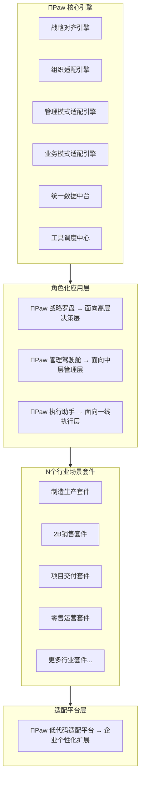

# ΠPaw 全层级产品落地定义（可直接落地版）
## 一、整体产品矩阵设计
基于企业「决策层-管理层-执行层」的天然组织层级，采用「1核3层N套件」的产品架构，实现从顶层到一线的全链路智能经营，天然匹配**场景-功能-数据-工具**四要素：

### 设计核心原则
1. **层级天然适配**：完全匹配企业组织层级，不同角色拿到的是完全贴合自己工作场景的产品，不需要学习复杂功能
2. **四要素自动匹配**：每个场景自动关联对应功能、所需数据、调度对应工具，用户不需要关心底层逻辑，只需要处理业务
3. **全链路贯通**：战略从顶层到底层自动拆解，结果从底层到顶层自动汇总，偏差自动识别，彻底解决"战略和执行两张皮"问题
4. **开箱即用+灵活扩展**：通用场景用预制套件直接落地，个性化需求用低代码平台快速配置，不需要大量定制开发
---
## 二、三层角色化应用详细定义（场景-功能-数据-工具精准匹配）
### 2.1 顶层应用：ΠPaw 战略罗盘 → 面向CEO、高管层、决策层
#### 核心价值
让高层"一眼看清全公司经营情况，一脑辅助重大决策，一键推行动作落地"
#### 核心场景与四要素匹配
| 核心场景 | 对应功能 | 依赖数据 | 集成工具 |
|----------|----------|----------|----------|
| **战略目标制定与拆解** | 1. 战略文档智能解析<br>2. 战略目标可视化拆解<br>3. 部门目标自动对齐校验<br>4. 资源自动匹配建议 | 历史战略数据、行业benchmark、公司资源数据、过往战略落地效果数据 | 企业战略管理系统、财报系统、行业数据库、宏观经济数据平台 |
| **全局经营实时监控** | 1. 经营核心指标大盘可视化<br>2. 多维度对比分析（同环比、预算对比、行业对比）<br>3. 核心指标智能预警<br>4. 异常指标自动下钻分析 | 全量经营数据（营收、利润、成本、现金流、人效等）、预算目标数据、行业对标数据 | BI系统、ERP、财务系统、各业务系统 |
| **重大风险智能预警** | 1. 外部风险监控（政策、市场、竞品、供应链等）<br>2. 内部风险识别（经营风险、合规风险、人事风险等）<br>3. 风险等级自动评估<br>4. 应对预案自动推荐 | 外部舆情数据、政策数据、竞品数据、内部经营数据、合规数据、风险案例库 | 舆情监测工具、政策数据库、竞品监测工具、合规管理系统 |
| **重大决策智能推演** | 1. 决策选项数字化建模<br>2. 多场景模拟推演（不同决策的结果预测）<br>3. 投入产出自动核算<br>4. 最优决策建议 | 历史决策数据、业务模型数据、外部环境数据、成本收益数据 | 仿真推演工具、财务测算模型、行业数据库 |
| **战略落地效果跟踪** | 1. 战略落地进度实时跟踪<br>2. 偏差自动识别与根因分析<br>3. 调整建议自动生成<br>4. 战略迭代效果评估 | 战略拆解后的各层级目标数据、执行进度数据、结果数据、偏差分析数据 | 战略管理系统、各业务执行系统 |
#### 交互设计
- 多端适配：智慧大屏（指挥中心用）、PC端（日常办公用）、移动端（外出用）、智能语音助手（汇报/查询用）
- 极简设计：核心指标一屏展示，异常自动高亮，支持语音查询"本月营收完成情况""某业务线利润下滑原因"
- 简报自动推送：每日/每周/每月自动生成经营简报，推送给高管，关键异常实时告警
#### 权限控制
- 最高级权限控制，按高管分管范围分配数据权限，操作全程审计留痕
---
### 2.2 中层应用：ΠPaw 管理驾驶舱 → 面向部门负责人、项目经理、业务线负责人
#### 核心价值
让中层"目标不跑偏，过程可管控，问题早发现，团队提效能"
#### 核心场景与四要素匹配
| 核心场景 | 对应功能 | 依赖数据 | 集成工具 |
|----------|----------|----------|----------|
| **目标承接与拆解** | 1. 公司战略目标承接<br>2. 部门/团队目标拆解与对齐<br>3. 团队成员目标分配<br>4. 目标合理性自动校验 | 公司战略目标、部门历史绩效数据、团队人员能力数据、资源配置数据 | OKR/KPI系统、HR系统、项目管理系统 |
| **业务过程实时管控** | 1. 业务进度实时跟踪可视化<br>2. 关键节点自动提醒<br>3. 异常自动识别与告警<br>4. 跨部门协作自动同步 | 业务流程数据、项目进度数据、关键节点数据、跨部门协作数据 | CRM、ERP、项目管理系统、OA系统、业务执行系统 |
| **异常问题智能处理** | 1. 异常根因自动分析<br>2. 解决方案自动推荐<br>3. 相关责任人自动推送<br>4. 处理过程自动跟踪闭环 | 异常规则库、历史问题处理库、责任人配置数据、业务关联数据 | 工单系统、IM工具、流程审批系统、知识库 |
| **团队效能管理** | 1. 团队人效自动核算<br>2. 个人绩效自动跟踪<br>3. 能力短板自动识别<br>4. 优化建议自动生成 | 团队产出数据、个人工作数据、绩效数据、能力评估数据 | HR系统、绩效系统、工时系统、知识库 |
| **管理报表自动生成** | 1. 日/周/月管理报表自动生成<br>2. 多维度数据分析<br>3. 向上汇报材料自动生成<br>4. 问题和改进建议自动提炼 | 业务结果数据、过程数据、绩效数据、行业对标数据 | BI工具、报表系统、Office工具 |
#### 交互设计
- 个性化管理看板：每个管理者可以自定义自己的看板，关注的核心指标、待办事项、异常告警一屏展示
- 待办驱动：所有需要处理的事项按优先级自动推送，不需要自己到处找信息
- 一键生成汇报材料：自动生成周报/月报/季度汇报PPT，减少文案工作
#### 权限控制
- 部门级数据权限，只能查看自己管辖范围内的数据，跨部门数据需要授权
---
### 2.3 一线应用：ΠPaw 执行助手 → 面向一线员工（销售、运营、生产、客服、技术等）
#### 核心价值
让一线"重复工作自动做，信息不用到处找，问题不用反复问，流程不用来回跑"，专注高价值创造性工作
#### 核心场景与四要素匹配
| 核心场景 | 对应功能 | 依赖数据 | 集成工具 |
|----------|----------|----------|----------|
| **日常任务自动处理** | 1. 常规工作自动执行（报表生成、数据填报、通知推送等）<br>2. 标准化业务流程自动处理（合同生成、订单录入、工单派单等）<br>3. 批量任务自动处理<br>4. 跨系统操作自动串联 | 标准化业务规则、流程配置数据、员工操作习惯数据、系统对接权限数据 | 各类业务系统、办公软件、RPA工具、流程引擎 |
| **智能问答助手** | 1. 业务知识查询（制度、流程、规则、常见问题等）<br>2. 业务数据查询（业绩、订单、库存、客户信息等）<br>3. 操作指引（系统操作步骤、问题解决方法等）<br>4. 专业知识咨询（技术、法律、财务等专业问题） | 企业知识库、业务数据库、常见问题库、专业知识图谱 | 知识库系统、业务系统、FAQ库、专业数据库 |
| **流程自动化处理** | 1. 审批流程自动发起、跟踪、提醒<br>2. 表单自动填充、提交<br>3. 跨部门流程自动对接<br>4. 流程异常自动提醒和处理 | 流程配置数据、表单模板数据、人员权限数据、历史流程数据 | OA系统、审批系统、表单工具、IM工具 |
| **业务操作智能辅助** | 1. 操作建议自动推荐（销售话术、客服回复、解决方案等）<br>2. 操作合规自动校验（避免错误操作、违规操作）<br>3. 经验自动沉淀（优秀实践自动提取到知识库）<br>4. 新人智能带教（操作指引、问题解答、能力提升建议） | 优秀实践库、合规规则库、用户画像数据、能力提升路径数据 | CRM、客服系统、生产系统、知识库系统 |
| **个人效能提升** | 1. 待办事项自动汇总、排序<br>2. 日程智能规划<br>3. 工作内容自动总结<br>4. 个人成长建议自动生成 | 个人日程数据、待办数据、工作产出数据、能力评估数据 | 日历、待办工具、绩效系统、知识库 |
#### 交互设计
- 多端入口：桌面端悬浮球、移动端APP/小程序、浏览器插件、业务系统内嵌入口、智能语音助手
- 非侵入式设计：不改变原有系统使用习惯，需要时一键唤起，自动获取上下文信息
- 极简操作：语音交互、一句话指令完成复杂操作，不需要多个系统来回切换
#### 权限控制
- 最小权限原则，只能访问和自己工作相关的数据和功能，操作全程可审计
---
## 三、全链路贯通引擎：实现从顶层到一线的无缝协同
三层应用不是孤立的，通过「战略-管理-执行贯通引擎」实现全链路打通，确保上下同欲，力出一孔：
### 3.1 自上而下的目标拆解链路
```
公司战略目标 → 部门管理目标 → 团队执行任务 → 个人工作项
     ↓            ↓            ↓          ↓
自动对齐校验 → 自动拆解分配 → 自动匹配资源 → 自动跟踪进度
```
- 自动校验各层级目标是否对齐公司战略，识别目标冲突、错配、遗漏
- 自动拆解到具体的可执行任务，分配到对应责任人，匹配所需资源和工具
- 进度自动跟踪，偏差自动识别和告警
### 3.2 自下而上的结果汇总链路
```
个人执行结果 → 团队任务结果 → 部门目标结果 → 公司战略结果
     ↓            ↓            ↓          ↓
自动数据采集 → 自动汇总核算 → 自动对比目标 → 自动偏差分析
```
- 不需要人工填报数据，自动从各业务系统采集结果数据
- 自动核算各层级目标完成情况，对比目标识别偏差
- 自动分析偏差根因，推送对应责任人
### 3.3 全链路偏差闭环处理
```
偏差识别 → 根因分析 → 方案推荐 → 责任人推送 → 执行跟踪 → 结果验证 → 流程优化
```
- 任何层级的偏差都自动触发闭环处理流程，不需要人工发起
- 处理过程全程跟踪，确保每个问题都有落地结果
- 处理经验自动沉淀到知识库，持续优化后续处理能力
---
## 四、场景化套件：开箱即用的四要素匹配方案
针对不同行业不同业务场景，预制标准化的场景套件，每个套件已经完成**场景-功能-数据-工具**的预匹配，企业可以直接选用，快速落地：
### 4.1 核心预制套件清单
| 套件名称 | 适用场景 | 包含内容（四要素预匹配） | 落地周期 |
|----------|----------|--------------------------|----------|
| 制造生产套件 | 生产制造型企业生产管理全场景 | 场景：生产计划、排产、执行、质量、设备、供应链全场景<br>功能：生产过程自动跟踪、异常自动预警、质量自动分析、设备 predictive maintenance 等<br>数据：生产、质量、设备、供应链、人员等数据 schema 预定义<br>工具：集成MES、ERP、SCADA、PLM等生产系统 | 2周 |
| 2B销售LTC套件 | 企业销售全流程管理 | 场景：线索、商机、投标、合同、回款、客户成功全场景<br>功能：线索自动打分、跟进建议自动生成、投标材料自动生成、合同自动审核、回款自动跟踪等<br>数据：客户、商机、合同、回款、产品等数据 schema 预定义<br>工具：集成CRM、ERP、合同管理系统、招投标系统等 | 1周 |
| 项目交付套件 | 项目型企业（建筑、软件实施、专业服务等）全流程管理 | 场景：立项、规划、执行、监控、验收、结项全场景<br>功能：进度自动跟踪、资源自动调度、风险自动识别、成本自动核算、验收材料自动生成等<br>数据：项目、资源、成本、进度、质量等数据 schema 预定义<br>工具：集成项目管理系统、OA、财务系统、工时系统等 | 1周 |
| 零售运营套件 | 零售品牌、电商、连锁门店全场景 | 场景：选品、采购、库存、营销、销售、用户运营全场景<br>功能：销量自动预测、库存自动优化、营销活动自动生成、用户自动分层运营等<br>数据：商品、库存、订单、用户、营销等数据 schema 预定义<br>工具：集成电商平台、ERP、POS系统、用户运营平台等 | 1周 |
| 研发管理套件 | 科技公司、研发团队全流程管理 | 场景：需求、规划、开发、测试、上线、运维全场景<br>功能：需求自动拆解、进度自动跟踪、缺陷自动分析、迭代自动复盘、效能自动度量等<br>数据：需求、代码、缺陷、迭代、人员等数据 schema 预定义<br>工具：集成Git、Jira、CI/CD、测试管理等系统 | 1周 |
| 财务管理套件 | 所有企业财务部门全场景 | 场景：核算、预算、资金、税务、风控、报表全场景<br>功能：凭证自动生成、报表自动编制、预算自动监控、风险自动识别、税务自动申报等<br>数据：凭证、报表、预算、资金、税务等数据 schema 预定义<br>工具：集成财务系统、ERP、银行系统、税务系统等 | 1周 |
### 4.2 套件扩展机制
- 支持自定义场景：企业可以基于现有套件扩展自己的个性化场景
- 支持自定义功能：可以调整、增加、删除套件中的功能
- 支持自定义数据映射：可以匹配自己企业的业务数据结构
- 支持自定义工具集成：可以对接自己企业在用的各类工具和系统
---
## 五、低代码适配平台：企业个性化扩展的核心载体
对于企业的个性化需求，不需要代码开发，通过ΠPaw低代码适配平台就能快速配置落地，降低落地成本，缩短上线周期：
### 5.1 核心配置能力
| 配置模块 | 功能说明 | 使用角色 |
|----------|----------|----------|
| **场景配置器** | 可视化新增、编辑业务场景，配置场景的触发条件、处理逻辑、输出结果 | 业务架构师、业务分析师 |
| **功能配置器** | 拖拽式配置功能模块、页面布局、交互逻辑，不需要前端开发 | 产品经理、业务分析师 |
| **数据映射器** | 可视化配置数据的采集、清洗、转换、映射规则，对接企业自有数据结构 | 数据分析师、IT人员 |
| **工具集成器** | 可视化配置和第三方系统、工具的对接，预置主流系统的对接模板，配置API参数即可完成对接 | IT人员、系统集成商 |
| **规则配置器** | 可视化配置业务规则、管理规则、审批规则、告警规则等各类规则，不需要代码开发 | 业务管理人员、IT人员 |
### 5.2 配置生效机制
- 所有配置实时生效，不需要发布、重启系统
- 配置支持灰度发布，可以先给小范围用户试用，验证后全量上线
- 配置支持版本管理，可以回滚到历史版本
- 配置操作全程审计留痕，谁在什么时候改了什么都有记录
---
## 六、落地实施路径（可直接执行）
### 6.1 四步落地法
| 实施阶段 | 周期 | 核心工作 | 输出物 | 验证标准 |
|----------|------|----------|--------|----------|
| **第一步：业务调研与分层梳理** | 1-2周 | 1. 高层访谈：明确战略目标、决策场景<br>2. 中层访谈：明确管理模式、业务流程、核心痛点<br>3. 一线访谈：明确执行场景、重复工作、工具使用情况<br>4. 系统调研：梳理现有IT系统、数据情况 | 《企业需求调研分析报告》《落地范围与优先级规划》 | 企业各级用户对需求和范围确认签字 |
| **第二步：场景套件选型与适配** | 2-4周 | 1. 选择适配的行业场景套件<br>2. 基于企业个性化需求配置调整<br>3. 对接现有业务系统和工具<br>4. 配置数据映射和业务规则 | 配置完成的ΠPaw系统、《系统配置说明文档》 | 核心场景走通，数据对接正常，功能符合需求 |
| **第三步：测试与灰度上线** | 1-2周 | 1. 功能测试：验证所有功能正确性<br>2. 集成测试：验证和现有系统对接正确性<br>3. 灰度测试：选择1-2个小团队试点运行<br>4. 问题修复和优化调整 | 《测试报告》《试点运行报告》 | 试点用户反馈良好，核心流程运行稳定，效率提升明显 |
| **第四步：全量推广与持续优化** | 2-4周 | 1. 各级用户培训<br>2. 分阶段全量上线<br>3. 运行支持和问题快速响应<br>4. 持续迭代优化，扩展更多场景 | 《上线运行报告》《操作手册》《培训材料》 | 全量上线稳定运行，用户使用率≥90%，核心指标达到预期 |
### 6.2 不同规模企业落地周期
| 企业规模 | 总落地周期 | 最快可落地时间 |
|----------|------------|----------------|
| 小微企业（<50人） | 2-4周 | 1周（直接用标准化套件） |
| 中型企业（50-500人） | 4-8周 | 2周（核心场景先上线，逐步扩展） |
| 大型企业（>500人） | 8-16周 | 4周（分业务线分阶段上线） |
| 集团企业（>10000人） | 16-32周 | 8周（先试点子公司，再逐步推广） |
---
## 七、落地效果验证标准（可量化）
### 7.1 各层级效果验证指标
| 层级 | 验证指标 | 预期效果 |
|----------|----------|----------|
| 高层决策层 | 1. 战略落地偏差率<br>2. 目标达成率<br>3. 风险识别提前量<br>4. 决策效率 | 战略落地偏差率降低≥80%<br>目标达成率提升≥50%<br>风险识别提前≥7天<br>决策效率提升≥100% |
| 中层管理层 | 1. 管理效率<br>2. 流程处理时长<br>3. 问题处理及时率<br>4. 团队人效 | 管理成本降低≥50%<br>流程处理时长缩短≥60%<br>问题处理及时率≥95%<br>团队人效提升≥30% |
| 一线执行层 | 1. 重复工作占比<br>2. 人均产出<br>3. 错误率<br>4. 系统操作时长 | 重复工作占比降低≥80%<br>人均产出提升≥50%<br>工作错误率降低≥90%<br>系统操作时长减少≥60% |
### 7.2 整体价值验证指标
| 指标类别 | 预期效果 |
|----------|----------|
| 效率指标 | 整体运营效率提升≥60% |
| 成本指标 | 运营成本降低≥30% |
| 收入指标 | 营收增长≥20% |
| 合规指标 | 合规风险降低≥90% |
---
## 八、落地示例（制造企业全链路演示）
### 示例背景
某大型制造企业，年度战略目标："降本增效10%"
### 全链路落地效果
#### 1. 高层（战略罗盘）
- 场景：战略目标制定与跟踪
- 功能：输入战略目标，系统自动拆解到各部门，实时跟踪落地进度
- 数据：全公司生产、成本、质量、效率等数据
- 工具：集成ERP、MES、财务系统
- 效果：高管一屏看到降本增效目标的全局进度，哪个部门完成好，哪个部门拖后腿，根因是什么，一目了然
#### 2. 中层生产总监（管理驾驶舱）
- 场景：生产部门降本目标落地过程管控
- 功能：承接降本10%的目标，拆解到各车间，实时跟踪各车间生产进度、成本、质量数据，异常自动告警
- 数据：各车间生产、成本、质量、设备等数据
- 工具：集成MES、ERP、设备管理系统
- 效果：生产总监实时掌握各车间降本进度，某车间原材料浪费超标，自动告警，自动分析根因是设备参数设置不合理，推送设备经理处理
#### 3. 一线车间工人（执行助手）
- 场景：生产过程执行与异常处理
- 功能：收到设备参数调整的任务，执行助手自动给出调整指引，自动校验调整后的参数是否合理，自动记录调整过程和结果
- 数据：设备参数、生产工艺要求、历史调整记录等数据
- 工具：集成MES、SCADA设备控制系统
- 效果：工人不需要查手册，按照指引快速调整到位，参数调整错误率降低90%，原材料浪费减少15%，单个车间年降本超百万
#### 全链路闭环
一线调整结果自动回传到中层管理驾驶舱，更新降本进度，中层结果自动汇总到高层战略罗盘，更新整体降本增效目标完成情况，偏差自动识别，优化建议自动生成，形成完整闭环。
---
## 九、核心产品优势（与传统系统的本质区别）
| 对比维度 | 传统ERP/BI/OA系统 | ΠPaw 智能经营系统 |
|----------|-------------------|--------------------|
| 设计逻辑 | 功能导向，有什么功能用什么功能 | 业务导向，需要什么场景配什么场景 |
| 层级适配 | 大一统系统，所有角色用同一套功能，需要用户适应系统 | 角色化适配，不同角色拿到完全贴合自己需求的功能，系统适应用户 |
| 链路贯通 | 系统之间孤立，数据不通，流程断层，战略和执行两张皮 | 全链路贯通，从顶层战略到一线执行无缝对接，数据同源，流程闭环 |
| 四要素匹配 | 需要用户自己找功能、导数据、对接工具，使用成本高 | 场景、功能、数据、工具自动匹配，用户只需要处理业务，不需要关心底层逻辑 |
| 落地周期 | 至少半年到一年，需要大量定制开发，实施成本高 | 2-4周快速落地，预制套件开箱即用，低代码配置不需要开发 |
| 智能化程度 | 被动记录数据，需要用户自己分析找问题 | 主动识别问题、推送信息、给出建议、自动处理，是真正的智能助手 |
ΠPaw不是传统信息化工具的升级，而是**企业级智能经营的全新操作系统**，从顶层决策到一线执行，全链路赋能，让每个层级的用户都能享受到AI带来的效率提升，最终实现企业整体经营能力的跃升。
